# 产品功能结构图

> **维护规则**：
> - 每次 PRD 移入正式区（prds/）后，AI 提议追加新功能节点，用户确认后写入
> - PRD §5「功能结构」只写本需求新增/调整的节点，完整产品结构见本文件
> - `/update-prd` 更新正式区 PRD 且引入新功能节点时同样触发更新提议
> - `/ingest-prd` 导入历史 PRD 进入正式区后同样触发更新提议

---

## 功能编号前缀映射表

> AI 为功能点生成编号时(格式：`[AREA]-[CATEGORY]-[SEQ]`),先查此表复用已有前缀;新模块才推导英文缩写,并追加到本表。

| 业务模块名(中文) | 英文前缀(AREA) | API 域标识 | 首次引入版本/PRD |
|---|---|---|---|
| 认证授权 | AUTH | auth3 | E-001 / F-001 |
| 文件与流程模板 | TPL | file-and-template3 | E-001 / F-002 |
| 签署流程 | SIGN | pdf-sign3 | E-001 / F-003 |
| 印章管理 | SEAL | seal3 | E-001 / F-005 |
| 企业成员管理 | EMP | employee | E-001 / F-006 |
| 账号凭证管理 | ACC | account_3 | E-001 / F-008 |
| 企业控制台 | CONS | console | E-001 / F-007 |
| 订单与计费 | ORD | order3 | E-001 |
| 消息推送 | NOTIFY | data-push3 | E-001 |
| APPID 配置管理 | CFG | —（运营后台 + 开放平台） | E-001（架构补录） |

---

## 产品功能结构树

```mermaid
graph TD
    ROOT[e签宝 OpenAPI 3.0]
    ROOT --> AUTH[AUTH 认证授权]
    ROOT --> TPL[TPL 文件与流程模板]
    ROOT --> SIGN[SIGN 签署流程]
    ROOT --> SEAL[SEAL 印章管理]
    ROOT --> EMP[EMP 企业成员管理]
    ROOT --> ACC[ACC 账号凭证管理]
    ROOT --> CONS[CONS 企业控制台]
    ROOT --> ORD[ORD 订单与计费]
    ROOT --> NOTIFY[NOTIFY 消息推送]
    ROOT --> CFG[CFG APPID 配置管理]

    AUTH --> A1[个人认证与授权]
    AUTH --> A2[机构认证与授权]
    AUTH --> A3[认证授权信息查询]
    AUTH --> A4[授权变更回调]

    TPL --> T1[文件模板管理]
    TPL --> T2[流程模板管理]
    TPL --> T3[控件与控件组]
    TPL --> T4[自定义业务控件]
    TPL --> T5[模板事件回调]

    SIGN --> S1[创建签署流程]
    SIGN --> S2[准备待签文件]
    SIGN --> S3[修改签署配置]
    SIGN --> S4[流程状态操作]
    SIGN --> S5[流程查询与下载]
    SIGN --> S6[PDF 验签]
    SIGN --> S7[签署事件回调]

    SEAL --> SE1[个人印章]
    SEAL --> SE2[机构印章]
    SEAL --> SE3[印章授权]
    SEAL --> SE4[用印审批]
    SEAL --> SE5[用印事件回调]

    EMP --> E1[成员增删查]
    EMP --> E2[成员角色管理]

    ACC --> AC1[凭证绑定/解绑]

    CONS --> C1[免登控制台]

    ORD --> O1[套餐与余量]
    ORD --> O2[订单与 License]

    NOTIFY --> N1[Webhook 配置]
    NOTIFY --> N2[签署提醒推送]

    CFG --> CF1[运营后台配置管理]
    CFG --> CF2[开放平台开发者自助配置]
    CFG --> CF3[配置可见性控制]
```



---

## Feature 清单(v1 基线)

> 来源：E-001 e签宝 OpenAPI 3.0 一期(v1.4)
> "业务上线状态"指对外 API 是否已发布;"PRD 状态"指本工作区 Feature PRD 编写状态

| Feature ID | 功能名称 | 涉及功能域 | 业务上线状态 | PRD 状态 | PRD 路径 |
|---|---|---|---|---|---|
| F-001 | 认证授权与免登体系 | auth3 | ✅ 已上线 | 📝 草稿 | drafts/F-001-认证授权与免登体系/ |
| F-002 | 文件&流程模板管理 | file-and-template3 | ✅ 已上线 | ⏳ 待创建 | — |
| F-003 | 签署流程(含查询、下载) | pdf-sign3 | ✅ 已上线 | ⏳ 待创建 | — |
| ~~F-004~~ | ~~(已废弃,E-001 v1.4 拆分至 F-001/F-003/F-007/F-008)~~ | — | — | — | 编号不再复用 |
| F-005 | 印章管理 | seal3 | ✅ 已上线 | ⏳ 待创建 | — |
| F-006 | 企业成员管理 | employee | ✅ 已上线 | ⏳ 待创建 | — |
| F-007 | 企业控制台免登 | console | ✅ 已上线 | ⏳ 待创建 | — |
| F-008 | 账号凭证管理 | account_3 | ✅ 已上线 | ⏳ 待创建 | — |

---

## 接口规范关联

> 本文件不再维护接口清单,各模块的接口详情统一由 OpenAPI 规范文件管理。
> 写 PRD §8 接口说明时,通过下表定位对应规范来源。

| 模块 | API 域标识 | OpenAPI 规范路径 | 原始资料 | 状态 |
|---|---|---|---|---|
| 认证授权 | auth3 | context/openapi/auth3/ | assets/opendoc/auth3/ | ⏳ 待初始化 |
| 文件与流程模板 | file-and-template3 | context/openapi/file-and-template3/ | assets/opendoc/file-and-template3/ | ⏳ 待初始化 |
| 签署流程 | pdf-sign3 | context/openapi/pdf-sign3/ | assets/opendoc/pdf-sign3/ | ⏳ 待初始化 |
| 印章管理 | seal3 | context/openapi/seal3/ | assets/opendoc/seal3/(约 37 个接口) | ⏳ 待初始化 |
| 企业成员管理 | employee | context/openapi/employee/ | assets/opendoc/employee/ | ⏳ 待初始化 |
| 账号凭证管理 | account_3 | context/openapi/account_3/ | assets/opendoc/account_3/ | ⏳ 待初始化 |
| 企业控制台 | console | context/openapi/console/ | assets/opendoc/console/ | ⏳ 待初始化 |
| 订单与计费 | order3 | context/openapi/order3/ | assets/opendoc/order3/ | ⏳ 待初始化 |
| 消息推送 | data-push3 | context/openapi/data-push3/ | assets/opendoc/data-push3/ | ⏳ 待初始化 |

**初始化方式**：对每个 API 域运行 `/import-openapi [api-name]`(如 `/import-openapi auth3`),系统会:
1. 在 `context/openapi/[api-name]/` 创建规范文件
2. 在 `context/api-registry.md` 注册该 API 域(注册表自身首次执行时一并创建,作为各 API 域规范的索引入口)
3. 后续 PRD §8 接口变更时,通过 `/update-openapi [api-name]` 同步

> **历史接口归属(来源 E-001 v1.4)**:F-001=auth3、F-002=file-and-template3、F-003=pdf-sign3、F-005=seal3、F-006=employee、F-007=console、F-008=account_3。

---

## PRD 中引用方式

在 PRD §5「功能结构」章节,按以下格式引用：

```markdown
## 功能结构

> 完整产品结构参考：context/product-feature-map.md
> 以下仅列出本需求新增/调整的节点。

### 新增功能节点

- [模块名] → [子功能名]

### 调整功能节点

- [原节点] → [新节点]
```
