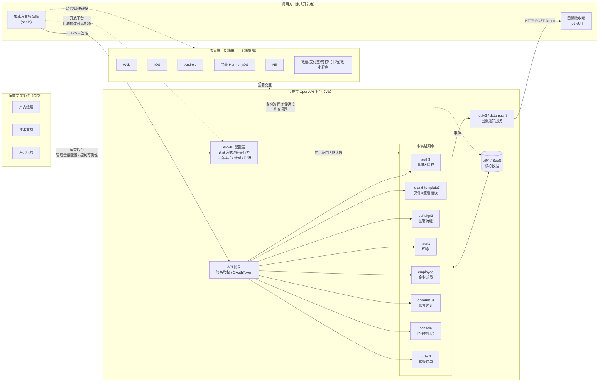
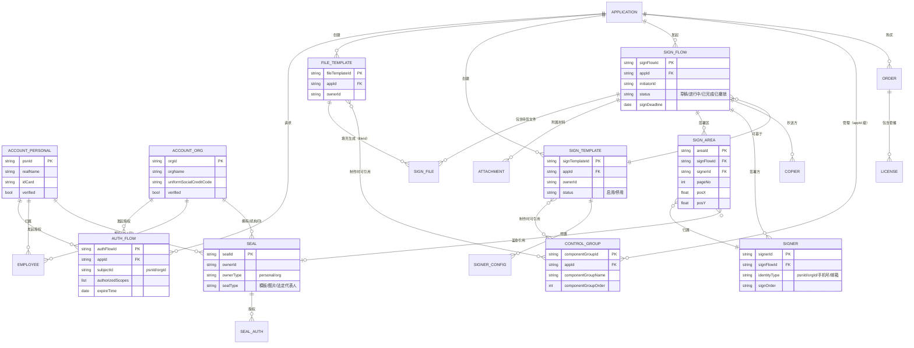
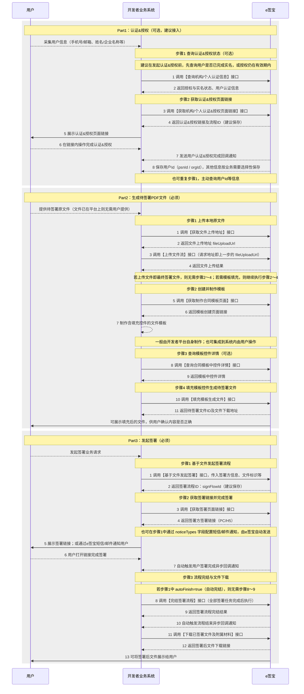

# e签宝 OpenAPI 3.0 一期

## 背景 & 业务目标

**现状**：
e签宝旧版 API（V1/V2）存在接口参数定义不规范、签名业务场景覆盖不足、开发者对接理解成本高等问题，客户集成效率低，且部分设计存在合规风险。

**目标**：
1. 完善用户授权 & 免登流程，满足电子签名合规要求
2. 完成接口参数定义的规范化重构（V3 标准）
3. 交付新规范下电子签名业务的 MVP 完整能力

**成功指标（KPI）**：
- 开发者接入文档满意度提升（理解成本降低）
- 签署业务通过合规审查，无法律合规风险
- 产品竞争力增强，减少交付顾问人力成本

---

## 用户故事

### P3 企业集成开发者

> **As a** 企业集成开发者，**I want to** 通过标准化的 OpenAPI 将电子签名能力接入我的企业系统，**so that** 我可以低成本、合规地为用户提供电子合同签署服务。

### P5 流程发起者

> **As a** 企业业务人员，**I want to** 通过集成了 e签宝 能力的企业系统快速发起签署流程，**so that** 我不需要单独登录 e签宝，业务流程可以连贯完成。

### P6 签署方

> **As a** 签署人，**I want to** 通过短信/邮件收到签署链接后快速完成签署，**so that** 无需下载 App 或注册账号，即可完成有法律效力的电子签名。

---

## 功能地图

> 完整产品结构参考：context/product-feature-map.md

| Feature ID | 功能域 | 功能名称 | 优先级 | 状态 | PRD 路径 |
|------------|--------|----------|--------|------|----------|
| F-001 | auth3 | 认证授权与免登体系 | Must | 草稿 | [../F-001-认证授权与免登体系/prd.md](../F-001-认证授权与免登体系/prd.md) |
| F-002 | file-and-template3 | 文件&流程模板管理 | Must | 草稿 | [../F-002-文件&流程模板管理/prd.md](../F-002-文件&流程模板管理/prd.md) |
| F-003 | pdf-sign3 | 签署流程（含查询/下载） | Must | 待创建 | - |
| ~~F-004~~ | — | ~~用户资源管理~~（v1.4 拆分至 F-001/F-003/F-007/F-008，编号空出不复用） | — | 已废弃 | — |
| F-005 | seal3 | 印章管理 | Should | 待创建 | - |
| F-006 | employee | 企业成员管理 | Should | 待创建 | - |
| F-007 | console | 企业控制台免登 | Should | 待创建 | - |
| F-008 | account_3 | 账号凭证管理 | Should | 待创建 | - |

---

## 分期规划

| 阶段 | 包含功能 | 目标 | 计划时间 |
|------|----------|------|----------|
| 一期 MVP | F-001、F-002（文件模板）、F-003（基础签署流程）、F-007、F-008 | 完整签署闭环可用，合规体系建立 | 2022-03（原计划） |
| 二期 | F-002（流程模板全功能）、F-003（模板发起签署、抄送方）、F-005 印章管理、F-006 企业成员管理 | 企业侧资源管理能力完善 | 已上线（V3 已全量交付） |

> **上线确认**：经与 `assets/opendoc/` 比对，V3 一期和二期所有对外接口均已上线，详见各功能域接口清单。

---

## 各功能域接口范围

### F-001 认证授权与免登体系

**核心业务逻辑**：
- 授权及授权校验：满足合规要求，平台方需获取用户资源授权（authorizedScopes）后才可操作对应资源。校验规则：appId ≠ 7488 且接口 URL 含 `/v3/` 时，验证该应用是否有权操作目标用户资源。
- 免登能力：用户完成授权后，无需登录即可通过免登链接访问对应 e签宝 页面

**接口清单**：

| 接口 | V3 对应 opendoc 文件 | 状态 |
|------|---------------------|------|
| 获取个人认证&授权页面链接 | auth3/rx8igf | ✅ 已上线 |
| 获取机构认证&授权页面链接 | auth3/kcbdu7 | ✅ 已上线 |
| 查询个人授权信息 | auth3/nurtvw | ✅ 已上线 |
| 查询机构授权信息 | auth3/ytn2tt | ✅ 已上线 |
| 查询个人认证信息 | auth3/vssvtu | ✅ 已上线 |
| 查询机构认证信息 | auth3/xxz4tc | ✅ 已上线 |
| 查询认证授权流程详情 | auth3/hlrs7s | ✅ 已上线（V3 新增，原文未记录） |
| 回调：用户授权范围变更 / 用户实名认证 | auth3/uozx98z5qom8ce5d | ✅ 已上线 |

> **V3 演变说明**：原文档"获取《用户认证&资源授权》页面链接"在 V3 拆分为个人和机构两个独立接口。

---

### F-002 文件&流程模板管理

**业务说明**：
- 文件模板（fileTemplateId）：包含文件底稿 + 控件，用于填充生成待签文件，由开发者/平台方创建管理
- 流程模板（signTemplateId）：包含文件底稿 + 控件 + 签署方等完整配置，可直接发起签署流程

**文件模板接口**：

| 接口 | V3 对应 opendoc 文件 | 状态 |
|------|---------------------|------|
| 查询文件模板列表 | （待补充对应文件路径） | ✅ 已上线 |
| 查询文件模板详情 | （待补充对应文件路径） | ✅ 已上线 |
| 获取《创建文件模板》页面链接 | （待补充对应文件路径） | ✅ 已上线 |
| 获取《编辑文件模板》页面链接 | （待补充对应文件路径） | ✅ 已上线 |
| 删除文件模板 | （待补充对应文件路径） | ✅ 已上线 |
| 回调：文件模板创建/编辑完成（EDIT_DOCTEMPLATE） | pdf-sign3/mcm1c9487grz0ynt | ✅ 已上线 |

**流程模板接口**（原文标注"待定"，V3 已全量实现）：

| 接口 | V3 对应 opendoc 文件 | 状态 |
|------|---------------------|------|
| 查询流程模板列表 | file-and-template3/al59g6n5oo75sl19 | ✅ 已上线 |
| 查询流程模板详情 | file-and-template3/pfzut7ho9obc7c5r | ✅ 已上线 |
| 获取《创建流程模板》页面链接 | file-and-template3/ukznvprry5qvlxh3 | ✅ 已上线 |
| 获取《编辑流程模板》页面链接 | file-and-template3/fifg4ked5cqk6vgt | ✅ 已上线 |
| 停用/开启流程模板 | file-and-template3/gyo1p6cg3yk1rv2g、ohk7cno35ozby9qt | ✅ 已上线（V3 新增） |
| 删除流程模板 | file-and-template3/lm10qsdrrag3wyyp | ✅ 已上线（V3 新增） |
| 复制流程模板 | file-and-template3/wylnqp3e9l61px5p | ✅ 已上线（V3 新增） |
| 回调：流程模板创建完成（CREATE_SIGN_TEMPLATE） | file-and-template3/nmg5r9a2szi5fsza | ✅ 已上线 |
| 回调：流程填写人填写状态（DRAFT_MISSON_COMPLETE） | file-and-template3/nmg5r9a2szi5fsza | ✅ 已上线 |

> **V3 演变说明**：原文档"获取《模板管理》页面链接（待定）"在 V3 拆分为独立的创建/编辑页面链接接口，无统一模板管理入口页。

---

### F-003 签署流程

**业务说明**：通过 signFlowId（原文档称 flowId）管理一次完整签署流程的生命周期。

> **差异标注**：原文档使用"合同"和 flowId，V3 opendoc 统一使用"签署流程"和 signFlowId，以 opendoc 为准。

**创建签署流程**：

| 接口 | V3 对应 opendoc 文件 | 状态 |
|------|---------------------|------|
| 通过文件创建签署流程（完整版） | pdf-sign3/su5g42 | ✅ 已上线 |
| 通过文件创建签署流程（精简版） | pdf-sign3/nxhgcl3bfgqz8qlz | ✅ 已上线（V3 新增精简版） |
| 通过流程模板创建合同拟定和签署流程 | file-and-template3/megwsgkmpbg1tec1 | ✅ 已上线（原文标注"二期"） |
| 通过页面发起签署 | pdf-sign3/lp54bn | ✅ 已上线（V3 新增） |

**准备待签文件**：

| 接口 | V3 对应 opendoc 文件 | 状态 |
|------|---------------------|------|
| 上传本地文件 | pdf-sign3/rlh256 | ✅ 已上线 |
| 查询文件上传状态 | pdf-sign3/qz4aip | ✅ 已上线 |
| 获取关键字坐标 | pdf-sign3/ze0ahv | ✅ 已上线 |
| 填写模板生成文件（填充控件） | pdf-sign3/mv8a3i | ✅ 已上线 |
| 回调：文件已损坏/有打开密码（FILE_UNAVAILABLE） | file-and-template3/nmg5r9a2szi5fsza | ✅ 已上线 |
| 控件组管理（创建/编辑/删除/查询） | pdf-sign3/pupwutihq20wss04 等 | ✅ 已上线（原文"添加/删除控件"在 V3 演变为控件组 API） |
| 自定义业务控件管理（创建/编辑/删除/查询） | pdf-sign3/agc4mx5ei2cg8qsc 等 | ✅ 已上线（V3 新增） |
| 获取填写页面链接 | file-and-template3/gu4n9g6fcaenhmnw | ✅ 已上线（原文"获取《设置填写控件》页面链接"在 V3 演变为填写页面） |
| 回调：文件上传成功 | — | ❌ V3 不实现，由调用方主动轮询「查询文件上传状态」（pdf-sign3/qz4aip） |

**修改签署流程配置**（均需 initiate_sign 授权）：

| 接口 | V3 对应 opendoc 文件 | 状态 |
|------|---------------------|------|
| 追加签署区 | pdf-sign3/ohzup7 | ✅ 已上线 |
| 删除签署区 | pdf-sign3/bd27ph | ✅ 已上线 |
| 追加待签文件 | pdf-sign3/fuuzv5 | ✅ 已上线 |
| 删除待签文件 | pdf-sign3/pvs0cm | ✅ 已上线 |
| 追加附属材料 | pdf-sign3/huo44q | ✅ 已上线 |
| 删除附属材料 | pdf-sign3/wvvyv8 | ✅ 已上线 |
| 添加抄送方 | pdf-sign3/pkicgm | ✅ 已上线（原文标注"二期"） |
| 删除抄送方 | pdf-sign3/bdn9yt | ✅ 已上线（原文标注"二期"） |
| 修改企业签署经办人 | — | ⚠️ V3 不提供独立接口；变更经办人需通过「删除签署区+追加签署区」组合调整，或由签署方在签署页面手动转交（TRANSMISS_SIGN 回调） |

**流程状态操作**：

| 接口 | V3 对应 opendoc 文件 | 状态 |
|------|---------------------|------|
| 开启签署流程 | pdf-sign3/pu4xsx | ✅ 已上线 |
| 撤销签署流程 | pdf-sign3/klbicu | ✅ 已上线 |
| 结束签署流程 | pdf-sign3/ynwqsm | ✅ 已上线 |
| 催签 | pdf-sign3/yws940 | ✅ 已上线 |
| 签署流程延期 | pdf-sign3/idv0fv | ✅ 已上线 |

**查询与下载接口**：

| 接口 | V3 对应 opendoc 文件 | 状态 |
|------|---------------------|------|
| 查询签署流程列表 | pdf-sign3/kq4b2e | ✅ 已上线 |
| 查询签署流程详情 | pdf-sign3/xxk4q6 | ✅ 已上线 |
| 获取签署页面链接 | pdf-sign3/pvfkwd | ✅ 已上线 |
| 查询集成方企业流程列表 | pdf-sign3/uhma1i | ✅ 已上线（V3 新增） |
| 下载已签署文件及附属材料 | pdf-sign3/kczf8g | ✅ 已上线（v1.4 由原 F-004 拆入） |

**回调通知**：

| 回调事件 | Action 事件类型 | 状态 |
|---------|---------------|------|
| 签署方已读 | OPERATOR_READ | ✅ 已上线 |
| 签署方完成签署 | SIGN_MISSON_COMPLETE | ✅ 已上线 |
| 签署流程结束 | SIGN_FLOW_COMPLETE | ✅ 已上线 |
| 经办人转交签署任务 | TRANSMISS_SIGN | ✅ 已上线 |
| 签署发起成功 | SIGN_FLOW_INITIATED | ✅ 已上线（V3 新增） |
| 签署人更正个人信息 | OPERATOR_CORRECT_IDENTITY | ✅ 已上线（原文"签署人申请修改身份信息"） |
| 填写人填写状态通知（文件模板路径） | FILL_DOCTEMPLATE | ✅ 已上线（原文"填写人已填写"） |
| 用印审批驳回 | SIGN_SEAL_EXAMINE_REJECTED | ✅ 已上线（V3 新增） |
| 合同发起/完成解约 | SIGN_FILE_RESCISSION_INITIATE、SIGN_FILE_RESCINDED | ✅ 已上线（V3 新增） |
| 抄送方已读 | COPIER_READ | ✅ 已上线（V3 新增） |
| 签署流程即将到期提醒 | — | ⚠️ 待确认：opendoc 中未找到到期提醒专用回调，可能已通过 data-push3 推送签署提醒实现 |

---

### ~~F-004 用户资源管理~~（v1.4 已废弃）

> **v1.4 变更说明**：F-004 原作为伞状 Feature 涵盖跨域查询能力，实际接口分散在多个域，没有独立的功能内聚性。本版本拆分如下，F-004 编号空出不复用：
>
> | 原 F-004 内容 | v1.4 归属 |
> |---|---|
> | 查询个人/机构认证信息 | F-001 auth3 接口清单（原本已含） |
> | 查询签署流程列表 / 查询集成方企业流程列表 | F-003 查询与下载接口（原本已含） |
> | 下载已签署文件及附属材料 | F-003 查询与下载接口（v1.4 由本节迁入） |
> | 获取免登企业控制台页面 | F-007 企业控制台免登（v1.4 新增） |
> | 修改/新增/解绑账号登录凭证 | F-008 账号凭证管理（v1.4 新增） |
>
> **V3 演变说明保留**：原文"查询个人/机构合同列表"在 V3 未设计为独立的"合同列表"接口，改为通过签署流程列表查询实现；account_3 模块在 V3 中定位为账号凭证管理，不包含合同查询能力。

---

### F-007 企业控制台免登（console）

**业务说明**：通过免登链接将 e签宝企业控制台页面集成到第三方系统，无需用户单独登录 e签宝。

**接口清单**：

| 接口 | V3 对应 opendoc 文件 | 状态 |
|------|---------------------|------|
| 获取免登企业控制台页面 | console/rhoap2 | ✅ 已上线 |

---

### F-008 账号凭证管理（account_3）

**业务说明**：管理个人/机构账号的登录凭证（手机号、邮箱等），支持新增、修改、解绑。V3 新增能力，原文档未记录。

**接口清单**：

| 接口 | V3 对应 opendoc 文件 | 状态 |
|------|---------------------|------|
| 修改/新增账号登录凭证 | account_3/vriragi8ohekdme0 | ✅ 已上线（V3 新增） |
| 解绑账号登录凭证 | account_3/smelh6m20a5fizu2 | ✅ 已上线（V3 新增） |

---

### F-005 印章管理（二期，已上线）

**业务说明**：对个人印章和机构印章的创建、查询、授权、停用等全生命周期管理。

**个人印章**：创建模板印章/图片印章、查询个人印章列表及详情、删除、设置默认印章、获取创建/管理印章页面链接

**机构印章**：创建模板印章/图片印章、上传印章图片、查询机构内部印章及详情、删除、启用/停用、设置默认印章、获取创建/管理印章页面链接、获取创建法定代表人印章页面链接

**印章授权**：内部成员授权、跨企业授权、查询授权详情、修改授权期限、解除授权、查询印章授权书签署链接

> 详细接口清单见 `assets/opendoc/seal3/`（共 37 个接口文件）

---

### F-006 企业成员管理（二期，已上线）

**业务说明**：对企业组织成员的新增、查询、移除及角色管理。

**接口清单**：

| 接口 | V3 对应 opendoc 文件 | 状态 |
|------|---------------------|------|
| 添加企业机构成员 | employee/has759 | ✅ 已上线 |
| 查询企业成员列表 | employee/bzrzic | ✅ 已上线 |
| 移除企业机构成员 | employee/tz2uqp | ✅ 已上线 |
| 查询企业管理员 | employee/fxm4ii | ✅ 已上线 |
| 查询个人用户是否为企业成员 | employee/smmg6dwz7fyys2wl | ✅ 已上线 |
| 添加成员角色 | employee/qhbzzmq2a7r03kyo | ✅ 已上线 |
| 删除成员角色 | employee/usgc6c1d2x6ofon1 | ✅ 已上线 |

---

### 辅助接口

| 接口 | V3 对应 opendoc 文件 | 优先级 | 状态 |
|------|---------------------|--------|------|
| PDF 文件验签（核验合同文件签名有效性） | pdf-sign3/yekrnc | P2 | ✅ 已上线 |
| 数据签名和验签 | — | P2 | ❌ V3 不实现，后续也不再规划；如需仅可使用 PDF 文件验签（pdf-sign3/yekrnc） |

---

## 依赖关系

| 依赖项 | 被依赖方 | 说明 |
|--------|---------|------|
| 认证授权（F-001）| 签署流程（F-003）、文件模板（F-002）| 操作用户资源前必须先获得 authorizedScopes 授权 |
| 认证授权（F-001）| 企业控制台免登（F-007）、账号凭证管理（F-008）| 访问企业控制台和管理账号凭证需先完成授权 |
| 文件模板（F-002）| 签署流程（F-003）| 通过文件模板填充生成待签文件后才能创建签署流程 |
| 流程模板（F-002）| 签署流程（F-003）| 通过流程模板发起签署需先创建流程模板 |
| 用户实名认证 | 签署流程（F-003）| 签署方需完成实名认证方可签署 |
| 印章管理（F-005）| 签署流程（F-003）| 企业盖章场景需先完成印章创建和授权 |

---

## 架构图

### 系统架构图

---

### 核心数据模型（E-R 图）

---

### 业务调用时序图

---

## 非功能需求（全局）

| 类型 | 要求 |
|------|------|
| 安全 | 所有通过 OpenAPI 创建的用户资源需带"来源应用（appId）"标识，支持后续资源隔离 |
| 鉴权 | 请求须通过签名鉴权（推荐）或 OAuthToken 鉴权；V3 接口校验 appId ≠ 7488 且路径含 `/v3/` |
| 合规 | 签署操作需符合《电子签名法》要求；用户授权为必要前提 |
| 多租户隔离 | 资源操作均需校验来源应用与用户授权关系，防止跨应用访问 |

---

## 开放问题

| # | 问题 | 状态 |
|---|------|------|
| 1 | 原文标注"待定"的接口（查询合同列表、填写人已填写等）在 V3 中的实现状态？ | ✅ 已关闭：除少数确认不实现项外全部上线（详见各功能域接口清单） |
| 2 | 原文标注"二期"的功能在 V3 中已实现，Feature PRD 编号分配？ | ✅ 已关闭：F-005（seal3 印章管理）、F-006（employee 企业成员管理）；流程模板创建签署和抄送方管理已并入 F-002/F-003 |
| 3 | 原始文档中的数据架构图和 E-R 图未能从文档中提取，是否需要补充？ | ✅ 已关闭：已补充系统架构图、核心数据模型（E-R 图）、业务调用时序图，见 §架构图 |
| 4 | F-001～F-004 的 Feature PRD 是否按功能域拆分创建（推荐），还是合并处理？ | ✅ 已关闭：按功能域拆分，功能地图已更新为 F-001～F-006 |
| 5 | 本 Epic 的当前上线状态？V3 一期是否已全量上线？ | ✅ 已关闭：用户确认 opendoc 中所有对外接口均已上线 |
| 6 | 修改企业签署经办人接口（原文"待定"）在 V3 中未找到对应文档，是否已取消或并入其他接口？ | ✅ 已关闭：V3 不提供独立接口，由"删除+追加签署区"或签署方页面手动转交实现 |
| 7 | 签署流程即将到期提醒（data-push3/sign-reminder）是否完全替代原"回调：签署流程即将到期提醒"？两者触发机制和配置方式是否一致？ | 🔴 待确认：需比对 data-push3/sign-reminder 实现细节 |

---

## 变更记录

> 详细变更历史见同目录 `CHANGELOG.md`。

| 版本 | 日期 | 变更摘要 |
|------|------|----------|
| v0.1 | 2022-02-22 | 原始文档（门生），已归档至 archive/original-v0.1.md |
| v1.0 | 2026-05-19 | 基于原始内容重构为标准 Epic PRD 格式，由 AI 生成；与 opendoc 差异已在各章节标注 |
| v1.1 | 2026-05-19 | 对比 assets/opendoc/ 确认所有接口上线状态：移除全部⚠️待定/二期标注，新增 F-005/F-006，新增 V3 演变说明，新增 OQ6/OQ7 两个遗留问题 |
| v1.2 | 2026-05-19 | 关闭 OQ1/OQ6：明确 3 个原"待定"项的最终落地——回调-文件上传成功（不实现，主动轮询）、数据签名和验签（不实现且不再规划）、修改企业签署经办人（不提供独立接口，通过签署区调整或页面手动转交实现） |
| v1.3 | 2026-05-19 | 新增 §架构图：系统架构图（LR 方向）、核心数据模型 E-R 图（修正控件组归属为 appId 级、移除 FILE_TEMPLATE→SIGN_TEMPLATE 直接关联、新增 FILE_TEMPLATE→SIGN_FILE 填充链路）、业务调用时序图（3 参与者，Part1-3 结构）；关闭 OQ3 |
| v1.4 | 2026-05-20 | 拆分 F-004 用户资源管理：F-004 编号空出不复用，认证查询归 F-001、签署文件查询/下载归 F-003、获取免登企业控制台页面拆为 F-007、账号凭证管理拆为 F-008；同步更新 features 字段、功能地图表、分期规划表、各功能域接口范围、依赖关系表 |
