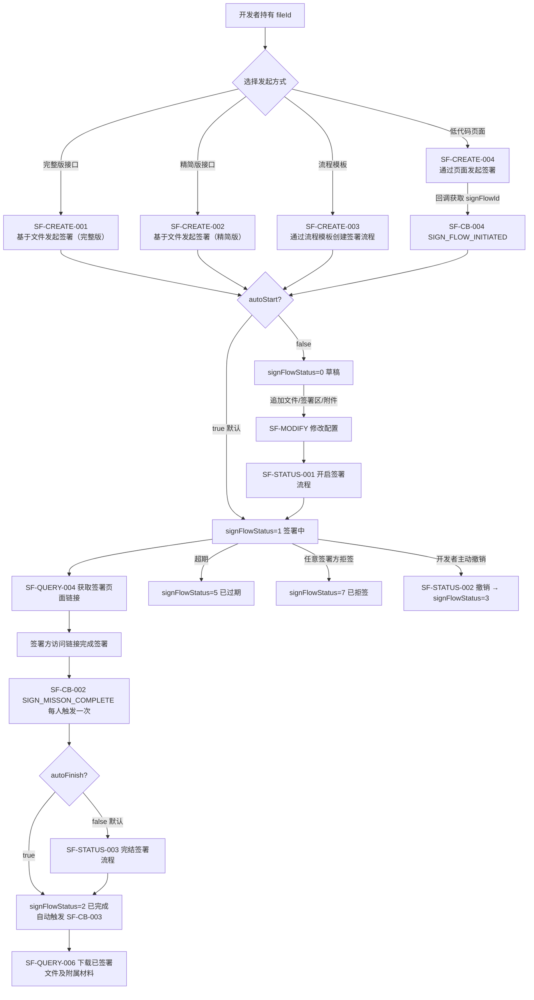

# 签署流程（含查询/下载）

## 1 文档元数据

| 字段 | 内容 |
| --- | --- |
| PRD-ID | F-003 |
| 产品线 | 签署流程（pdf-sign3 主域，跨 file-and-template3） |
| 需求类型 | 新功能（V3 标准化重构） |
| 需求状态 | 草稿 |
| 当前版本 | V1.0 |
| 最后更新日期 | 2026-05-20 |
| 关键词（Tag） | signFlowId、签署流程、创建签署、准备待签文件、签署区、signFlowStatus、autoStart、autoFinish、回调通知、下载签署文件 |
| 关联需求卡片 | 暂无（从 Epic E-001 抽取，未走 /requirement-clarifier） |
| 关联页面规格卡 | 待产出 |
| 关联原型文件 | 待产出 |
| 所属 Epic | [E-001 e签宝 OpenAPI 3.0 一期](../E-001-e签宝OpenAPI3.0一期/prd.md) |
| 依赖 Feature | [F-001 认证授权与免登体系](../F-001-认证授权与免登体系/prd.md)（发起签署需 `initiate_sign` 授权；代机构/个人签署需对应 `operate_resource` 授权） |
| 被依赖 Feature | [F-002 文件&流程模板管理](../F-002-文件&流程模板管理/prd.md)（通过文件模板生成 fileId、通过流程模板创建签署流程） |

## 2 文档修订记录

| 版本 | 日期 | 修订内容 | 修订人 |
| --- | --- | --- | --- |
| V0.1 | 2022-02-22 | 原始内容（Epic E-001 V0.1 中"合同签署业务"章节），已归档至 archive/original-v0.1.md | 门生 |
| V1.0 | 2026-05-20 | 从 Epic E-001 抽取 F-003 内容，对照 assets/opendoc/pdf-sign3/ 重构为标准 Feature PRD；段 1（§1-§5）完成骨架 | AI 生成（门生 review） |

## 3 需求概要

### 3.1 问题与机会（概要）

**现状问题**：

- V1/V2 的"合同"概念与 V3 的"签署流程"存在命名混乱：原文档统一称 flowId，V3 规范使用 signFlowId；"合同完结"在 V3 拆分为"自动完结（autoFinish=true）"和"手动完结（调用 完结签署流程 接口）"两种路径，开发者经常混淆
- 旧版 API 发起签署只有一个"通过文件创建"入口，V3 新增精简版（减少必填参数）、通过页面发起（低代码，无需编程）、通过流程模板发起（企业模板复用）三种入口，缺少系统性说明导致开发者难以选型
- 签署流程"草稿"和"签署中"两种状态允许的操作集不同，但旧文档未清晰区分；开发者在签署中状态尝试追加待签文件，或在草稿状态直接拉签署链接，均会引发无谓报错
- 原 flowId 级别的"修改经办人"接口在 V3 被废除，变更经办人需通过"删除签署区 + 追加签署区"组合操作，但无文档显式说明导致开发者踩坑

**机会**：

- V3 为签署流程提供了完整的生命周期管理：草稿 → 签署中 → 完成/撤销/过期/拒签；6 种 signFlowStatus 状态均有对应操作约束，文档化后可大幅降低无效 API 调用
- 新增精简版发起接口（nxhgcl3bfgqz8qlz）将核心参数从 20+ 收敛到 8 个，显著降低首次接入成本
- 通过 autoStart / autoFinish 两个布尔参数，开发者可灵活控制"先批量备料后一键开启"和"所有人签完自动收口"两种常见模式

### 3.2 目标用户（概要）

> 用户画像参考：context/user-persona.md

- **核心用户**：**P3 企业集成开发者**——通过 API 将签署能力嵌入企业 ERP/OA/合同系统；最关心：发起路径选择（文件直签 vs 模板签）、签署流程状态精确判断、回调事件可靠投递
- **次级用户**：**P5 流程发起者**（企业业务人员）——在企业系统中触发签署流程，偶尔通过「通过页面发起」手动配置；最关心：签署链接的分发方式（自取链接 vs e签宝短信通知）
- **终端用户**：**P6 签署方**（外部签署人）——通过短信/邮件/企业内嵌页面访问签署链接完成签署；最关心：链接有效期、平台登录跳出体验
- **间接用户**：**P2 平台运营人员**——通过查询接口（列表/详情）排查"签署流程为何卡住""下载链接为何失效"等日常运维问题；**P4 流程管理者**（企业管理员）——通过催签/延期/撤销处理签署超时场景

### 3.3 方案概述

按 feature-map.md SIGN 域六个子节点组织，共 47 个接口 + 12 个回调事件：

1. **SF-CREATE 创建签署流程**（4 项，SF-CREATE-001~004）：完整版文件发起 / 精简版文件发起 / 通过流程模板发起 / 通过页面发起
2. **SF-FILE 准备待签文件**（9 项，SF-FILE-001~009）：上传本地文件（两步） / 查询上传状态 / 检索关键字坐标 / 填写模板生成文件 / 控件组管理 / 自定义业务控件管理 / 获取填写页面链接
3. **SF-MODIFY 修改签署流程配置**（11 项，SF-MODIFY-001~011）：追加/删除签署区 / 追加/删除待签文件 / 追加/删除附属材料 / 添加/删除抄送方 / 修改经办人（V3 废除说明）
4. **SF-STATUS 流程状态操作**（5 项，SF-STATUS-001~005）：开启 / 撤销 / 完结 / 催签 / 延期
5. **SF-QUERY 查询与下载**（6 项，SF-QUERY-001~006）：流程列表 / 流程详情 / 集成方企业流程列表 / 获取签署页面链接 / 获取批量签页面链接 / 下载已签署文件及附属材料
6. **SF-CB 回调通知**（12 项，SF-CB-001~012）：签署方已读 / 签署方完成签署 / 流程结束 / 发起成功 / 经办人转交 / 身份信息更正 / 填写人填写 / 用印审批驳回 / 解约发起/完成 / 抄送方已读 / 到期提醒（待确认）

跨域归属说明：SF-CREATE-003（通过流程模板创建签署流程）在 opendoc 中实际归属 **file-and-template3** 域，其余所有接口均归属 **pdf-sign3** 域。本 PRD 采用 feature-map 的业务视图（SIGN）作为顶层组织，§8 每个接口标注其实际 opendoc 域路径。

### 3.4 成功指标（3-5 项）

| 指标 | 目标值 | 观测时间 | 数据来源 |
| --- | --- | --- | --- |
| 基于文件发起签署接口成功率 | ≥ 99.5% | 月度 | SF-CREATE-001/002 接口监控 |
| 回调投递成功率（含重试） | ≥ 99.5% | 月度 | data-push3 投递指标 |
| 签署流程从发起到首个签署方完成的平均响应时间 | ≤ 5 min（基于通知路径） | 月度 | 用户行为埋点（签署页面打开 → 完成） |
| 因"状态不允许操作"导致的开发者接口报错占比 | ≤ 3% | 季度 | 错误码监控（状态相关错误码） |
| 下载签署文件接口成功率（签署完成状态下） | ≥ 99.9% | 月度 | SF-QUERY-006 接口监控 |

---

## 4 需求对象与概念模型

> 业务术语参考：context/business-glossary.md
> 已在术语表收录、本 PRD 直接引用、不再重复定义的术语：**签署流程** / **signFlowId**（V3 标准，原文档 flowId） / **fileId** / **orgId** / **psnId** / **appId** / **签署方** / **抄送方** / **附属材料** / **签署区** / **signTemplateId** / **docTemplateId**。
>
> 本 PRD 新引入的术语 / 枚举：

| 术语 | 类型 | 定义 | 约束/备注 |
| --- | --- | --- | --- |
| signFlowStatus | 枚举值 | 签署流程状态 | 0=草稿 / 1=签署中 / 2=已完成 / 3=已撤销 / 5=已过期 / 7=已拒签；注意无 4 和 6 |
| autoStart | 布尔参数 | 发起签署时是否自动从草稿进入签署中 | 默认 true；传 false 时流程停留在草稿状态，需手动调用「开启签署流程」；草稿状态可追加文件/签署区/附件 |
| autoFinish | 布尔参数 | 全员签署完成后是否自动完结流程 | 默认 false；传 true 则系统自动触发完结；传 false 需手动调用「完结签署流程」；**仅已完成状态可下载签署文件** |
| signerType | 枚举值 | 签署方类型 | 0=个人签署方 / 1=机构签署方（机构自动盖章 autoSign=true 时 orgSignerInfo 必传，psnSignerInfo 不传） |
| signOrder | 整型字段 | 签署方的签署顺序 | 1-255；相同值表示同时签（无顺序要求）；不同值表示按升序依次签 |
| noticeTimes | 整型字段 | 催签次数 | 发起催签后累计送达次数，≥ 1 |
| signValidity | 整型字段 | 签署截止时间 | Unix 时间戳（毫秒），超期后流程自动变为 signFlowStatus=5（已过期） |
| attachmentType | 枚举值 | 附属材料用途 | 1=附件（辅助阅读材料）/ 2=补充协议（需签署） |
| downloadFileType | 枚举值 | 下载文件类型 | 0=全量文件包（ZIP）/ 1=仅签署文件 / 2=仅附属材料 |
| signLinkType | 枚举值 | 签署链接类型（获取签署页面链接接口参数） | 1=签署链接 / 2=预览链接 |
| noticeTypes | 枚举值集合 | e签宝主动通知签署方的方式 | 1=短信 / 2=邮件；逗号分隔；配置后 e签宝发送通知，不支持隐藏登录页 |
| SIGN_FLOW_INITIATED | 回调 Action | 签署流程发起成功通知 | V3 新增；通过页面发起（SF-CREATE-004）时必须依赖此回调获取 signFlowId |
| SIGN_MISSON_COMPLETE | 回调 Action | 签署方完成签署通知 | 每个签署方签署后各触发一次 |
| SIGN_FLOW_COMPLETE | 回调 Action | 签署流程完结通知 | 整个流程完结后触发，触发时文件可下载 |
| TRANSMISS_SIGN | 回调 Action | 经办人转交签署任务通知 | 企业签署方的经办人手动转交给其他人时触发 |
| OPERATOR_READ | 回调 Action | 签署方已读通知 | 签署方打开签署链接时触发 |
| OPERATOR_CORRECT_IDENTITY | 回调 Action | 签署人更正个人信息通知 | 原文"申请修改身份信息"，V3 更名 |
| FILL_DOCTEMPLATE | 回调 Action | 填写人完成文件模板填写通知 | 含最终 fileId；归属 pdf-sign3 回调服务 |
| SIGN_SEAL_EXAMINE_REJECTED | 回调 Action | 用印审批驳回通知 | V3 新增；企业开启用印审批时触发 |
| SIGN_FILE_RESCISSION_INITIATE | 回调 Action | 合同解约发起通知 | V3 新增 |
| SIGN_FILE_RESCINDED | 回调 Action | 合同解约完成通知 | V3 新增 |
| COPIER_READ | 回调 Action | 抄送方已读通知 | V3 新增 |

---

## 5 功能结构

> 完整产品功能结构参考：context/product-feature-map.md
> 本图与 feature-map.md SIGN 域的 SF-CREATE/FILE/MODIFY/STATUS/QUERY/CB 六个子节点完全同构。

### 5.1 本需求新增的功能节点

```mermaid
graph TD
    SIGN[SIGN 签署流程 / F-003]
    SIGN --> CREATE[SF-CREATE 创建签署流程]
    SIGN --> FILE[SF-FILE 准备待签文件]
    SIGN --> MODIFY[SF-MODIFY 修改签署流程配置]
    SIGN --> STATUS[SF-STATUS 流程状态操作]
    SIGN --> QUERY[SF-QUERY 查询与下载]
    SIGN --> CB[SF-CB 回调通知]

    CREATE --> C1[SF-CREATE-001 完整版：基于文件发起签署]
    CREATE --> C2[SF-CREATE-002 精简版：基于文件发起签署]
    CREATE --> C3[SF-CREATE-003 通过流程模板发起签署<br/>归属 file-and-template3]
    CREATE --> C4[SF-CREATE-004 通过页面发起签署]

    FILE --> F1[SF-FILE-001/002 上传本地文件（两步）]
    FILE --> F2[SF-FILE-003 查询文件上传状态]
    FILE --> F3[SF-FILE-004 检索文件关键字坐标]
    FILE --> F4[SF-FILE-005 填写模板生成文件]
    FILE --> F5[SF-FILE-006~008 控件组管理 CRUD<br/>与 file-and-template3 镜像]
    FILE --> F6[SF-FILE-009 获取填写页面链接<br/>归属 file-and-template3]

    MODIFY --> M1[SF-MODIFY-001/002 追加/删除签署区]
    MODIFY --> M2[SF-MODIFY-003/004 追加/删除待签文件]
    MODIFY --> M3[SF-MODIFY-005/006 追加/删除附属材料]
    MODIFY --> M4[SF-MODIFY-007/008 添加/删除抄送方]
    MODIFY --> M5[SF-MODIFY-009 修改经办人<br/>V3 废除 见 BR-04]

    STATUS --> S1[SF-STATUS-001 开启签署流程]
    STATUS --> S2[SF-STATUS-002 撤销签署流程]
    STATUS --> S3[SF-STATUS-003 完结签署流程]
    STATUS --> S4[SF-STATUS-004 催签]
    STATUS --> S5[SF-STATUS-005 延长签署截止时间]

    QUERY --> Q1[SF-QUERY-001 查询签署流程列表]
    QUERY --> Q2[SF-QUERY-002 查询签署流程详情]
    QUERY --> Q3[SF-QUERY-003 查询集成方企业流程列表]
    QUERY --> Q4[SF-QUERY-004 获取签署页面链接]
    QUERY --> Q5[SF-QUERY-005 获取批量签页面链接（多流程）]
    QUERY --> Q6[SF-QUERY-006 下载已签署文件及附属材料]

    CB --> CB1[SF-CB-001 OPERATOR_READ 签署方已读]
    CB --> CB2[SF-CB-002 SIGN_MISSON_COMPLETE 签署方完成签署]
    CB --> CB3[SF-CB-003 SIGN_FLOW_COMPLETE 签署流程完结]
    CB --> CB4[SF-CB-004 SIGN_FLOW_INITIATED 发起成功]
    CB --> CB5[SF-CB-005 TRANSMISS_SIGN 经办人转交]
    CB --> CB6[SF-CB-006 OPERATOR_CORRECT_IDENTITY 身份信息更正]
    CB --> CB7[SF-CB-007 FILL_DOCTEMPLATE 填写人完成填写]
    CB --> CB8[SF-CB-008 SIGN_SEAL_EXAMINE_REJECTED 用印审批驳回]
    CB --> CB9[SF-CB-009/010 解约发起/完成]
    CB --> CB10[SF-CB-011 COPIER_READ 抄送方已读]
    CB --> CB11[SF-CB-012 到期提醒 待确认]
```

### 5.2 本需求核心业务流程

### 5.3 核心业务规则

> 跨多个功能的全局约束，单功能内部异常归入对应 §8.x.3。

| 规则编号 | 规则描述 | 备注 |
| --- | --- | --- |
| BR-01 | **发起签署需 `initiate_sign` 授权**：调用方 appId 必须持有目标签署方（个人 psnId 或机构 orgId）对当前应用的 `initiate_sign` 授权，否则接口返回无授权错误 | F-001 §5.3 BR-03 定义；appId 代表本企业签署（autoSign=true）时无需额外授权 |
| BR-02 | **草稿状态（signFlowStatus=0）允许的操作集**：追加/删除待签文件、追加/删除签署区、追加/删除附属材料、追加/删除抄送方；**不可获取签署链接**（需先开启） | 详见 gsy6xe 签署流程状态说明 |
| BR-03 | **签署中状态（signFlowStatus=1）允许的操作集**：获取签署链接、催签、延期、撤销、追加附属材料、添加/删除抄送方（仅 autoFinish=false）、追加签署区（仅 autoFinish=false）、删除未签署签署区 | 详见 gsy6xe |
| BR-04 | **V3 废除"修改企业签署经办人"独立接口**：变更经办人需通过「删除签署区（SF-MODIFY-002）+ 追加签署区（SF-MODIFY-001）」组合；或由当前经办人在签署页面手动转交（触发 TRANSMISS_SIGN 回调） | opendoc E-001 §F-003 差异标注 |
| BR-05 | **文件下载仅限已完成状态（signFlowStatus=2）**：SF-QUERY-006 在非完成状态调用返回错误；autoFinish=false 时必须先调用 SF-STATUS-003 完结流程 | opendoc kczf8g 前置说明 |
| BR-06 | **通过页面发起（SF-CREATE-004）的 signFlowId 获取路径**：接口本身不直接返回 signFlowId，需通过配置 notifyUrl 并监听 SF-CB-004（SIGN_FLOW_INITIATED）回调获取 | opendoc lp54bn 说明 |
| BR-07 | **autoStart 默认值为 true**（直接进入签署中）；**autoFinish 默认值为 false**（所有人签完后需手动完结）；两个参数均可在发起签署时显式指定 | opendoc su5g42 / gsy6xe |
| BR-08 | **回调 Action 枚举可能新增**：开发者侧未识别的 Action 应忽略而非报错；不可在代码中硬编码完整枚举集合 | opendoc mcm1c9487grz0ynt warning |
| BR-09 | **沙箱与正式环境流程完全隔离**：沙箱（smlopenapi）创建的 signFlowId 在正式环境无效，反之亦然；测试完成后需在正式环境重新发起 | opendoc dev-guide3/qwnnsb |
| BR-10 | **文件上传为两步操作**：SF-FILE-001 获取上传地址（POST），SF-FILE-002 使用 PUT 方法上传文件流到 fileUploadUrl；上传后需轮询 SF-FILE-003 确认 convertStatus=2（转换完成）再使用 fileId | opendoc rlh256 |
| BR-11 | **通过 e签宝通知方式（noticeTypes）分发的签署链接不支持隐藏 e签宝登录页面**；通过接口获取签署链接（SF-QUERY-004）的方式支持隐藏 | opendoc tv8gsiqwk2z00wwi |
| BR-12 | **催签限制**：仅签署中（signFlowStatus=1）的流程、且该签署方尚未签署时可催签；已签署/已完成/已撤销状态不可催签 | opendoc yws940 |

---

## 6 用户故事与用例

> **[占位]** 段 2 填充。内容大纲：
>
> - §6.1 Epic（签署闭环全链路）
> - §6.2 Must Have：直接上传文件发起签署（完整版 + 精简版）、通过模板发起、签署链接分发、下载签署文件
> - §6.3 Should Have：草稿模式批量备料后开启、通过页面发起（低代码）、催签/延期
> - §6.4 Could Have：批量签、解约

---

## 7 功能清单

> **[占位]** 段 2 填充。内容大纲：
>
> - 按 SF-CREATE / SF-FILE / SF-MODIFY / SF-STATUS / SF-QUERY / SF-CB 六组列表
> - 每项：功能 ID / 名称 / 优先级 / 对应 opendoc 文件 / V3 vs 原文差异标注 / feature-map 归属

---

## 8 功能说明

> **[占位]** 段 3-7 填充。每个接口包含：接口概述 / 前置条件 / 请求参数 / 响应字段 / 异常处理 / 业务规则引用。
>
> - §8.1 SF-CREATE 创建签署流程（段 3）
> - §8.2 SF-FILE 准备待签文件（段 4）
> - §8.3 SF-MODIFY 修改签署流程配置（段 5）
> - §8.4 SF-STATUS 流程状态操作（段 6 前半）
> - §8.5 SF-QUERY 查询与下载（段 6 后半）
> - §8.6 SF-CB 回调通知（段 7）

---

## 9 非功能性需求

> **[占位]** 段 8 填充。

### 9.1 性能

| 指标 | 目标 | 说明 |
| --- | --- | --- |
| 发起签署接口 P99 响应时间 | ≤ 3s | 服务端同步创建 signFlowId |
| 回调投递延迟（从触发到开发者收到） | ≤ 30s（P95） | 含重试队列延迟 |
| 下载签署文件生成时间 | ≤ 10s（P95） | ZIP 打包含多文件 |

### 9.2 安全

- 所有接口通过请求签名鉴权（HmacSHA256 或 OAuthToken，见 F-001 §9.2）
- signFlowId 通过随机 UUID 生成，不可枚举
- 回调通知包含签名，开发者应验签后再处理（见 SF-CB 回调通知规范）
- 下载链接包含时效性 token，有效期 30 分钟

### 9.3 可靠性

- 回调失败自动重试，最大重试次数和间隔见 data-push3 投递规范
- 接口幂等性：SF-CREATE-001/002 支持 customBizNum（业务流水号）去重，同 customBizNum 不会重复发起
- 文件转换失败触发 FILE_UNAVAILABLE 回调（SF-CB 回调通知中补充）

### 9.4 兼容性

> 平台支持端清单参考：context/platform-support.md

- 签署页面链接（SF-QUERY-004 返回）支持：PC Web / H5 / 微信小程序（需配置业务域名）/ 支付宝小程序 / App（WebView 内嵌）
- 通过页面发起（SF-CREATE-004）仅支持 PC Web 操作，不支持移动端发起

---

## 10 验收清单

> **[占位]** 段 8 填充。包含：接口联调验收 / 回调事件全量验证 / 状态机完整性测试 / 下载安全性测试。

---

## 11 项目与排期

| 字段 | 内容 |
| --- | --- |
| 优先级 | Must（一期 MVP 核心） |
| 所属阶段 | E-001 一期 MVP |
| 计划上线时间 | 已上线（V3 全量交付） |
| 开发工作量（估算） | — |
| 上线确认 | ✅ 经与 assets/opendoc/pdf-sign3/ 比对，所有接口均已上线 |

---

## 12 开放问题

| 编号 | 问题 | 状态 | 优先级 |
| --- | --- | --- | --- |
| OQ-001 | 签署流程即将到期提醒是否有专用回调 Action？opendoc 中未找到，疑似通过 data-push3 签署提醒消息推送实现（sign-reminder-签署提醒消息推送服务.md），待确认具体 Action 名称及触发规则 | 待确认 | 中 |
| OQ-002 | 控件组接口是否存在 pdf-sign3 与 file-and-template3 镜像（与 F-002 BR-03 结论一致）？若是，F-003 §8.2 SF-FILE-006~008 应同步标注与 F-002 的共用关系，避免重复文档维护 | 待对比 opendoc | 低 |
| OQ-003 | 精简版发起（SF-CREATE-002）与完整版（SF-CREATE-001）的核心参数差集是什么？是否所有完整版支持的功能精简版均支持？需从 opendoc nxhgcl3bfgqz8qlz 详细读取后确认 | 待段 3 填充时确认 | 高（段 3 必答） |
