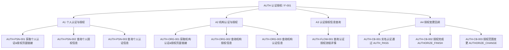
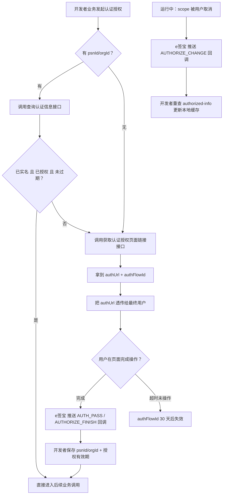
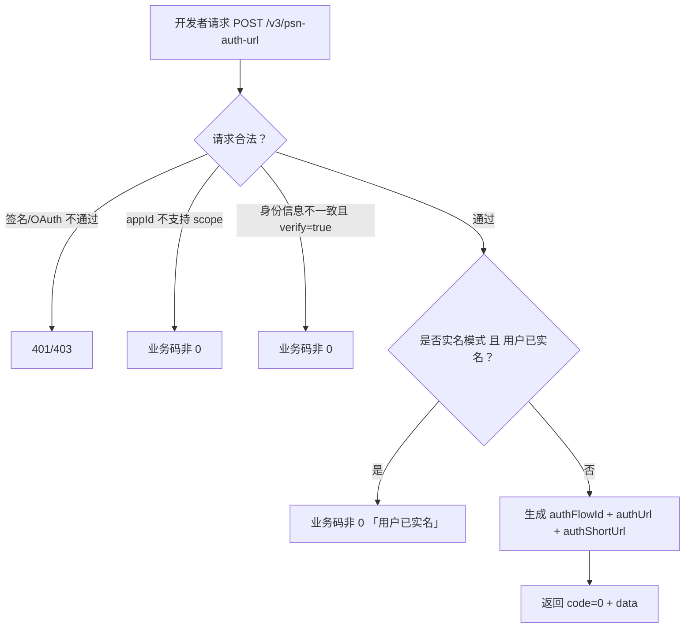
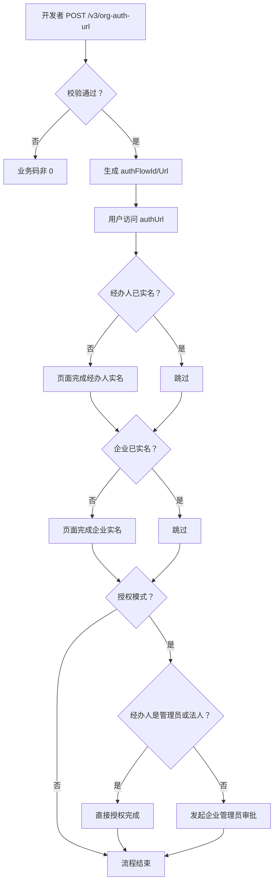

***

type: feature-prd
id: F-001
title: 认证授权与免登体系
status: draft
version: "1.3"
created: 2026-05-19
updated: 2026-05-20
author: 门生
feature-area: auth3
epic: E-001
related-stories: \[]
has-prototype: false
prototype-path:
req-ids: \[]
notes: "从 Epic E-001 §F-001 章节抽取并对照 assets/opendoc/auth3/ 全量补充 §8 详细字段；req-ids 未匹配（iteration-requirement-list.md 为空模板）。"
------------------------------------------------------------------------------------------------------------------------

# 认证授权与免登体系

## 1 文档元数据

| 字段       | 内容                                                          |
| -------- | ----------------------------------------------------------- |
| PRD-ID   | F-001                                                       |
| 产品线      | 认证授权（auth3）                                                 |
| 需求类型     | 新功能（V3 标准化重构）                                               |
| 需求状态     | 草稿                                                          |
| 当前版本     | V1.3                                                        |
| 最后更新日期   | 2026-05-20                                                  |
| 关键词（Tag） | 实名认证、用户授权、authFlowId、authorizedScopes、免登、回调                 |
| 关联需求卡片   | 暂无（从 Epic E-001 抽取，未走 /requirement-clarifier）               |
| 关联页面规格卡  | 待产出                                                         |
| 关联原型文件   | 待产出                                                         |
| 所属 Epic  | [E-001 e签宝 OpenAPI 3.0 一期](../E-001-e签宝OpenAPI3.0一期/prd.md) |

## 2 文档修订记录

| 版本   | 日期         | 修订内容                                                                                                                                                                                                 | 修订人              |
| ---- | ---------- | ---------------------------------------------------------------------------------------------------------------------------------------------------------------------------------------------------- | ---------------- |
| V0.1 | 2022-02-22 | 原始内容（Epic E-001 V0.1 中 F-001 部分），已归档至 archive/original-v0.1.md                                                                                                                                       | 门生               |
| V1.0 | 2026-05-19 | 从 Epic E-001 抽取 F-001 内容，对照 assets/opendoc/auth3/ 补充 §8 全量字段说明，重构为标准 Feature PRD 格式                                                                                                                  | AI 生成（门生 review） |
| V1.1 | 2026-05-20 | context 维护后一致性同步：§3.2 对齐 user-persona / §4 引用 business-glossary 精简术语 / §5.3 BR-01 引用 permission-model / §9.4 端清单对齐 platform-support 补足支付宝小程序+钉钉+飞书+企微                                                | AI 同步            |
| V1.2 | 2026-05-20 | 与 feature-map.md AUTH 域 A1-A4 子节点对齐：CATEGORY 由 URL/AUTHZ/IDENT/FLOW/CB 重划为 PSN/ORG/FLOW/CB；6 个功能 ID 重命名（URL→PSN/ORG，AUTHZ→PSN/ORG，IDENT→PSN/ORG）；§5.1 Mermaid 引用 A1-A4 作为上层锚点；§7 新增「feature-map 归属」列 | AI 同步            |
| V1.3 | 2026-05-20 | BR-04 规则修正（实名模式下，未实名返回 authUrl，已实名报错）；§8.3 异常处理补充"实名后不会生效"说明；§8.4 业务流转图调整为「经办人→企业→授权判断」顺序 | 门生修正          |

## 3 需求概要

### 3.1 问题与机会（概要）

**现状问题**：

- 旧版 API（V1/V2）的认证授权能力分散，未对"实名认证"和"资源授权"两个独立业务诉求建立清晰边界
- 部分授权范围（如代发起签署、获取身份信息）缺少颗粒度控制，无法满足《电子签名法》对用户知情权和最小化授权的合规要求
- 集成开发者难以判断"用户当前是否实名"/"应用是否被授权"，导致签署中频繁卡点

**机会**：

- V3 提供标准化的 RESTful API，明确"实名认证"和"用户授权"两条独立但可组合的链路
- 通过 `authFlowId` 把一次认证授权流程串起来，让开发者既能拿到结果回调，也能主动查询流程详情
- 通过细颗粒度的 `authorizedScopes` 模型，让应用按需申请权限，未授权场景接口层直接拦截，满足合规审查

### 3.2 目标用户（概要）

> 用户画像参考：context/user-persona.md

- **核心用户**：**P3 企业集成开发者**——承担在自家业务系统中发起认证/授权、保存 psnId/orgId、订阅回调的工作；主要痛点是文档与行为不一致、回调丢失乱序、错误码语义模糊
- **次级用户**：**P6 任务执行者**（个人用户 / 机构经办人）——通过 e签宝 提供的认证授权页面完成实名与授权操作；主要诉求是入口顺畅、操作明确、能在多端（小程序/App/H5/PC）流畅完成
- **间接用户**：**P2 平台运营人员**——通过查询类接口（AUTH-PSN-002/003、AUTH-ORG-002/003、AUTH-FLOW-001）排查"为何签署被拒""授权是否过期"等问题

### 3.3 方案概述

提供 1 套覆盖"个人 / 机构"两类主体、"实名认证 / 授权认证"两种模式的认证授权能力，按 feature-map.md AUTH 域的 4 个子节点组织：

1. **A1 个人认证与授权**（3 项，AUTH-PSN-001/002/003）：个人入口链接 + 个人授权信息查询 + 个人认证信息查询
2. **A2 机构认证与授权**（3 项，AUTH-ORG-001/002/003）：机构入口链接 + 机构授权信息查询 + 机构认证信息查询
3. **A3 认证授权信息查询**（1 项，AUTH-FLOW-001）：按 authFlowId 查询流程完整详情，跨主体的统一排查入口
4. **A4 授权变更回调**（3 项，AUTH-CB-001/002/003）：实名通过 / 授权完成 / 授权范围变更，主动向开发者推送状态变化

所有接口遵守"appId ≠ 7488 且 URL 含 `/v3/`"则强制校验授权关系的全局规则（BR-01，详见 context/permission-model.md）。

### 3.4 成功指标（3-5 项）

| 指标                    | 目标值             | 观测时间     | 数据来源            |
| --------------------- | --------------- | -------- | --------------- |
| 开发者认证授权对接平均工时         | ≤ 0.5 人日        | 上线后 90 天 | 开发者满意度问卷 + 工单统计 |
| 「未授权 / 授权过期」类签署卡点工单占比 | 较 V2 同期下降 ≥ 50% | 上线后 90 天 | 客服工单系统          |
| 授权完成回调送达成功率（重试后）      | ≥ 99.5%         | 月度       | data-push3 投递指标 |
| 认证授权页面进入到完成的转化率       | ≥ 70%           | 月度       | 认证流程埋点          |

***

## 4 需求对象与概念模型

> 业务术语参考：context/business-glossary.md
> 已在术语表收录、本 PRD 直接引用、不再重复定义的术语：psnId、orgId、authFlowId、authorizedScopes（授权范围）、实名认证、意愿认证、经办人、appId、V3 API。
> 以下仅列出本 PRD **新引入**的术语与枚举。

| 术语               | 类型  | 定义                       | 约束/备注                                                                              |
| ---------------- | --- | ------------------------ | ---------------------------------------------------------------------------------- |
| realnameStatus   | 枚举值 | 用户在 e签宝 的实名认证状态          | 0=未实名 / 1=已实名；与 authorizedStatus 相互独立（BR-10）                                       |
| authorizedStatus | 枚举值 | 一次认证授权流程的授权状态            | 0=流程过期失效 / 1=已授权 / 2=授权中 / 3=审批未通过；3 仅出现在"经办人非管理员需企业审批"场景                          |
| 授权认证模式           | 枚举值 | 「获取认证&授权页面链接」接口的两种行为模式之一 | 触发条件：请求体含非空 `authorizeConfig.authorizedScopes`；行为：实名 + 资源授权一体化                     |
| 实名认证模式           | 枚举值 | 同上接口的另一种模式               | 触发条件：`authorizedScopes` 为空或未传 `authorizeConfig`；行为：仅做实名认证，已实名用户重复发起会被接口拒绝（BR-04） |

### 4.1 authorizedScopes 取值清单

| Scope                    | 适用主体       | 含义                                      | 版本约束（自 2024-09-12）        |
| ------------------------ | ---------- | --------------------------------------- | ------------------------- |
| get\_psn\_identity\_info | 个人 / 机构经办人 | 获取个人账号基本信息（姓名、手机号/邮箱、证件号）               | 高级版 / 生态伙伴                |
| get\_org\_identity\_info | 机构         | 获取企业/组织基本信息（含国家信息公示网查不到的法定代表人证件号、对公账户等） | 高级版 / 生态伙伴                |
| psn\_initiate\_sign      | 个人 / 机构经办人 | 代表个人用户发起合同签署及查询详情                       | 生态伙伴                      |
| org\_initiate\_sign      | 机构         | 代表企业/组织发起合同签署及查询详情                      | 生态伙伴                      |
| manage\_psn\_resource    | 个人 / 机构经办人 | 获取个人印章等资源管理权限                           | 高级版 / 生态伙伴                |
| manage\_org\_member      | 机构         | 企业成员查、增、改、删                             | 高级版 / 生态伙伴                |
| manage\_org\_seal        | 机构         | 企业印章查、增、改、授权、删                          | 高级版 / 生态伙伴                |
| manage\_org\_template    | 机构         | 企业模板查、增、改、复制、删                          | 高级版 / 生态伙伴                |
| use\_org\_template       | 机构         | 使用企业模板发起                                | 高级版 / 生态伙伴                |
| manage\_org\_resource    | 机构         | 企业印章 + 成员等资源管理（不含用印）                    | 高级版 / 生态伙伴                |
| psn\_sign\_file\_storage | 个人         | 个人合同文件存储到平台应用本地服务器                      | 仅专属云项目                    |
| org\_sign\_file\_storage | 机构         | 企业合同文件存储到平台应用本地服务器                      | 仅专属云项目                    |
| org\_approval\_info      | 机构         | 获取企业用印审批信息                              | 高级版 / 生态伙伴                |
| use\_org\_order          | 机构         | 使用企业套餐订单                                | 生态伙伴                      |
| apply\_psn\_evidence     | 个人 / 机构经办人 | 代表个人申请出证                                | 高级版 / 生态伙伴（2025-09-22 新增） |
| apply\_org\_evidence     | 机构         | 代表企业申请出证                                | 高级版 / 生态伙伴（2025-09-22 新增） |
| org\_function\_benefits  | 机构         | 查询企业在 e签宝 官网功能权益                        | 高级版 / 生态伙伴（2025-09-22 新增） |
| manage\_org\_contract    | 机构         | 获取企业合同管理权限                              | 高级版 / 生态伙伴（2026-01-22 新增） |

***

## 5 功能结构

> 完整产品功能结构参考：context/product-feature-map.md（当前为初始化模板）
> 本 PRD 为 auth3 域首次正式 PRD，新增 AUTH 前缀（认证授权域）的功能编号空间。

### 5.1 本需求新增的功能节点

> 本图与 context/product-feature-map.md AUTH 域的 A1-A4 子节点完全同构，仅展开本 PRD 的具体功能项。



### 5.2 本需求核心业务流程



### 5.3 核心业务规则

> 跨多个功能的全局约束，单功能内部异常归入对应 §8.x.3。

| 规则编号  | 规则描述                                                                                                                                                                      | 备注                                                                            |
| ----- | ------------------------------------------------------------------------------------------------------------------------------------------------------------------------- | ----------------------------------------------------------------------------- |
| BR-01 | 仅当 `appId ≠ 7488` 且接口路径包含 `/v3/` 时，平台强制校验该应用是否拥有目标用户的对应 `authorizedScope`；不通过则接口层直接拒绝（详细错误码见 §8.x.3）                                                                      | 平台 ABAC 校验规则，详见 context/permission-model.md §校验规则；appId 7488 为 e签宝 自有调用方，例外放行 |
| BR-02 | 一个 `authFlowId` 的认证授权长/短链接（`authUrl` / `authShortUrl`）有效期统一为 30 天；过期后须重新调用入口接口生成新链接                                                                                       | opendoc rx8igf / kcbdu7 响应参数说明                                                |
| BR-03 | `authorizedScopes` 中每个 scope 独立计算 `effectiveTime` / `expireTime`，过期后该 scope 单独失效，其他未过期 scope 不受影响；开发者应按 scope 维度判断而非整体                                                    | opendoc nurtvw / ytn2tt 响应数据结构                                                |
| BR-04 | 实名认证模式（`authorizedScopes` 为空或未传 `authorizeConfig`）下：若用户**未实名**，正常返回 `authUrl` 让用户进行实名；若用户**已实名**，接口直接报错 `"个人用户已实名"` / `"企业用户已实名"`，不返回 `authUrl`；授权认证模式下不会报此错，允许已实名用户走授权流程 | opendoc rx8igf / kcbdu7 接口描述                                                  |
| BR-05 | 部分 scope 自 2024-09-12 起需 e签宝 高级版 / 生态伙伴版本方可指定（见 §4.1）；普通版本指定受限 scope 会在「获取认证&授权页面链接」接口返回业务码非 0，不进入页面                                                                      | opendoc rx8igf / kcbdu7 warning 区                                             |
| BR-06 | 当 `psnIdentityVerify=true` 或 `orgIdentityVerify=true` 时，传入的身份信息须与 e签宝 已有信息完全一致；不一致则接口报错并阻断发起，提示具体不匹配字段（姓名/证件号/实名手机号/银行卡号）                                                 | opendoc rx8igf / kcbdu7 字段说明                                                  |
| BR-07 | `redirectUrl` 所在域名须事先在 e签宝 后台放行；未放行域名跳转时页面提示「您即将访问的页面可能有安全风险」                                                                                                             | opendoc rx8igf / kcbdu7 字段说明                                                  |
| BR-08 | 回调通知（AUTH\_PASS / AUTHORIZE\_FINISH / AUTHORIZE\_CHANGE）通过用户首次发起认证授权时传入的 `notifyUrl` 推送，开发者侧应做幂等处理；Action 事件类型可能新增，开发者应忽略未知类型而非报错                                         | opendoc uozx98z5qom8ce5d warning 区                                            |
| BR-09 | iframe 内嵌集成不支持人脸识别认证方式（`PSN_FACE`）；如开发者需要在 iframe 中使用，须把 `psnAvailableAuthModes` 限制为 `PSN_MOBILE3` / `PSN_BANKCARD4`                                                      | opendoc rx8igf / kcbdu7 字段说明                                                  |
| BR-10 | 实名认证状态（`realnameStatus`）与授权状态（`authorizedStatus`）相互独立：实名是用户和 e签宝 之间的一次性事件；授权是用户与 appId 之间、按 scope 维度、可被取消、可过期的关系                                                          | 综合 opendoc nurtvw / vssvtu / hlrs7s                                           |

***

## 6 用户故事与用例

### 6.1 Epic

让企业集成开发者能以最低成本接入合规的"实名认证 + 资源授权"能力，使最终用户在不离开开发者业务系统的前提下完成 e签宝 平台的身份核验和应用授权，从而支撑后续签署 / 印章 / 模板 / 成员等业务接口的合法调用。

### 6.2 Must Have（MVP）

**故事 1：开发者为新用户发起个人实名认证 + 授权**

```text
作为企业集成开发者，
我希望传入用户的手机号和身份信息后，拿到一个 e签宝 认证授权页面链接，
以便我把链接透传给最终用户，让用户在 e签宝 完成实名 + 授权后，我能通过回调拿到 psnId 和授权有效期。
```

验收标准（Gherkin）：

- Given 调用方持有合法 appId（≠ 7488）和待认证用户的手机号
- When 调用 `POST /v3/psn-auth-url`，传入 `psnAccount` + `psnInfo` + `authorizeConfig.authorizedScopes = ["get_psn_identity_info"]`
- Then 返回 `code=0`、`data.authFlowId` 非空、`data.authUrl` 为有效 https 链接
- And 用户访问 `authUrl` 完成实名后，开发者 `notifyUrl` 收到 `Action=AUTH_PASS` 通知，含 `psnId`
- And 用户在页面完成授权后，开发者 `notifyUrl` 再收到 `Action=AUTHORIZE_FINISH` 通知，含 `authorizedScopes` 及其有效期

**故事 2：开发者为已知 psnId 用户主动查询授权状态**

```text
作为企业集成开发者，
我希望按 psnId 查询当前应用对该用户的授权范围和有效期，
以便我在调用受授权保护的接口前主动判断"是否需要重新发起授权"，避免业务卡点。
```

验收标准（Gherkin）：

- Given 调用方持有目标用户的 `psnId`，且过去 30 天内为其发起过授权
- When 调用 `GET /v3/persons/{psnId}/authorized-info`
- Then 返回 `data.authorizedInfo` 为列表，每项含 `authorizedScope`、`effectiveTime`、`expireTime`
- And 已过期 scope 不在返回列表中（或返回但 `expireTime` 早于当前时间）

**故事 3：机构经办人代企业完成实名 + 授权**

```text
作为机构经办人（个人），
我希望在开发者业务系统中点击「企业认证授权」入口后，跳转到 e签宝 页面完成机构实名（对公打款 / 法人快捷 / 法定代表人本人认证之一）+ 应用授权，
以便我所属的企业能被开发者代为发起合同签署。
```

验收标准（Gherkin）：

- Given 调用方调用 `POST /v3/org-auth-url`，传入 `orgAuthConfig` + `transactorInfo` + `authorizeConfig.authorizedScopes`
- When 经办人在 `authUrl` 页面完成机构实名 + 经办人个人实名 + 授权
- Then 开发者 `notifyUrl` 依序收到 `AUTH_PASS`（含 `orgId` 与经办人 `psnId`）、`AUTHORIZE_FINISH`
- And 调用 `GET /v3/auth-flow/{authFlowId}` 可拿到本次流程的完整详情（含使用的认证方式、流程时间戳、授权 scope 列表）

**故事 4：开发者侦听授权范围变更**

```text
作为企业集成开发者，
我希望在用户主动取消授权或部分 scope 过期时，第一时间收到通知，
以便我刷新本地缓存，避免在调用业务接口时才发现授权已失效。
```

验收标准（Gherkin）：

- Given 开发者已订阅 `notifyUrl`
- When 用户在 e签宝 官网或 App 中取消该 appId 的某个 scope
- Then 开发者 `notifyUrl` 收到 `Action=AUTHORIZE_CHANGE` 通知
- And 调用 `GET /v3/persons/{psnId}/authorized-info` 或 `GET /v3/organizations/{orgId}/authorized-info` 返回的列表不再包含被取消的 scope

**故事 5：先查后发起，避免重复实名**

```text
作为企业集成开发者，
我希望在为用户发起实名认证前，先查一次用户是否已实名，
以便我在已实名用户上跳过实名步骤、直接走授权流程，提升用户体验。
```

验收标准（Gherkin）：

- Given 调用方持有用户的手机号 `psnAccount`
- When 先调用 `GET /v3/persons/identity-info?psnAccount=xxx`
- Then 返回 `data.realnameStatus`（0 / 1）；若 `=1` 则可直接进入授权认证模式，不传 `psnAuthPageConfig.psnAvailableAuthModes`，让用户跳过实名直接到授权页

***

## 7 功能清单（AI 实现主清单）

> 功能编号格式：`AUTH-[CATEGORY]-[SEQ]`，AUTH 为 auth3 域前缀（见 context/product-feature-map.md 前缀映射表）。
> CATEGORY 与 feature-map.md AUTH 域 A1-A4 子节点一一对应：**PSN**（A1 个人认证与授权）/ **ORG**（A2 机构认证与授权）/ **FLOW**（A3 认证授权信息查询）/ **CB**（A4 授权变更回调）。

| 功能编号          | feature-map 归属 | 功能名称（全限定）                           | 功能描述（Job Story）                                                   | 优先级 | 需求来源                           |
| ------------- | -------------- | ----------------------------------- | ----------------------------------------------------------------- | --- | ------------------------------ |
| AUTH-PSN-001  | A1             | 认证授权-个人-获取认证&授权页面链接                 | 当开发者要为个人用户发起实名/授权时，传入手机号或 psnId 拿到长/短链接，把链接透传给用户去完成操作             | P0  | opendoc auth3/rx8igf           |
| AUTH-PSN-002  | A1             | 认证授权-个人-查询授权信息                      | 当开发者需要确认当前应用对某个 psnId 的授权范围与有效期时，按 psnId 查询授权列表，可在调用受授权接口前判断是否仍有效 | P0  | opendoc auth3/nurtvw           |
| AUTH-PSN-003  | A1             | 认证授权-个人-查询认证信息                      | 当开发者需要判断个人用户是否在 e签宝 已实名时，按 psnId / psnAccount / 证件号查询实名状态及身份信息    | P0  | opendoc auth3/vssvtu           |
| AUTH-ORG-001  | A2             | 认证授权-机构-获取认证&授权页面链接                 | 当开发者要为机构发起实名/授权时，传入企业信息和经办人信息拿到链接，经办人可代企业完成认证授权                   | P0  | opendoc auth3/kcbdu7           |
| AUTH-ORG-002  | A2             | 认证授权-机构-查询授权信息                      | 当开发者需要确认当前应用对某个 orgId 的授权范围与有效期时，按 orgId 查询授权列表                   | P0  | opendoc auth3/ytn2tt           |
| AUTH-ORG-003  | A2             | 认证授权-机构-查询认证信息                      | 当开发者需要判断企业是否在 e签宝 已实名时，按 orgId / orgName / 统一社会信用代码查询实名状态及机构信息    | P0  | opendoc auth3/xxz4tc           |
| AUTH-FLOW-001 | A3             | 认证授权-流程-查询认证授权流程详情                  | 当开发者要排查一次具体的认证授权流程时，按 authFlowId 拿到完整流程信息（含使用的认证方式、流程时间戳、授权详情）    | P0  | opendoc auth3/hlrs7s           |
| AUTH-CB-001   | A4             | 认证授权-回调-实名认证通过通知（AUTH\_PASS）        | 当用户在 e签宝 页面完成实名时，e签宝 主动通知开发者 notifyUrl，开发者从中取到 psnId / orgId      | P0  | opendoc auth3/uozx98z5qom8ce5d |
| AUTH-CB-002   | A4             | 认证授权-回调-授权完成通知（AUTHORIZE\_FINISH）   | 当用户在 e签宝 页面完成授权时，e签宝 主动推送授权完成事件，含本次授权的 scope 列表及有效期               | P0  | opendoc auth3/uozx98z5qom8ce5d |
| AUTH-CB-003   | A4             | 认证授权-回调-授权范围变更通知（AUTHORIZE\_CHANGE） | 当用户主动取消某个 scope 或 scope 自然过期时，e签宝 推送变更事件，开发者据此刷新本地缓存              | P0  | opendoc auth3/uozx98z5qom8ce5d |

***

## 8 功能需求说明书（逐功能展开）

***

### AUTH-PSN-001 认证授权-个人-获取认证&授权页面链接 需求说明

#### 8.1 任务故事（Job Story）

当开发者需要为某个个人用户发起 e签宝 实名认证 + 资源授权时，我想要传入用户的手机号/邮箱（或已有 psnId）以及身份附加信息，拿到一个 e签宝 提供的 https 长/短链接，这样我可以把链接透传给用户去完成实名 + 授权，操作完成后通过 notifyUrl 接收回调。

#### 8.2 逻辑实现规范

##### Context（前置条件）

- 调用方持有合法 appId（≠ 7488），并已配置 `redirectUrl` 域名在 e签宝 后台放行
- 待认证用户的手机号或邮箱（psnAccount）已采集
- 若要进入「授权认证模式」，需明确本次申请的 `authorizedScopes` 列表，且应用版本满足 scope 版本约束（参考 §4.1 + BR-05）

##### Action（触发动作）

1. 开发者构造请求体：`psnAuthConfig`（必填，含 `psnAccount` 或 `psnId` 二选一）、`authorizeConfig.authorizedScopes`（可选，决定模式）、`redirectConfig`、`notifyUrl`、`clientType`、`appScheme`
2. 开发者发起 `POST {host}/v3/psn-auth-url`
3. 系统校验请求头签名 / OAuthToken、appId 与 scope 版本约束、身份信息一致性（若 `psnIdentityVerify=true`）
4. 系统生成 `authFlowId` 与 30 天有效的 `authUrl` / `authShortUrl`，返回开发者

##### Outcome（预期结果）

1. **业务返回**：`code=0`、`data.authFlowId` 非空（格式形如 `OF-xxxxxxx`）、`data.authUrl` 为 e签宝 提供的 https 长链、`data.authShortUrl` 为短链
2. **数据变化**：系统侧记录一条 `auth-flow`（状态：未开始），关联 `appId` + `psnAccount` / `psnId`
3. **链接行为**：用户访问 `authUrl` 进入 e签宝 提供的 H5/PC 自适应页面（受 `clientType` 控制）；按 `psnAuthPageConfig` 限定可选认证方式；完成实名/授权后按 `redirectConfig.redirectDelayTime` 跳转回 `redirectUrl`

#### 8.3 异常处理要求

| 异常场景                    | 触发条件                                                                                   | 系统行为（预期结果）                                                               |
| ----------------------- | -------------------------------------------------------------------------------------- | ------------------------------------------------------------------------ |
| 用户已实名（实名模式下）            | `authorizedScopes` 为空或未传 `authorizeConfig`，且 `psnAccount` 对应用户已在 e签宝 实名                                      | 接口返回业务码非 0，message 含「个人用户已实名」；不生成 `authUrl`                              |
| 身份信息不一致                 | `psnInfo.psnIdentityVerify=true`，传入字段与 e签宝 已有信息不一致                                     | 接口返回业务码非 0，message 含「传入的%s和该用户在e签宝的个人信息不一致」，%s 列出具体字段（姓名/证件号/实名手机号/银行卡号） |
| Scope 受版本约束             | 调用方应用非高级版/生态伙伴，但 `authorizedScopes` 含受限 scope                                          | 接口返回业务码非 0，提示 scope 不可指定，需联系商务升级                                         |
| redirectUrl 未放行         | 用户从 `authUrl` 跳转回 `redirectUrl` 时域名不在白名单                                               | 页面提示「您即将访问的页面可能有安全风险」，不跳转                                                |
| psnAccount 与 psnId 同时未传 | `psnAuthConfig` 中 `psnAccount` 与 `psnId` 均为空                                           | 用户进入页面后需自主填写手机号/邮箱并回填验证码注册，不阻断接口；但开发者后续无法把 psnId 关联到具体用户                 |
| iframe 内嵌指定 PSN\_FACE   | `psnAvailableAuthModes` 或 `psnDefaultAuthMode` 含 `PSN_FACE` 且 `clientType` 实际嵌入 iframe | 页面侧不支持刷脸，跳过该方式或提示用户改用其他方式                                                |
| authFlowId 过期           | 用户在 30 天后才访问 `authUrl`                                                                 | 页面提示链接已失效；开发者须重新调用本接口生成新链接                                               |

#### 8.4 业务流转图



#### 8.5 数据字典

请求参数详见 opendoc auth3/rx8igf。本节列出核心字段：

| 字段名                                                   | 来源页面     | 类型      | 逻辑约束                                                                                                                    |
| ----------------------------------------------------- | -------- | ------- | ----------------------------------------------------------------------------------------------------------------------- |
| psnAuthConfig.psnAccount                              | body     | string  | 与 psnId 二选一；手机号或邮箱                                                                                                      |
| psnAuthConfig.psnId                                   | body     | string  | 与 psnAccount 二选一                                                                                                        |
| psnAuthConfig.psnInfo.psnName                         | body     | string  | 姓名                                                                                                                      |
| psnAuthConfig.psnInfo.psnIDCardNum                    | body     | string  | 证件号码（与 psnIDCardType 配对）                                                                                                |
| psnAuthConfig.psnInfo.psnIDCardType                   | body     | string  | 枚举：CRED\_PSN\_CH\_IDCARD / CRED\_PSN\_CH\_HONGKONG / CRED\_PSN\_CH\_MACAO / CRED\_PSN\_CH\_TWCARD / CRED\_PSN\_PASSPORT |
| psnAuthConfig.psnInfo.psnMobile                       | body     | string  | 仅用于认证（运营商实名手机号 / 银行卡预留手机号）                                                                                              |
| psnAuthConfig.psnInfo.bankCardNum                     | body     | string  | 个人银行卡号                                                                                                                  |
| psnAuthConfig.psnInfo.psnIdentityVerify               | body     | boolean | true=强校验；false=默认值，不校验                                                                                                  |
| psnAuthConfig.psnAuthPageConfig.psnDefaultAuthMode    | body     | string  | 枚举：PSN\_FACE（默认）/ PSN\_MOBILE3 / PSN\_BANKCARD4                                                                         |
| psnAuthConfig.psnAuthPageConfig.psnAvailableAuthModes | body     | list    | 限定可选方式，子集 of psnDefaultAuthMode                                                                                         |
| psnAuthConfig.psnAuthPageConfig.psnEditableFields     | body     | list    | 取值：name / IDCardNum / mobile / bankCardNum                                                                              |
| authorizeConfig.authorizedScopes                      | body     | list    | 见 §4.1；非空进入授权认证模式                                                                                                       |
| redirectConfig.redirectUrl                            | body     | string  | https/http；域名须放行                                                                                                        |
| redirectConfig.redirectDelayTime                      | body     | string  | 秒数；0=不展示结果页                                                                                                             |
| notifyUrl                                             | body     | string  | https/http；回调地址                                                                                                         |
| clientType                                            | body     | string  | ALL（默认）/ H5 / PC                                                                                                        |
| appScheme                                             | body     | string  | 支付宝刷脸回跳 App 时的 scheme                                                                                                   |
| data.authFlowId                                       | response | string  | 流程 ID                                                                                                                   |
| data.authUrl                                          | response | string  | 长链（30 天）                                                                                                                |
| data.authShortUrl                                     | response | string  | 短链（30 天）                                                                                                                |

#### 8.6 状态流转表

| 当前状态        | 触发动作         | 条件     | 下一个状态                      | 失败处理             |
| ----------- | ------------ | ------ | -------------------------- | ---------------- |
| 流程已创建（未操作）  | 用户访问 authUrl | 30 天内  | 流程进行中                      | 30 天后链接失效，需重新生成  |
| 流程进行中       | 用户完成实名       | 实名校验通过 | 已实名（待授权 / 完成）              | 校验失败可在页面内重试      |
| 已实名（授权认证模式） | 用户在页面授权      | 选择允许   | 已授权（流程完结）                  | 选择拒绝则流程进入「授权未通过」 |
| 流程进行中       | 30 天未操作      | 时间触发   | 流程过期失效（authorizedStatus=0） | —                |

#### 8.7 权限矩阵

| 角色          | 可见范围           | 可执行动作          | 数据范围约束                       | 失败提示                     |
| ----------- | -------------- | -------------- | ---------------------------- | ------------------------ |
| 接入应用（appId） | 所有应用           | 调用本接口          | 仅能为传入的 psnAccount/psnId 创建流程 | 鉴权失败：401/403；签名错误：业务码非 0 |
| 最终个人用户      | 自己的 authUrl 页面 | 完成实名 / 授权 / 拒绝 | 一个 authFlowId 仅供发起时指定的用户使用   | 用户已实名（实名模式）：页面提示重定向      |

#### 8.8 边界条件与并发规则

- **数值边界**：authFlowId 长度 ≤ 64；authUrl 长度 ≤ 2048；可同时为同一用户存在多个未完成 authFlowId
- **时序冲突**：用户同时持有两个未完成 authFlowId 时，完成其中之一不会影响另一个的有效期；后续 30 天均可访问
- **数据依赖**：依赖 e签宝 SaaS 实名认证服务、域名白名单服务、scope 版本订阅信息

#### 8.9 PRD-页面规格卡映射

| 功能编号         | PRD 章节位置 | 页面规格卡区段        | 页面规格卡状态 | 一致性说明       |
| ------------ | -------- | -------------- | ------- | ----------- |
| AUTH-PSN-001 | §8       | 待产出（认证授权页·个人版） | 待产出     | 待页面规格卡产出后回填 |

#### 8.10 对外 OpenAPI 变更说明

| 变更类型 | 接口路径             | HTTP 方法 | 变更内容描述                            | 是否影响对外文档 |
| ---- | ---------------- | ------- | --------------------------------- | -------- |
| 新增   | /v3/psn-auth-url | POST    | V3 新增个人认证授权页面链接接口；相对 V2 拆分为独立个人入口 | 是        |

***

### AUTH-ORG-001 认证授权-机构-获取认证&授权页面链接 需求说明

#### 8.1 任务故事

当开发者需要为某个企业机构发起 e签宝 实名认证 + 资源授权时，我想要传入企业信息（orgName / orgId / orgInfo）以及经办人信息（transactorInfo），拿到一个 e签宝 提供的 https 长/短链接，这样经办人能代企业完成机构实名 + 经办人个人实名 + 应用授权，操作完成后通过 notifyUrl 接收回调。

#### 8.2 逻辑实现规范

##### Context（前置条件）

- 与 AUTH-PSN-001 相同的鉴权与域名前置条件
- 已采集企业信息（至少 `orgName` 或 `orgId` 之一）和经办人个人信息（至少 `psnAccount` 或 `psnId` 之一）
- 若计划使用对公打款认证方式，已采集 `orgInfo.orgBankAccountNum`
- 若使用"法定代表人本人意愿认证"，经办人需为法定代表人本人，且 `legalRepName` 与 `legalRepIDCardNum` 已采集

##### Action（触发动作）

1. 开发者构造请求体：`orgAuthConfig`（必填，含 `orgName`/`orgId`、`orgInfo`、`orgAuthPageConfig`、`transactorInfo`、`transactorAuthPageConfig`）、`authorizeConfig`、`redirectConfig`、`notifyUrl`、`clientType`、`appScheme`、`transactorUseSeal`、`orgIdentityVerify`
2. 开发者发起 `POST {host}/v3/org-auth-url`
3. 系统执行同上校验（含企业身份核验 `orgIdentityVerify` 配置）
4. 系统返回 `authFlowId` + `authUrl` + `authShortUrl`

##### Outcome（预期结果）

1. **业务返回**：与 AUTH-PSN-001 相同结构
2. **页面行为**：用户访问后依序完成「机构实名 → 经办人个人实名 → 资源授权」三段；首次为企业实名的经办人会自动成为企业管理员，后续无需为其单独获取用印权限
3. **数据变化**：流程绑定 appId、orgId（或 orgName）、经办人 psnAccount/psnId

#### 8.3 异常处理要求

| 异常场景                    | 触发条件                                                      | 系统行为（预期结果）                                                        |
| ----------------------- | --------------------------------------------------------- | ----------------------------------------------------------------- |
| 企业已实名（实名模式下）            | `authorizedScopes` 为空或未传 `authorizeConfig`，且 `orgName`/`orgId` 对应企业已实名          | 接口返回业务码非 0，message 含「企业用户已实名」                                     |
| 企业名称与 e签宝 已有信息不一致（更名场景） | `orgIdentityVerify=true`，传入 `orgName` 与同一证件号下 e签宝 已有名称不一致 | 接口报错；若 `orgIdentityVerify=false`（默认），允许正常发起，用户登录页面后按当前传入信息重新做企业实名实名后不会生效 |
| 法人身份与 e签宝 已有信息不一致（更名场景） | `transactorInfo.psnIdentityVerify=true`，且企业名称与法人身份信息同时与 e签宝 已有不一致 | 接口报错；若 `transactorInfo.psnIdentityVerify=false`（默认），允许正常发起，实名后不会生效 |
| 法人快捷认证条件不满足             | 经办人非法定代表人本人，却指定 `ORG_ALIPAY_CREDIT` 为默认认证方式               | 页面侧不展示法人快捷选项；用户改用其他方式                                             |
| 经办人身份不一致                | `transactorInfo.psnIdentityVerify=true` 且传入信息与 e签宝 已有不一致  | 接口返回业务码非 0，message 同 §AUTH-PSN-001                                |
| 经办人为非管理员且需要用印           | `transactorUseSeal=true` 但当前不为授权认证模式                      | 参数无效，不报错；用户不会自动获得用印权限                                             |
| 其他错误                    | 同 AUTH-PSN-001：版本约束、域名未放行、签名失败、链接过期                       | 同上                                                                |

#### 8.4 业务流转图



#### 8.5 数据字典

在 AUTH-PSN-001 字段基础上，新增：

| 字段名                                                   | 来源页面 | 类型      | 逻辑约束                                                                |
| ----------------------------------------------------- | ---- | ------- | ------------------------------------------------------------------- |
| orgAuthConfig.orgName                                 | body | string  | 与 orgId 二选一                                                         |
| orgAuthConfig.orgId                                   | body | string  | 与 orgName 二选一                                                       |
| orgAuthConfig.orgInfo.orgIDCardNum                    | body | string  | 组织机构证件号                                                             |
| orgAuthConfig.orgInfo.orgIDCardType                   | body | string  | CRED\_ORG\_USCC / CRED\_ORG\_REGCODE                                |
| orgAuthConfig.orgInfo.legalRepName                    | body | string  | 法定代表人姓名                                                             |
| orgAuthConfig.orgInfo.legalRepIDCardNum               | body | string  | 法定代表人证件号                                                            |
| orgAuthConfig.orgInfo.legalRepIDCardType              | body | string  | 同个人证件类型枚举                                                           |
| orgAuthConfig.orgInfo.orgBankAccountNum               | body | string  | 对公打款账户号；仅 ORG\_BANK\_TRANSFER 必填                                    |
| orgAuthConfig.orgAuthPageConfig.orgDefaultAuthMode    | body | string  | ORG\_BANK\_TRANSFER / ORG\_ALIPAY\_CREDIT / ORG\_LEGALREP\_INVOLVED |
| orgAuthConfig.orgAuthPageConfig.orgAvailableAuthModes | body | list    | 限定可选范围                                                              |
| orgAuthConfig.orgAuthPageConfig.orgEditableFields     | body | list    | orgNum / legalRepName / orgBankAccountNum                           |
| orgAuthConfig.transactorInfo.psnId / psnAccount       | body | string  | 经办人；二选一                                                             |
| orgAuthConfig.transactorInfo.psnInfo.\*               | body | object  | 同个人 psnInfo 字段                                                      |
| orgAuthConfig.transactorAuthPageConfig                | body | object  | 经办人认证页面配置；字段同 psnAuthPageConfig                                     |
| transactorUseSeal                                     | body | boolean | 经办人非管理员时是否获取企业全部印章用印权限                                              |
| orgIdentityVerify                                     | body | boolean | 企业身份信息校验配置                                                          |

#### 8.6 状态流转表

与 AUTH-PSN-001 相同，多了"机构实名 → 经办人实名"两阶段串接，单段失败可在页面内重试。

#### 8.7 权限矩阵

| 角色          | 可见范围       | 可执行动作                     | 数据范围约束               | 失败提示                      |
| ----------- | ---------- | ------------------------- | -------------------- | ------------------------- |
| 接入应用（appId） | 所有应用       | 调用本接口                     | 仅能为传入企业 + 经办人创建流程    | 同 AUTH-PSN-001            |
| 经办人         | authUrl 页面 | 完成机构实名 + 个人实名 + 授权        | 一个 authFlowId 仅供本经办人 | 经办人非法人时无法选法人快捷            |
| 企业管理员       | 企业控制台      | 审批经办人授权请求（授权认证模式且经办人非管理员） | 仅本企业                 | 审批未通过则 authorizedStatus=3 |

#### 8.8 边界条件与并发规则

- 同一企业可同时存在多个未完成 authFlowId（不同经办人）；互不冲突
- 首次实名的经办人会被设置为企业管理员；并发情况下，首个完成实名的经办人成为管理员

#### 8.9 PRD-页面规格卡映射

| 功能编号         | PRD 章节位置 | 页面规格卡区段        | 页面规格卡状态 | 一致性说明       |
| ------------ | -------- | -------------- | ------- | ----------- |
| AUTH-ORG-001 | §8       | 待产出（认证授权页·机构版） | 待产出     | 待页面规格卡产出后回填 |

#### 8.10 对外 OpenAPI 变更说明

| 变更类型 | 接口路径             | HTTP 方法 | 变更内容描述                            | 是否影响对外文档 |
| ---- | ---------------- | ------- | --------------------------------- | -------- |
| 新增   | /v3/org-auth-url | POST    | V3 新增机构认证授权页面链接接口；相对 V2 拆分为独立机构入口 | 是        |

***

### AUTH-PSN-002 认证授权-个人-查询授权信息 需求说明

#### 8.1 任务故事

当开发者需要确认当前应用（appId）对某个个人用户（psnId）的授权范围与有效期时，我想要按 psnId 查询授权列表，这样可在调用受授权保护接口前主动判断"是否仍有效"，避免业务接口被服务端拦截。

#### 8.2 逻辑实现规范

##### Context（前置条件）

- 调用方持有 psnId（来自历史回调或查询）
- 当前应用 appId 与 psnId 之间历史上存在过授权关系

##### Action（触发动作）

1. 开发者发起 `GET {host}/v3/persons/{psnId}/authorized-info`
2. 系统按 appId + psnId 查询授权关系表，返回所有未过期或最近一次的授权记录

##### Outcome（预期结果）

1. **业务返回**：`code=0`，`data.authorizedInfo` 数组；每项含 `authorizedScope` / `effectiveTime` / `expireTime`
2. **数据语义**：仅返回当前 appId 对该 psnId 的授权，跨 appId 数据隔离

#### 8.3 异常处理要求

| 异常场景                      | 触发条件                 | 系统行为                                          |
| ------------------------- | -------------------- | --------------------------------------------- |
| psnId 不存在                 | psnId 拼写错误或对应账号未注册   | 业务码非 0，message 提示用户不存在                        |
| 当前 appId 从未对该 psnId 发起过授权 | 不曾通过 AUTH-PSN-001 发起 | `data.authorizedInfo` 返回空数组（非报错），开发者据此判断需重新发起 |
| 所有 scope 已过期              | 距上次授权 > 有效期          | 仅返回最近过期记录或空数组（取决于平台策略），开发者应以 expireTime 判断为准  |

#### 8.4 业务流转图

不涉及（单步查询）。

#### 8.5 数据字典

| 字段名                                    | 来源页面     | 类型     | 逻辑约束    |
| -------------------------------------- | -------- | ------ | ------- |
| psnId                                  | path     | string | 必填      |
| data.authorizedInfo\[].authorizedScope | response | string | 见 §4.1  |
| data.authorizedInfo\[].effectiveTime   | response | int64  | Unix 毫秒 |
| data.authorizedInfo\[].expireTime      | response | int64  | Unix 毫秒 |

#### 8.6 状态流转表

不涉及。

#### 8.7 权限矩阵

| 角色          | 可见范围         | 可执行动作  | 数据范围约束     |
| ----------- | ------------ | ------ | ---------- |
| 接入应用（appId） | 仅本 appId 的授权 | 查询授权列表 | 跨 appId 隔离 |

#### 8.8 边界条件与并发规则

- 单次请求仅查询一个 psnId
- 与 AUTHORIZE\_CHANGE 回调存在时延：用户在 e签宝 官网取消授权后，最终一致；开发者可在收到回调后立即重查

#### 8.9 PRD-页面规格卡映射

不涉及（纯 API 接口，无页面）。

#### 8.10 对外 OpenAPI 变更说明

| 变更类型 | 接口路径                                | HTTP 方法 | 变更内容描述                        | 是否影响对外文档 |
| ---- | ----------------------------------- | ------- | ----------------------------- | -------- |
| 新增   | /v3/persons/{psnId}/authorized-info | GET     | V3 新增；按 psnId 查询当前应用对该用户的授权列表 | 是        |

***

### AUTH-ORG-002 认证授权-机构-查询授权信息 需求说明

#### 8.1 任务故事

当开发者需要确认当前应用对某个企业（orgId）的授权范围与有效期时，按 orgId 查询授权列表。

#### 8.2 逻辑实现规范

##### Context

- 调用方持有 orgId
- 当前 appId 与 orgId 历史上存在授权关系

##### Action

1. 发起 `GET {host}/v3/organizations/{orgId}/authorized-info`
2. 系统返回该 orgId 在当前 appId 下的所有授权记录

##### Outcome

结构与 AUTH-PSN-002 一致，但 scope 取值范围为机构 scope（见 §4.1）。

#### 8.3 异常处理要求

参见 AUTH-PSN-002（差异仅在主体）。

#### 8.4 业务流转图

不涉及。

#### 8.5 数据字典

| 字段名                                    | 来源页面     | 类型     | 逻辑约束            |
| -------------------------------------- | -------- | ------ | --------------- |
| orgId                                  | path     | string | 必填              |
| data.authorizedInfo\[].authorizedScope | response | string | 机构 scope，见 §4.1 |
| data.authorizedInfo\[].effectiveTime   | response | int64  | Unix 毫秒         |
| data.authorizedInfo\[].expireTime      | response | int64  | Unix 毫秒         |

#### 8.6 状态流转表

不涉及。

#### 8.7 权限矩阵

同 AUTH-PSN-002。

#### 8.8 边界条件与并发规则

同 AUTH-PSN-002。

#### 8.9 PRD-页面规格卡映射

不涉及。

#### 8.10 对外 OpenAPI 变更说明

| 变更类型 | 接口路径                                      | HTTP 方法 | 变更内容描述                        | 是否影响对外文档 |
| ---- | ----------------------------------------- | ------- | ----------------------------- | -------- |
| 新增   | /v3/organizations/{orgId}/authorized-info | GET     | V3 新增；按 orgId 查询当前应用对该机构的授权列表 | 是        |

***

### AUTH-PSN-003 认证授权-个人-查询认证信息 需求说明

#### 8.1 任务故事

当开发者需要判断个人用户是否已在 e签宝 实名时，我想要按 psnId / psnAccount（手机号或邮箱）/ psnIDCardNum（证件号）任一标识查询用户的实名状态、e签宝 账号 ID 以及（在已授权 `get_psn_identity_info` 时）身份信息，这样可在发起实名前避免重复操作。

#### 8.2 逻辑实现规范

##### Context

- 调用方持有 psnId / psnAccount / psnIDCardNum 三者之一
- 若传 psnIDCardNum，必须配套 psnIDCardType

##### Action

1. 发起 `GET {host}/v3/persons/identity-info?[psnId|psnAccount|psnIDCardNum&psnIDCardType]`
2. 系统按优先级 psnId > psnAccount > psnIDCardNum 命中用户

##### Outcome

1. 返回 `data.realnameStatus`（0/1）、`data.authorizeUserInfo`（true/false）、`data.psnId`
2. 当 `authorizeUserInfo=true`（即该用户已对当前应用授权 `get_psn_identity_info`）时，附加返回 `psnAccount`（含手机号/邮箱）和 `psnInfo`（姓名、证件号、银行卡号、实名手机号等）
3. **重要约束**：若用户通过刷脸方式实名，`psnInfo.psnMobile` 不会返回

#### 8.3 异常处理要求

| 异常场景                          | 触发条件            | 系统行为                                                                                     |
| ----------------------------- | --------------- | ---------------------------------------------------------------------------------------- |
| 三个标识都未传                       | 请求参数均为空         | 业务码非 0，message 提示参数缺失                                                                    |
| psnIDCardNum 未配 psnIDCardType | 仅传 psnIDCardNum | 业务码非 0，提示证件类型必传                                                                          |
| 用户不存在                         | 标识查不到对应账号       | 业务码非 0 或返回空 data，需以平台返回为准                                                                |
| 未授权 get\_psn\_identity\_info  | 用户未授权或授权已过期     | `authorizeUserInfo=false`；`psnAccount` 与 `psnInfo` 不返回，但 `realnameStatus` 与 `psnId` 仍可返回 |

#### 8.4 业务流转图

不涉及。

#### 8.5 数据字典

| 字段名                           | 来源页面     | 类型      | 逻辑约束                               |
| ----------------------------- | -------- | ------- | ---------------------------------- |
| psnId                         | query    | string  | 优先级最高                              |
| psnAccount                    | query    | string  | 与 psnId/psnIDCardNum 三选一           |
| psnIDCardNum                  | query    | string  | 配 psnIDCardType 使用                 |
| psnIDCardType                 | query    | string  | 5 种证件类型枚举                          |
| data.realnameStatus           | response | int32   | 0/1                                |
| data.authorizeUserInfo        | response | boolean | true=已授权 get\_psn\_identity\_info  |
| data.psnId                    | response | string  | e签宝 个人账号 ID                        |
| data.psnAccount.accountMobile | response | string  | 仅 authorizeUserInfo=true 返回        |
| data.psnAccount.accountEmail  | response | string  | 仅 authorizeUserInfo=true 返回        |
| data.psnInfo.psnName          | response | string  | 仅 authorizeUserInfo=true 返回        |
| data.psnInfo.psnNationality   | response | string  | 暂无值返回                              |
| data.psnInfo.psnIDCardNum     | response | string  | 仅 authorizeUserInfo=true 返回        |
| data.psnInfo.psnIDCardType    | response | string  | 仅 authorizeUserInfo=true 返回        |
| data.psnInfo.bankCardNum      | response | string  | 仅 authorizeUserInfo=true 返回        |
| data.psnInfo.psnMobile        | response | string  | 仅 authorizeUserInfo=true 且非刷脸认证时返回 |

#### 8.6 状态流转表

不涉及。

#### 8.7 权限矩阵

| 角色          | 可见范围      | 可执行动作 | 数据范围约束                                   |
| ----------- | --------- | ----- | ---------------------------------------- |
| 接入应用（appId） | 全平台用户实名状态 | 查询    | 身份信息仅当用户已授权 get\_psn\_identity\_info 时返回 |

#### 8.8 边界条件与并发规则

不涉及（幂等查询）。

#### 8.9 PRD-页面规格卡映射

不涉及。

#### 8.10 对外 OpenAPI 变更说明

| 变更类型 | 接口路径                      | HTTP 方法 | 变更内容描述                                                      | 是否影响对外文档 |
| ---- | ------------------------- | ------- | ----------------------------------------------------------- | -------- |
| 新增   | /v3/persons/identity-info | GET     | V3 新增；按 psnId / psnAccount / psnIDCardNum 任一标识查询个人实名状态及身份信息 | 是        |

***

### AUTH-ORG-003 认证授权-机构-查询认证信息 需求说明

#### 8.1 任务故事

当开发者需要判断企业是否已在 e签宝 实名时，按 orgId / orgName / orgIDCardNum 任一标识查询。

#### 8.2 逻辑实现规范

##### Context

- 调用方持有 orgId / orgName / orgIDCardNum 三者之一
- 若传 orgIDCardNum，必须配套 orgIDCardType

##### Action

1. `GET {host}/v3/organizations/identity-info?[orgId|orgName|orgIDCardNum&orgIDCardType]`
2. 优先级：orgId > orgName > orgIDCardNum

##### Outcome

1. 返回 `data.realnameStatus`、`data.authorizeUserInfo`、`data.orgId`、`data.orgName`、`data.orgAuthMode`
2. `data.orgInfo` 含证件号、法定代表人信息、对公账户信息、营业执照下载地址（按授权和功能开启情况返回）
3. **重要约束**：
   - 实名机构默认返回 orgName、orgIDCardNum、orgIDCardType、legalRepName、adminName（脱敏）、adminAccount（脱敏）
   - `legalRepIDCardNum` / `legalRepIDCardType` / `corporateAccount` / `orgBankAccountNum` / `cnapsCode` / `authorizationDownloadUrl` 仅当用户授权 `get_org_identity_info` 才返回
   - `licenseDownloadUrl` 需联系交付顾问开启「页面 OCR-营业执照上传」功能且用户授权 `get_org_identity_info`
   - 文件下载地址有效期 1 小时；文件保存 180 天

#### 8.3 异常处理要求

| 异常场景                          | 触发条件            | 系统行为                              |
| ----------------------------- | --------------- | --------------------------------- |
| 三个标识都未传                       | 请求参数均为空         | 业务码非 0                            |
| orgIDCardNum 未配 orgIDCardType | 仅传 orgIDCardNum | 业务码非 0                            |
| 未授权 get\_org\_identity\_info  | 用户未授权或授权已过期     | `authorizeUserInfo=false`；敏感字段不返回 |
| 文件下载地址过期                      | 距生成 > 1 小时      | 需重新调用接口获取新地址                      |

#### 8.4 业务流转图

不涉及。

#### 8.5 数据字典

| 字段名                                   | 来源页面     | 类型      | 逻辑约束                                                                                                                                                                  |
| ------------------------------------- | -------- | ------- | --------------------------------------------------------------------------------------------------------------------------------------------------------------------- |
| orgId                                 | query    | string  | 优先级最高                                                                                                                                                                 |
| orgName                               | query    | string  | 与 orgId/orgIDCardNum 三选一                                                                                                                                              |
| orgIDCardNum                          | query    | string  | 配 orgIDCardType                                                                                                                                                       |
| orgIDCardType                         | query    | string  | CRED\_ORG\_USCC / CRED\_ORG\_REGCODE                                                                                                                                  |
| data.realnameStatus                   | response | int32   | 0/1                                                                                                                                                                   |
| data.authorizeUserInfo                | response | boolean | 是否授权 get\_org\_identity\_info                                                                                                                                         |
| data.orgId                            | response | string  | 机构账号 ID                                                                                                                                                               |
| data.orgName                          | response | string  | 机构名称                                                                                                                                                                  |
| data.orgAuthMode                      | response | string  | ORG\_BANK\_TRANSFER / ORG\_LEGALREP\_AUTHORIZATION / ORG\_LEGALREP / ORG\_LEGALREP\_WILLINGNESS / ORG\_ALIPAY\_QUICK / ORG\_ALIPAY\_CREDIT / ORG\_MANUAL / ORG\_OTHER |
| data.orgInfo.orgIDCardNum             | response | string  | 默认返回                                                                                                                                                                  |
| data.orgInfo.orgIDCardType            | response | string  | 默认返回                                                                                                                                                                  |
| data.orgInfo.legalRepName             | response | string  | 默认返回                                                                                                                                                                  |
| data.orgInfo.legalRepIDCardNum        | response | string  | 仅授权后返回                                                                                                                                                                |
| data.orgInfo.legalRepIDCardType       | response | string  | 仅授权后返回                                                                                                                                                                |
| data.orgInfo.corporateAccount         | response | string  | 仅对公打款 + 授权后返回                                                                                                                                                         |
| data.orgInfo.orgBankAccountNum        | response | string  | 仅对公打款 + 授权后返回                                                                                                                                                         |
| data.orgInfo.cnapsCode                | response | string  | 仅对公打款 + 授权后返回                                                                                                                                                         |
| data.orgInfo.authorizationDownloadUrl | response | string  | 对公打款委托书；地址 1h，文件 180d                                                                                                                                                 |
| data.orgInfo.licenseDownloadUrl       | response | string  | 营业执照；需 OCR 功能 + 授权                                                                                                                                                    |
| data.orgInfo.adminName                | response | string  | 脱敏                                                                                                                                                                    |
| data.orgInfo.adminAccount             | response | string  | 脱敏，优先返回手机号                                                                                                                                                            |

#### 8.6 状态流转表

不涉及。

#### 8.7 权限矩阵

| 角色          | 可见范围      | 可执行动作 | 数据范围约束     |
| ----------- | --------- | ----- | ---------- |
| 接入应用（appId） | 全平台机构实名状态 | 查询    | 敏感字段仅授权后返回 |

#### 8.8 边界条件与并发规则

- 文件下载地址 1 小时过期，需开发者按需重新获取

#### 8.9 PRD-页面规格卡映射

不涉及。

#### 8.10 对外 OpenAPI 变更说明

| 变更类型 | 接口路径                            | HTTP 方法 | 变更内容描述                                                   | 是否影响对外文档 |
| ---- | ------------------------------- | ------- | -------------------------------------------------------- | -------- |
| 新增   | /v3/organizations/identity-info | GET     | V3 新增；按 orgId / orgName / orgIDCardNum 任一标识查询机构实名状态及机构信息 | 是        |

***

### AUTH-FLOW-001 认证授权-流程-查询认证授权流程详情 需求说明

#### 8.1 任务故事

当开发者要排查一次具体的认证授权流程（例如「用户说他完成了，但我没收到回调」）时，我想要按 authFlowId 拿到流程的完整信息（含使用的认证方式、流程时间戳、个人/经办人信息、机构信息、本次授权 scope 列表及有效期），这样可独立于回调链路做问题排查。

#### 8.2 逻辑实现规范

##### Context

- 调用方持有 authFlowId（来自 AUTH-PSN-001 / AUTH-ORG-001 的响应）

##### Action

1. `GET {host}/v3/auth-flow/{authFlowId}`

##### Outcome

1. 返回完整流程详情（详见 §8.5 数据字典）
2. 含本次流程的状态机视图：`realNameStatus`（0/1）+ `authorizedStatus`（0/1/2/3）

#### 8.3 异常处理要求

| 异常场景                   | 触发条件            | 系统行为                                               |
| ---------------------- | --------------- | -------------------------------------------------- |
| authFlowId 不存在         | 拼写错误 / 已被清理     | 业务码非 0                                             |
| authFlowId 不属于当前 appId | 跨 appId 访问      | 业务码非 0，提示无权访问                                      |
| 流程未授权                  | 实名认证模式 / 未到授权步骤 | `authorizedInfo` 为 null，`authorizedStatus` 为 0 或 2 |

#### 8.4 业务流转图

不涉及（单步查询，返回的是流程状态机快照）。

#### 8.5 数据字典

核心字段：

| 字段名                                                                     | 来源页面     | 类型     | 逻辑约束                                                                                                   |
| ----------------------------------------------------------------------- | -------- | ------ | ------------------------------------------------------------------------------------------------------ |
| authFlowId                                                              | path     | string | 必填                                                                                                     |
| data.authFlowId                                                         | response | string | 回显                                                                                                     |
| data.authType                                                           | response | string | ORG / PSN                                                                                              |
| data.realNameOrWillingness                                              | response | string | realName / willingness / none                                                                          |
| data.realNameOrWillingnessFlowId                                        | response | string | 关联认证流程 ID（如 none 则为 "0"）                                                                               |
| data.realNameStatus                                                     | response | int32  | 0/1                                                                                                    |
| data.authorizedStatus                                                   | response | int32  | 0=过期失效 / 1=已授权 / 2=授权中 / 3=审批未通过                                                                       |
| data.authUrl                                                            | response | string | 回显本次长链                                                                                                 |
| data.authInfo.willingnessAuthModes                                      | response | string | CODE\_SMS / CODE\_EMAIL / PSN\_FACE\_ALIPAY / PSN\_FACE\_TECENT / PSN\_FACE\_ESIGN / PSN\_FACE\_WECHAT |
| data.authInfo.psnAuthMode                                               | response | string | PSN\_BANKCARD4 / PSN\_MOBILE3 / PSN\_BANKCARD4\_DETAILS / PSN\_MOBILE3\_DETAILS / PSN\_FACE            |
| data.authInfo.orgAuthMode                                               | response | string | 同 AUTH-ORG-003                                                                                         |
| data.authInfo.authFlowCreateTime                                        | response | int64  | Unix 毫秒                                                                                                |
| data.authInfo.authFlowUpdateTime                                        | response | int64  | Unix 毫秒                                                                                                |
| data.authInfo.person.psnId / psnAccount / psnInfo / faceRecognitionInfo | response | object | 个人或机构经办人信息                                                                                             |
| data.authInfo.organization.orgId / orgName / orgInfo                    | response | object | 机构信息（仅 authType=ORG 时）                                                                                 |
| data.authorizedInfo\[]                                                  | response | array  | 同 AUTH-PSN-002 / 002 结构                                                                                |

**人脸识别附加信息（faceRecognitionInfo）默认不返回，需联系 e签宝 业务开通**：

- `facePhotoUrl` / `idCardFront` / `idCardBack`：仅当认证方式为腾讯云人脸 / 快捷人脸 / 微信小程序刷脸时返回
- `similarityScore`：相似度得分
- `livingScore`：活体检测得分
- 地址 1 小时过期，照片保存 180 天

#### 8.6 状态流转表

| 当前状态                    | 触发动作          | 条件    | 下一个状态    |
| ----------------------- | ------------- | ----- | -------- |
| authorizedStatus=2（授权中） | 用户在页面授权       | 同意    | 1（已授权）   |
| authorizedStatus=2      | 经办人非管理员发起企业审批 | 管理员拒绝 | 3（审批未通过） |
| authorizedStatus=任意     | 30 天未操作       | 时间触发  | 0（过期失效）  |

#### 8.7 权限矩阵

| 角色          | 可见范围           | 可执行动作 | 数据范围约束     |
| ----------- | -------------- | ----- | ---------- |
| 接入应用（appId） | 仅本 appId 创建的流程 | 查询详情  | 跨 appId 隔离 |
| 内部运营        | 通过运维入口         | 查询详情  | 仅排查工单时     |

#### 8.8 边界条件与并发规则

- authFlowId 在 30 天过期后仍可查询历史详情，但 authorizedStatus=0；超过更长期限可能被清理（具体保留期由 e签宝 决定，未在 opendoc 明示）

#### 8.9 PRD-页面规格卡映射

不涉及。

#### 8.10 对外 OpenAPI 变更说明

| 变更类型 | 接口路径                       | HTTP 方法 | 变更内容描述                                       | 是否影响对外文档 |
| ---- | -------------------------- | ------- | -------------------------------------------- | -------- |
| 新增   | /v3/auth-flow/{authFlowId} | GET     | V3 新增；按 authFlowId 查询认证授权流程完整详情（含人脸认证信息按需开通） | 是        |

***

### AUTH-CB-001 认证授权-回调-实名认证通过通知（AUTH\_PASS）需求说明

#### 8.1 任务故事

当用户在 e签宝 认证授权页面完成实名时，e签宝 主动把"实名通过"事件推送到开发者首次发起认证时传入的 notifyUrl，开发者从推送内容中取到 psnId / orgId 与认证主体信息，保存到本地账号体系。

#### 8.2 逻辑实现规范

##### Context

- 用户已在 authUrl 页面完成实名认证
- 开发者首次发起时传入了有效 notifyUrl（https/http）

##### Action

1. e签宝 流程引擎检测到实名通过事件
2. 通过 data-push3 服务向 notifyUrl 发起 HTTP POST 请求，请求体 JSON 中含 `Action=AUTH_PASS` 与对应业务字段（详见 \[opendoc notify3/tme3qi]）
3. 开发者侧返回 2xx 视为成功；非 2xx 触发重试

##### Outcome

1. 开发者收到推送，从中取得 psnId（PSN 类型）或 orgId（ORG 类型）+ 经办人 psnId
2. 开发者侧需做幂等处理（同一 authFlowId 可能重试推送）

#### 8.3 异常处理要求

| 异常场景          | 触发条件             | 系统行为                           |
| ------------- | ---------------- | ------------------------------ |
| notifyUrl 不可达 | 网络异常 / DNS / 5xx | e签宝 按 data-push3 重试策略重发        |
| 开发者返回非 2xx    | 业务异常             | 触发重试                           |
| 用户实名失败        | 信息核验不通过 / 用户主动取消 | 不推送 AUTH\_PASS，开发者侧不会收到任何事件    |
| 重复推送          | 网络抖动导致重试         | 开发者需以 authFlowId + Action 为幂等键 |
| Action 类型未来新增 | e签宝 扩展事件         | 开发者侧未识别的 Action 应忽略而非报错（BR-08） |

#### 8.4 业务流转图

不涉及（推送侧由 data-push3 控制；详细投递策略见 data-push3 服务文档）。

#### 8.5 数据字典

请求体核心字段（具体载荷格式以 opendoc notify3/tme3qi 为准）：

| 字段名             | 来源页面    | 类型     | 逻辑约束                 |
| --------------- | ------- | ------ | -------------------- |
| Action          | 推送 body | string | 固定值 `AUTH_PASS`      |
| authFlowId      | 推送 body | string | 关联流程 ID              |
| authType        | 推送 body | string | PSN / ORG            |
| psnId           | 推送 body | string | 个人主体 / 机构经办人个人 ID    |
| orgId           | 推送 body | string | 机构主体（仅 authType=ORG） |
| ts / sign 等公共字段 | 推送 body | —      | 见 data-push3 公共字段    |

#### 8.6 状态流转表

不涉及。

#### 8.7 权限矩阵

不涉及（推送方向单一）。

#### 8.8 边界条件与并发规则

- 重试可能跨数小时；开发者应做幂等处理
- 同一用户多次实名（不同 authFlowId）会触发多次 AUTH\_PASS

#### 8.9 PRD-页面规格卡映射

不涉及。

#### 8.10 对外 OpenAPI 变更说明

| 变更类型 | 接口路径              | HTTP 方法 | 变更内容描述                  | 是否影响对外文档 |
| ---- | ----------------- | ------- | ----------------------- | -------- |
| 新增   | notifyUrl（开发者自定义） | POST    | V3 新增 AUTH\_PASS 回调事件类型 | 是        |

***

### AUTH-CB-002 认证授权-回调-授权完成通知（AUTHORIZE\_FINISH）需求说明

#### 8.1 任务故事

当用户在 e签宝 页面完成对当前应用的资源授权时，e签宝 主动推送"授权完成"事件，开发者从中取到本次授权的 scope 列表及生效/到期时间，保存到本地授权关系缓存。

#### 8.2 逻辑实现规范

##### Context

- 用户已通过 AUTH-PSN-001 / AUTH-ORG-001 进入授权认证模式且完成授权
- 开发者已配置 notifyUrl

##### Action

1. e签宝 流程引擎检测到 `authorizedStatus=1` 事件
2. 通过 data-push3 推送 `Action=AUTHORIZE_FINISH` 到 notifyUrl
3. 推送内容含 authorizedInfo 列表（同 AUTH-FLOW-001 结构）

##### Outcome

1. 开发者收到推送，更新本地"appId × (psnId | orgId) × scope"授权关系
2. 后续业务接口调用时可直接命中本地缓存

#### 8.3 异常处理要求

| 异常场景          | 触发条件               | 系统行为                                                                                                  |
| ------------- | ------------------ | ----------------------------------------------------------------------------------------------------- |
| 经办人非管理员，需企业审批 | 授权认证模式 + 经办人无管理员权限 | 不立即推送 AUTHORIZE\_FINISH，等待企业管理员审批；审批通过推送，未通过推送 AUTHORIZE\_CHANGE 或 authorizedStatus=3（具体见 data-push3） |
| 用户在页面点击拒绝     | 用户拒绝授权             | 不推送 AUTHORIZE\_FINISH，开发者可通过 AUTH-FLOW-001 查询确认                                                       |
| 其他异常          | 同 AUTH-CB-001      | 同上：notifyUrl 重试 / 幂等                                                                                  |

#### 8.4 业务流转图

不涉及。

#### 8.5 数据字典

| 字段名               | 来源页面    | 类型     | 逻辑约束                                  |
| ----------------- | ------- | ------ | ------------------------------------- |
| Action            | 推送 body | string | 固定 `AUTHORIZE_FINISH`                 |
| authFlowId        | 推送 body | string | 关联流程                                  |
| authorizedInfo\[] | 推送 body | array  | scope 列表 + effectiveTime + expireTime |
| psnId / orgId     | 推送 body | string | 主体                                    |

#### 8.6 状态流转表

不涉及。

#### 8.7 权限矩阵

不涉及。

#### 8.8 边界条件与并发规则

- 同一 authFlowId 的 AUTH\_PASS 与 AUTHORIZE\_FINISH 不保证顺序（实名与授权可能在用户操作中先后顺序不同），开发者应分别处理

#### 8.9 PRD-页面规格卡映射

不涉及。

#### 8.10 对外 OpenAPI 变更说明

| 变更类型 | 接口路径              | HTTP 方法 | 变更内容描述                         | 是否影响对外文档 |
| ---- | ----------------- | ------- | ------------------------------ | -------- |
| 新增   | notifyUrl（开发者自定义） | POST    | V3 新增 AUTHORIZE\_FINISH 回调事件类型 | 是        |

***

### AUTH-CB-003 认证授权-回调-授权范围变更通知（AUTHORIZE\_CHANGE）需求说明

#### 8.1 任务故事

当用户主动在 e签宝 官网/App 中取消授权某个 scope，或某个 scope 因时效到期而失效时，e签宝 推送"授权变更"事件，开发者据此刷新本地缓存，避免在用户已撤销授权的情况下还继续调用受授权保护的接口。

#### 8.2 逻辑实现规范

##### Context

- 历史上当前 appId 对用户至少有过一次 AUTHORIZE\_FINISH
- 用户在 e签宝 SaaS 平台主动取消，或 expireTime 到达系统判定过期

##### Action

1. e签宝 检测到授权关系变化事件
2. 通过 data-push3 推送 `Action=AUTHORIZE_CHANGE`
3. 推送内容含变化后的授权状态（取消 / 过期 / 新增的具体 scope）

##### Outcome

1. 开发者刷新本地缓存
2. 推荐：开发者收到 AUTHORIZE\_CHANGE 后立即调用 AUTH-PSN-002 或 AUTH-ORG-002 拉取最新授权列表，避免遗漏

#### 8.3 异常处理要求

| 异常场景         | 触发条件                | 系统行为                                                           |
| ------------ | ------------------- | -------------------------------------------------------------- |
| 用户已注销 e签宝 账号 | 用户在 SaaS 自助注销       | 推送 AUTHORIZE\_CHANGE 表明所有 scope 失效，psnId 后续不可用；开发者需把本地用户标记为不可用 |
| 多次变更         | 用户连续取消多个 scope      | 可能合并为一次推送或多次推送，开发者侧应以幂等查询为准                                    |
| 其他异常         | 同 AUTH-CB-001 / 002 | 同上                                                             |

#### 8.4 业务流转图

不涉及。

#### 8.5 数据字典

| 字段名           | 来源页面    | 类型     | 逻辑约束                                  |
| ------------- | ------- | ------ | ------------------------------------- |
| Action        | 推送 body | string | 固定 `AUTHORIZE_CHANGE`                 |
| psnId / orgId | 推送 body | string | 主体                                    |
| 变更详情字段        | 推送 body | —      | 以 opendoc notify3/cgw9f3sa5dgoqynf 为准 |

#### 8.6 状态流转表

不涉及。

#### 8.7 权限矩阵

不涉及。

#### 8.8 边界条件与并发规则

- 推送可能批量延迟（如批量过期任务），开发者应以「收到推送 → 立即重查 authorized-info」的模式保持最终一致

#### 8.9 PRD-页面规格卡映射

不涉及。

#### 8.10 对外 OpenAPI 变更说明

| 变更类型 | 接口路径              | HTTP 方法 | 变更内容描述                         | 是否影响对外文档 |
| ---- | ----------------- | ------- | ------------------------------ | -------- |
| 新增   | notifyUrl（开发者自定义） | POST    | V3 新增 AUTHORIZE\_CHANGE 回调事件类型 | 是        |

***

## 9 非功能性需求

### 9.1 性能要求

| 场景                                                     | 要求                                                 |
| ------------------------------------------------------ | -------------------------------------------------- |
| 获取认证授权页面链接接口（AUTH-PSN-001 / 002）                       | P95 < 1s；并发能力跟随 e签宝 SaaS 平台主接入层                    |
| 查询类接口（AUTH-PSN-002/003、AUTH-ORG-002/003、AUTH-FLOW-001） | P95 < 500ms；GET 类接口；可缓存 1 分钟                       |
| 回调推送（AUTH-CB-\*）                                       | 首次推送延迟 < 30s；按 data-push3 重试策略保证最终送达，月度成功率 ≥ 99.5% |

### 9.2 安全要求

- 全部接口必须经过签名鉴权（推荐）或 OAuthToken 鉴权（详见 \[Epic E-001 §非功能需求]）
- 资源操作均需校验来源应用与用户授权关系（BR-01），防止跨应用访问
- `redirectUrl` 须配置域名白名单；不允许重定向到任意 URL，防止开放重定向漏洞
- 回调推送应使用 HTTPS，开发者侧应校验 e签宝 推送签名后再处理
- 敏感字段（证件号、银行卡号、对公账户、营业执照下载地址）严格按 scope 授权返回

### 9.3 可用性与可访问性

- 认证授权页面同时提供 PC 与 H5 自适应（clientType=ALL）
- 错误提示文案须清晰，包含具体不一致字段名（参考 BR-06）
- 实名页面支持键盘 Tab 切换、Enter 提交
- 错误码统一参见 \[opendoc codemsg-v3]

### 9.4 兼容性要求

> 端清单参考：context/platform-support.md
> 本 PRD 涉及的端体验为**签署端**（用户接收 authUrl 后完成实名 + 授权操作的页面），触发端（开发者后端 API 调用）全端无差异。
> 下表仅列出存在差异的端，未列出的端与 Web 端（基准实现）一致。

| 端                 | 标识符              | 差异说明                                                                                                                  |
| ----------------- | ---------------- | --------------------------------------------------------------------------------------------------------------------- |
| Web 端（PC 浏览器）     | `web`            | 基准实现，完整支持 3 种实名认证方式 + 全部意愿认证方式；iframe 内嵌时不支持人脸识别（BR-09），须显式限制 `psnAvailableAuthModes` 为 PSN\_MOBILE3 / PSN\_BANKCARD4 |
| 微信小程序             | `wechat_miniapp` | 必须使用 `data.authUrl` 长链；短链 `authShortUrl` 不能用于小程序 H5 内嵌；需配置 e签宝 OpenAPI 业务域名白名单                                        |
| 支付宝小程序            | `alipay_miniapp` | 支持支付宝刷脸认证（PSN\_FACE\_ALIPAY），通过 `appScheme` 控制刷脸完成后回跳                                                                 |
| iOS App           | `ios`            | 通过 H5 + `appScheme` 回跳开发者 App；推荐使用 `data.authUrl` 长链                                                                  |
| Android App       | `android`        | 同 iOS，通过 H5 + `appScheme` 回跳                                                                                          |
| 鸿蒙 App（HarmonyOS） | `harmonyos`      | 跟随 Android H5 行为                                                                                                      |
| 钉钉端               | `dingtalk`       | 需在钉钉后台配置 e签宝 OpenAPI 业务域名白名单                                                                                          |
| 飞书端               | `feishu`         | 需配置业务域名白名单                                                                                                            |
| 企业微信端             | `wecom`          | 需配置业务域名白名单                                                                                                            |
| H5（移动浏览器）         | `h5`             | 完整支持；与 Web 端一致                                                                                                        |

### 9.5 数据统计需求

| 事件对象   | 触发动作         | 事件名                     | 属性                                     | 属性值说明     |
| ------ | ------------ | ----------------------- | -------------------------------------- | --------- |
| 认证授权链接 | 用户访问 authUrl | auth\_page\_view        | authFlowId / authType / clientType     | 用于计算到达率   |
| 认证授权页面 | 用户完成实名       | auth\_realname\_pass    | authFlowId / psnAuthMode               | 用于计算实名转化率 |
| 认证授权页面 | 用户完成授权       | auth\_authorize\_finish | authFlowId / scopes / authorizedStatus | 用于计算授权转化率 |
| 接口     | 调用方调用入口接口    | api\_auth\_url\_call    | appId / authType                       | 接入量统计     |

***

## 10 验收检查清单

> 本节为 §6 Gherkin AC 的汇总索引视图。

- [ ] **AC-1**：调用 POST /v3/psn-auth-url 传入 psnAccount + psnInfo + authorizedScopes，返回 code=0 + 非空 authFlowId + 有效 https authUrl
- [ ] **AC-2**：用户访问 authUrl 完成实名后，notifyUrl 收到 Action=AUTH\_PASS 且含 psnId
- [ ] **AC-3**：用户完成授权后，notifyUrl 收到 Action=AUTHORIZE\_FINISH 且含 authorizedScopes 与有效期
- [ ] **AC-4**：调用 GET /v3/persons/{psnId}/authorized-info 返回授权列表，每项含 authorizedScope / effectiveTime / expireTime
- [ ] **AC-5**：调用 POST /v3/org-auth-url 含 orgAuthConfig + transactorInfo + authorizedScopes，经办人在页面完成机构实名 + 个人实名 + 授权后，notifyUrl 依序收到 AUTH\_PASS（含 orgId 与经办人 psnId）+ AUTHORIZE\_FINISH
- [ ] **AC-6**：调用 GET /v3/auth-flow/{authFlowId} 返回完整流程信息（含 authInfo + authorizedInfo + person + organization）
- [ ] **AC-7**：用户在 e签宝 官网取消某 scope 后，notifyUrl 收到 AUTHORIZE\_CHANGE；重查 authorized-info 不再含该 scope
- [ ] **AC-8**：调用 GET /v3/persons/identity-info?psnAccount=xxx 返回 realnameStatus；已实名用户可跳过实名直接走授权
- [ ] **AC-9**：实名模式下，已实名用户再次调用 POST /v3/psn-auth-url 返回业务码非 0，message 含「个人用户已实名」（BR-04）
- [ ] **AC-10**：appId ≠ 7488 时，未授权用户调用 /v3/\* 接口被接口层拒绝（BR-01）
- [ ] **AC-11**：用户授权超过 expireTime 后，受授权保护接口调用被拒
- [ ] **AC-12**：开发者重复收到相同 authFlowId + AUTH\_PASS 推送时，幂等键能识别去重

***

## 11 范围外（Out of Scope）

- **意愿认证独立 API**：当前意愿认证（短信验证码 / 人脸）能力嵌入在「获取认证&授权页面链接」流程内，不单独对外提供独立的意愿认证 API
- **小程序原生授权能力**：所有授权操作均通过 e签宝 提供的 H5/PC 页面承接，本期不提供小程序原生组件式授权
- **批量授权**：本期不支持一次为多个 appId 或多个 scope 批量发起授权；多 scope 通过单个 authorizedScopes 列表实现
- **运营侧人工干预授权**：当前不提供后台运营人员手动为用户创建授权关系的能力
- **过期前主动续约**：本期不提供"在 expireTime 前自动续约 scope"的能力；过期后须重新发起 AUTH-PSN-001 / 002
- **回调推送签名详细规范**：详细见 data-push3 公共文档，本 PRD 不复述

***

## 12 开放问题

| # | 问题                                                                                                                         | 提出方 | 状态  |
| - | -------------------------------------------------------------------------------------------------------------------------- | --- | --- |
| 1 | `authFlowId` 在 30 天过期后的查询保留期具体多长？opendoc 未明示，需运营侧确认数据保留策略                                                                  | AI  | 待确认 |
| 2 | 用户在 e签宝 SaaS 主动取消授权时，AUTHORIZE\_CHANGE 推送是否包含"哪些 scope 被取消"的明细字段？需对照 notify3/cgw9f3sa5dgoqynf 文档结构补充 §8.AUTH-CB-003.5 数据字典 | AI  | 待确认 |
| 3 | "经办人非管理员需企业管理员审批授权"场景下，审批未通过（authorizedStatus=3）时是否推送特定 Action？需确认是否有 `AUTHORIZE_REJECT` 类事件                               | AI  | 待确认 |
| 4 | `licenseDownloadUrl`（营业执照）的"页面 OCR-营业执照上传"功能开启的标准开通流程是什么？是否在 §11 范围外明确为本期不涵盖                                               | AI  | 待确认 |
| 5 | 接收回调时开发者侧验签的具体算法（HMAC / 公钥签名），需链入 data-push3 公共说明并在本 PRD §9.2 补充链接                                                         | AI  | 待确认 |
| 6 | iframe 内嵌不支持人脸识别（BR-09），是否需要在「获取认证&授权页面链接」入参中显式拒绝同时设置 `clientType` 与 `psnAvailableAuthModes=PSN_FACE` 的组合？还是由页面层兜底降级？需产品确认 | AI  | 待确认 |
| 7 | 同一 authFlowId 的 AUTH\_PASS 与 AUTHORIZE\_FINISH 推送顺序问题（§8.AUTH-CB-002.8）：是否要在文档中明确"顺序无保证"，以避免开发者依赖顺序处理？                     | AI  | 待确认 |

***

## 变更记录

> 详细变更历史见同目录 `CHANGELOG.md`。

| 版本   | 日期         | 变更摘要                                                                                             |
| ---- | ---------- | ------------------------------------------------------------------------------------------------ |
| V0.1 | 2022-02-22 | 原始内容（Epic E-001 V0.1 中 F-001 部分），已归档至 archive/original-v0.1.md                                   |
| V1.0 | 2026-05-19 | 从 Epic E-001 抽取 F-001 内容，对照 assets/opendoc/auth3/ 全量补充 §8 字段、异常处理、状态机；建立 BR-01\~BR-10 业务规则       |
| V1.1 | 2026-05-20 | 与 context 维护后的一致性同步（§3.2 / §4 / §5.3 / §9.4 四处修订，详见 CHANGELOG.md）                                |
| V1.2 | 2026-05-20 | 功能清单与 feature-map.md AUTH 域 A1-A4 子节点对齐：6 个 ID 重命名 + §5.1 Mermaid 重构 + §7 新增归属列（详见 CHANGELOG.md） |

