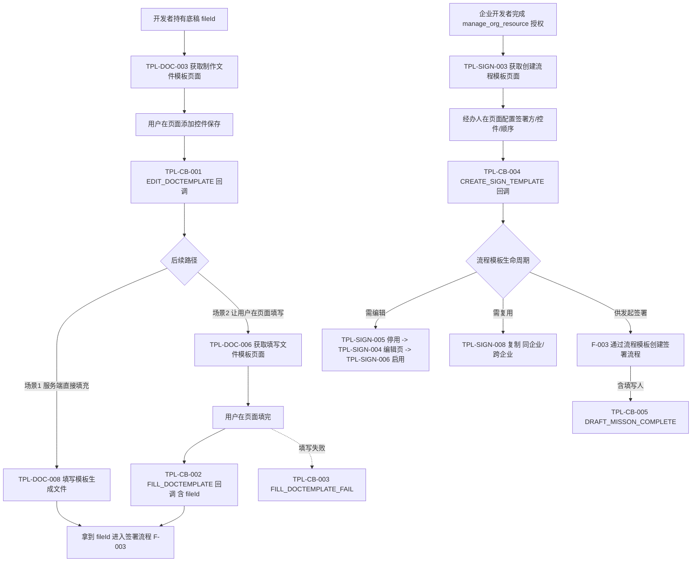
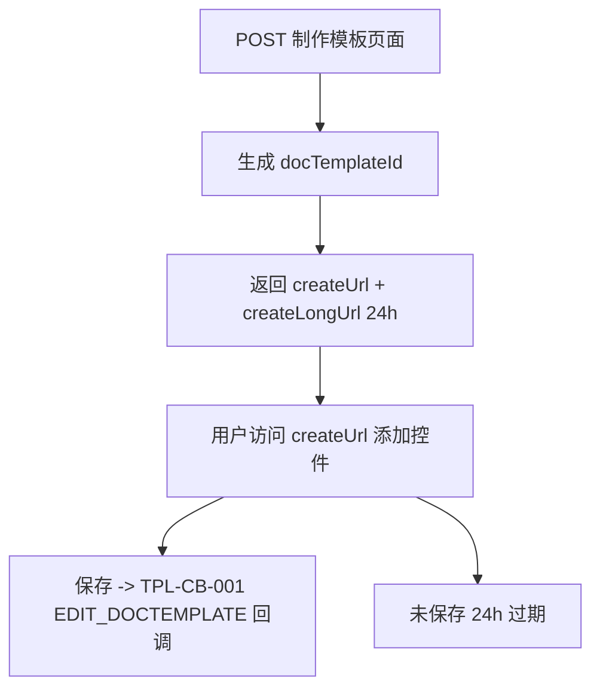
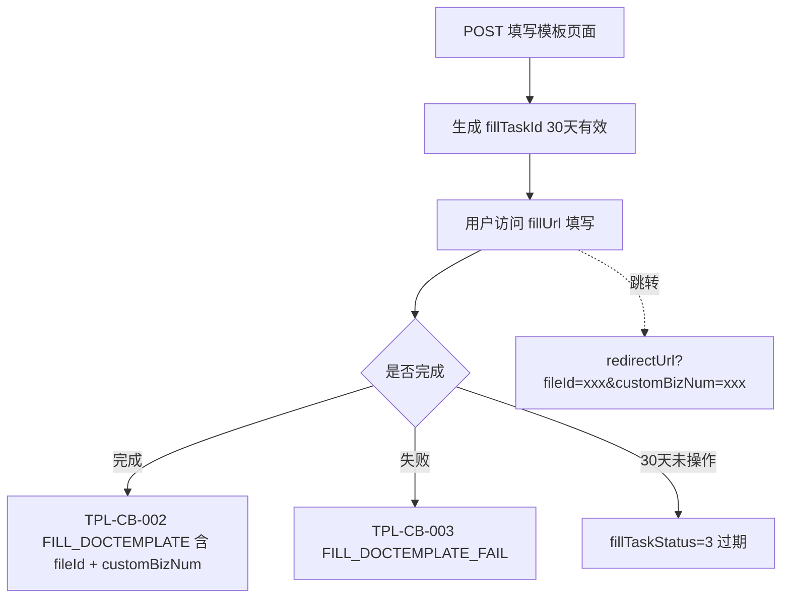
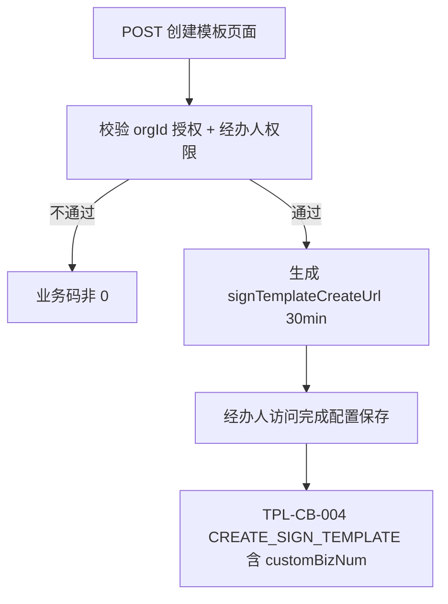

# 文件&流程模板管理

## 1 文档元数据

| 字段 | 内容 |
| --- | --- |
| PRD-ID | F-002 |
| 产品线 | 文件与流程模板（feature-map.md TPL 域，opendoc 跨 pdf-sign3 + file-and-template3 两域） |
| 需求类型 | 新功能（V3 标准化重构） |
| 需求状态 | 草稿 |
| 当前版本 | V1.0 |
| 最后更新日期 | 2026-05-20 |
| 关键词（Tag） | 文件模板、流程模板、docTemplateId、signTemplateId、模板填写、模板复制、模板停用启用、控件组、模板回调 |
| 关联需求卡片 | 暂无（从 Epic E-001 抽取） |
| 关联页面规格卡 | 待产出 |
| 关联原型文件 | 待产出 |
| 所属 Epic | [E-001 e签宝 OpenAPI 3.0 一期](../E-001-e签宝OpenAPI3.0一期/prd.md) |
| 依赖 Feature | [F-001 认证授权与免登体系](../F-001-认证授权与免登体系/prd.md)（流程模板需要 `manage_org_resource` / `manage_org_template` 授权） |

## 2 文档修订记录

| 版本 | 日期 | 修订内容 | 修订人 |
| --- | --- | --- | --- |
| V0.1 | 2022-02-22 | 原始内容（Epic E-001 V0.1 中 F-002 部分），已归档至 archive/original-v0.1.md | 门生 |
| V1.0 | 2026-05-20 | 从 Epic E-001 抽取 F-002 内容，对照 assets/opendoc/{pdf-sign3, file-and-template3}/ 全量补充 T1/T2/T5 三个子节点的 §8 字段；T3/T4 占位 | AI 生成（门生 review） |

## 3 需求概要

### 3.1 问题与机会（概要）

**现状问题**：

- V1/V2 的"合同模板"概念笼统，没有清晰区分"文件级模板（开发者侧底稿+控件复用）"和"流程级模板（企业侧含签署方+流程配置的完整复用单元）"
- 原文档中流程模板管理整体标注"待定/二期"，开发者无法在一期完成企业侧的模板复用闭环
- PDF 与 HTML 两种模板适用场景不清，开发者经常误用导致动态表格场景失败
- 控件组功能在 pdf-sign3 和 file-and-template3 两个域下各有镜像入口，开发者难判归属

**机会**：

- V3 明确两层模板模型：文件模板（docTemplateId，归属 appId）+ 流程模板（signTemplateId，归属 orgId），各自独立的生命周期
- 流程模板补齐全套 CRUD + 停用/启用 + 复制 + 跨企业复制 + 权限查询，企业侧可完整运营自有模板
- 控件与控件组作为可复用资产沉淀到 appId 级，避免每次制作模板重复定义业务控件

### 3.2 目标用户（概要）

> 用户画像参考：context/user-persona.md

- **核心用户**：**P3 企业集成开发者**——通过 API 制作文件模板、为企业搭建流程模板、订阅模板事件回调；最关心模板和接口环境隔离（沙箱/正式不互通）以及链接有效期管理
- **次级用户**：**P5 流程发起者**——在企业系统中通过开发者集成的「制作/编辑/填写模板」页面操作；最关心页面交互的稳定与跳转回开发者业务系统的体验
- **间接用户**：**P4 流程管理者**（企业管理员）——通过流程模板的停用/启用 + 编辑/复制权限控制企业自有模板资产；**P2 平台运营人员**——通过查询接口排查"模板为何不可用""填写任务为何未完成"

### 3.3 方案概述

按 feature-map.md TPL 域 T1-T5 五个子节点组织：

1. **T1 文件模板管理**（10 项，TPL-DOC-001~010）：列表/详情/制作页/编辑页/预览页/填写页/查询填写结果/填充生成文件/复制/删除——开发者侧的底稿+控件复用单元
2. **T2 流程模板管理**（9 项，TPL-SIGN-001~009）：列表/详情/创建页/编辑页/停用/启用/删除/复制/权限查询——企业侧的完整签署流程复用单元（含签署方、控件、顺序等）
3. **T3 控件与控件组**（本轮占位，~6 项）：appId 级的可复用控件容器（pdf-sign3 与 file-and-template3 两个域下为同一套接口的镜像入口）
4. **T4 自定义业务控件**（本轮占位，~4 项）：appId 级的可复用业务字段控件
5. **T5 模板事件回调**（5 项，TPL-CB-001~005）：EDIT_DOCTEMPLATE / FILL_DOCTEMPLATE / FILL_DOCTEMPLATE_FAIL / CREATE_SIGN_TEMPLATE / DRAFT_MISSON_COMPLETE

跨域归属说明：T1 文件模板的全部接口在 opendoc 中实际归属 **pdf-sign3** 域，T2 流程模板归属 **file-and-template3** 域，T5 回调分别由两个域的回调通知文档承接。本 PRD 采用 feature-map 的业务视图（TPL）作为顶层组织，§8 每个接口标注其实际 opendoc 域路径。

### 3.4 成功指标（3-5 项）

| 指标 | 目标值 | 观测时间 | 数据来源 |
| --- | --- | --- | --- |
| 通过文件模板填充生成的文件成功率 | ≥ 99% | 月度 | TPL-DOC-008 接口监控 |
| 流程模板单次创建到首次发起签署的平均工时 | 较 V2 同期下降 ≥ 40% | 上线后 90 天 | 开发者埋点 |
| 模板回调投递成功率（重试后） | ≥ 99.5% | 月度 | data-push3 投递指标 |
| 「模板已停用无法编辑」类卡点工单占比 | ≤ 5% | 月度 | 客服工单系统 |
| HTML 模板填充行数超 2000 的失败比例 | ≤ 1% | 月度 | TPL-DOC-008 错误日志 |

---

## 4 需求对象与概念模型

> 业务术语参考：context/business-glossary.md
> 已在术语表收录、本 PRD 直接引用、不再重复定义的术语：**文件模板** / **流程模板** / **控件** / **控件组** / **自定义业务控件** / **签署方** / **抄送方** / **附属材料** / **填表补充人** / **docTemplateId**（即 glossary fileTemplateId） / **signTemplateId** / **componentGroupId** / **appId** / **orgId** / **psnId**。
>
> 本 PRD 新引入的术语 / 枚举：

| 术语 | 类型 | 定义 | 约束/备注 |
| --- | --- | --- | --- |
| docTemplateType | 枚举值 | 文件模板类型 | 0=PDF 模板（默认，表格固定行）/ 1=HTML 模板（表格可动态增行；行数 ≤ 2000；填充样式可能产生变化） |
| 模板填写任务 | 产品概念 | 通过「获取填写文件模板页面」生成的一次性填写流程，由 `fillTaskId` 标识 | 链接有效期 30 天；任务完成生成文件 ID |
| fillTaskStatus | 枚举值 | 模板填写任务状态 | 1=待填写 / 2=填写完成 / 3=已过期（30 天未填写） |
| signTemplateStatus | 枚举值 | 流程模板可用状态 | 0=停用 / 1=启用；停用是编辑前置（BR-04） |
| participantSetMode | 枚举值 | 流程模板参与人指定方式 | 1=使用模板时指定 / 2=固定成员 / 3=发起人本人 / 4=固定企业（经办人可指定） |
| participateBizType | 枚举值 | 参与方式 | 1=填写 / 2=签署；同时填写并签署为 "1,2" |
| draftOrder | 系统字段 | 流程模板内填写顺序 | 1-255；同一模板内不可重复；小的先填 |
| signOrder | 系统字段 | 流程模板内签署顺序 | 1-255；可重复（重复=同时签，不要求顺序） |
| sealTypes | 枚举值 | 流程模板内可选签章方式 | 1=企业章 / 2=法人章 / 3=个人手绘 / 4=个人模板章 / 5=个人 AI 手绘；逗号分隔 |
| willingnessAuthModes | 枚举值 | 流程模板内签署人可选意愿方式 | 1=人脸（含 e签宝/腾讯云/支付宝三种刷脸）/ 2=短信验证码 / 3=邮箱验证码 / 4=签署密码 |
| hiddenOriginComponents | 枚举值 | 模板制作页面是否隐藏原始控件 | true=隐藏 / false=不隐藏（默认） |
| basicComponentsType | 枚举值 | 模板制作页面展示的基础控件类型 | 14 种（1 文本/2 数字/3 日期/5 骑缝/6 普通签章/8 多行文本/9 复选/10 单选/11 图片/14 下拉/15 勾选/16 身份证/17 备注），仅 `hiddenOriginComponents=false` 时生效 |
| uneditableFields | 枚举值 | 流程模板制作页面禁止用户修改的内容 | docs（待签文件）/ participants（参与方） |
| copyToExternalOrg | 枚举值 | 流程模板复制是否跨企业 | true=跨企业（需 manage_org_template 授权 + externalOrgId + externalTransactorPsnId）/ false=同企业（自动加 "_副本" 后缀） |

### 4.1 文件模板控件类型枚举表

> 文件模板（PDF/HTML）支持的控件类型完整清单，源自 opendoc pdf-sign3/aoq509（查询文件模板详情）响应 `componentType` 字段。

| 类型值 | 含义 | 特有属性 |
| --- | --- | --- |
| 1 | 单行文本 | componentMaxLength（仅 PDF）、字符样式（font/fontSize/textColor/bold/italic 等） |
| 2 | 数字 | numberFormat（0=整数 / 0.0=一位小数 / 0.00=两位小数） |
| 3 | 日期 | dateFormat |
| 5 | 骑缝签署区 | normalSignField（含 sealSpecs / signFieldStyle=2） |
| 6 | 普通签章区 | normalSignField（showSignDate / dateFormat / signFieldStyle=1 / sealSpecs / signerRole） |
| 8 | 多行文本 | componentMaxRows（仅 PDF）、verticalAlignment、textLineSpacing |
| 9 | 复选 | options[] |
| 10 | 单选 | options[] |
| 11 | 图片 | imageType（IDCard_widthwise / IDCard_longitudinal / other） |
| 14 | 下拉框 | options[] |
| 15 | 勾选框 | tickComponentType（tick / cross / unspecified） |
| 16 | 身份证 | — |
| 17 | 备注区域 | remarkSignField（inputType / aiCheck / remarkContent / remarkFontSize） |
| 18 | 动态表格 | tableContent；仅 HTML 模板有效；行数 ≤ 2000 |
| 19 | 手机号 | — |
| 23 | 人民币大写 | componentAssociatedId（关联数字控件 ID） |

---

## 5 功能结构

> 完整产品功能结构参考：context/product-feature-map.md
> 本图与 feature-map.md TPL 域的 T1-T5 子节点完全同构。

### 5.1 本需求新增的功能节点

```mermaid
graph TD
    TPL[TPL 文件与流程模板 / F-002]
    TPL --> T1[T1 文件模板管理]
    TPL --> T2[T2 流程模板管理]
    TPL --> T3[T3 控件与控件组]
    TPL --> T4[T4 自定义业务控件]
    TPL --> T5[T5 模板事件回调]

    T1 --> D1[TPL-DOC-001/002 列表与详情]
    T1 --> D2[TPL-DOC-003/004/005 制作/编辑/预览页]
    T1 --> D3[TPL-DOC-006/007/008 填写页/查询结果/填充生成]
    T1 --> D4[TPL-DOC-009/010 复制/删除]

    T2 --> S1[TPL-SIGN-001/002 列表与详情]
    T2 --> S2[TPL-SIGN-003/004 创建/编辑页链接]
    T2 --> S3[TPL-SIGN-005/006/007/008 停用/启用/删除/复制]
    T2 --> S4[TPL-SIGN-009 权限查询]

    T3 --> CG[TPL-CG-* 控件组 CRUD<br/>本轮占位]
    T4 --> CC[TPL-CC-* 自定义业务控件 CRUD<br/>本轮占位]

    T5 --> CB1[TPL-CB-001 EDIT_DOCTEMPLATE]
    T5 --> CB2[TPL-CB-002 FILL_DOCTEMPLATE]
    T5 --> CB3[TPL-CB-003 FILL_DOCTEMPLATE_FAIL]
    T5 --> CB4[TPL-CB-004 CREATE_SIGN_TEMPLATE]
    T5 --> CB5[TPL-CB-005 DRAFT_MISSON_COMPLETE]
```



### 5.2 本需求核心业务流程



### 5.3 核心业务规则

> 跨多个功能的全局约束，单功能内部异常归入对应 §8.x.3。

| 规则编号 | 规则描述 | 备注 |
| --- | --- | --- |
| BR-01 | 接口制作的文件模板与 e签宝 SaaS 官网模板**完全隔离**：接口模板不会同步到官网，官网模板不可通过 API 编辑/复制/删除，但可以通过 API 预览和填写 | opendoc xagpot / lgb2go / le6t3e7fbsrdmtx6 / ub4ncy / hgcwhl 注意事项均强调此点 |
| BR-02 | 沙箱环境（smlopenapi）和正式环境（openapi）的模板**完全不互通**，需要分别制作；docTemplateId / signTemplateId 跨环境无效 | 同上 opendoc 注意事项 |
| BR-03 | 控件组接口 `pdf-sign3/pupwutihq20wss04` 与 `file-and-template3/crxfb1zzefbt5166` 是同一套接口的镜像入口（URL `/v3/custom-component-group/create` + 请求/响应/错误码完全一致）；控件组数据归属 **appId 级**，跨文件模板与流程模板共享 | 经 opendoc 对比确认；OQ-1 待官方文档明确归并 |
| BR-04 | 流程模板编辑前置：模板必须先 `TPL-SIGN-005` 停用（status=0）才能 `TPL-SIGN-004` 进入编辑页，编辑完成后需 `TPL-SIGN-006` 启用 | opendoc fifg4ked5cqk6vgt 注意事项 |
| BR-05 | 流程模板编辑/复制/删除等管理操作需要经办人在企业内具备模板操作权限；建议直接使用企业管理员账号；当前应用需先获取目标企业 `manage_org_resource`（或更细的 `manage_org_template`）授权 | opendoc ukznvprry5qvlxh3 / fifg4ked5cqk6vgt / lm10qsdrrag3wyyp / wylnqp3e9l61px5p 通用前置 |
| BR-06 | PDF 模板与 HTML 模板差异：PDF 支持 `requiredCheck=false` 跳过必填校验；HTML 强制校验必填；HTML 表格动态增行限 2000 行；HTML 填充完样式可能产生变化，不保证完全一致 | opendoc xagpot / mv8a3i / ub4ncy 注意事项 |
| BR-07 | 链接有效期：制作/编辑模板页面 24h、预览页面 30 分钟、填写页面 30 天；过期不可逆，需重新调用对应接口生成新链接 | 各 opendoc 响应字段说明 |
| BR-08 | 文件模板 `fileDownloadUrl`（底稿 PDF 下载）有效期 60 分钟；HTML 类型模板的底稿下载链接默认返回 null，开发者无法获取 HTML 底稿 | opendoc aoq509 fileDownloadUrl 说明 |
| BR-09 | 控件 ID 与控件 Key：`componentId` 由 e签宝 系统生成、唯一；`componentKey` 由用户在制作模板时自定义、可复用；在填充和查询填写结果接口中 componentId 与 componentKey 二选一传值 | opendoc mv8a3i / ub4ncy / ovhittqcf7cooxxv 参数说明 |
| BR-10 | 流程模板复制规则：同企业复制自动加 "_副本" 后缀；跨企业复制（`copyToExternalOrg=true`）不加后缀，需提前通过 F-001 获取目标企业的 `manage_org_template` 授权 | opendoc wylnqp3e9l61px5p |
| BR-11 | 流程模板的 4 种 participantSetMode（1=使用时指定 / 2=固定成员 / 3=发起人本人 / 4=固定企业）决定后续通过流程模板发起签署时 `participants` 字段是否必传，开发者需在 §8 中按场景分别处理 | opendoc pfzut7ho9obc7c5r 字段说明 |
| BR-12 | 删除是不可逆操作：文件模板（TPL-DOC-010）/ 流程模板（TPL-SIGN-007）删除后均不可恢复，只能重新制作 | opendoc iwtpf3 / lm10qsdrrag3wyyp 红字提示 |
| BR-13 | Action 事件类型可能新增，开发者侧未识别的 Action 应**忽略而非报错**；不可硬编码完整枚举集合 | opendoc mcm1c9487grz0ynt / nmg5r9a2szi5fsza warning 区 |

---

## 6 用户故事与用例

### 6.1 Epic

让企业开发者在 V3 标准化框架下完成文件级 + 流程级两层模板的完整运营闭环：开发者侧通过文件模板抽象出"底稿+控件"做填充复用；企业侧通过流程模板抽象出"含签署方+控件+顺序"的完整签署流程做企业资产复用，并通过事件回调与企业自有系统打通生命周期。

### 6.2 Must Have（MVP）

**故事 1：开发者制作 PDF 文件模板并填充生成签署文件（服务端路径）**

```text
作为企业集成开发者，
我希望上传一份 PDF 底稿后，跳转到 e签宝 提供的模板制作页面让运营同学添加签署区与表单控件，制作完成后能通过接口直接传入数据生成最终待签署文件，
以便我把生成的 fileId 接到后续 F-003 签署流程里。
```

AC：
- Given 调用方持有 fileId（由 [上传本地文件](https://qianxiaoxia.yuque.com/opendoc/pdf-sign3/rlh256) 接口产出）
- When 调用 `POST /v3/doc-templates/doc-template-create-url` 传入 `docTemplateName + fileId + docTemplateType=0`
- Then 返回 `code=0` + `docTemplateId` + `docTemplateCreateUrl`（短链）+ `docTemplateCreateLongUrl`（长链）
- And 运营同学访问短链完成添加控件并保存
- And 开发者 `notifyUrl` 收到 `Action=EDIT_DOCTEMPLATE` 通知，含 docTemplateId
- And 调用 `POST /v3/files/create-by-doc-template` 传入 `docTemplateId + fileName + components[]` 后返回 `fileId` + `fileDownloadUrl`（60 分钟有效）

**故事 2：开发者让最终用户在 e签宝 页面里填写模板（页面路径）**

```text
作为企业集成开发者，
我希望让最终用户（如客户/员工）直接在 e签宝 提供的填写页面填表，生成的文件 ID 通过回调推送给我，
以便我减少自己维护表单页面的成本。
```

AC：
- Given 调用方持有已制作好的 docTemplateId
- When 调用 `POST /v3/doc-templates/doc-template-fill-url` 传入 `docTemplateId + customBizNum + componentFillingtValues[] + notifyUrl + redirectUrl`
- Then 返回 `fillTaskId` + `docTemplateFillUrl`（30 天有效）
- And 用户访问填写链接完成填写
- And 开发者 `notifyUrl` 收到 `Action=FILL_DOCTEMPLATE` + 含 `fileId`；填写失败时收到 `FILL_DOCTEMPLATE_FAIL`
- And 调用 `POST /v3/doc-templates/fill-task-result` 可查到 fillTaskStatus=2 + 填写后的 components 列表 + 最终 fileId

**故事 3：企业开发者为客户企业搭建流程模板（含签署方/控件/顺序）**

```text
作为企业集成开发者，
我希望为客户企业搭建一个含"甲方+乙方+顺序+签署区+填写区"完整配置的流程模板，让企业经办人后续直接选模板发起签署，
以便企业方避免每次重复配置流程。
```

AC：
- Given 调用方持有目标企业 orgId + 经办人 psnId，且目标企业已对当前应用授权 `manage_org_resource`（或 `manage_org_template`）
- When 调用 `POST /v3/sign-templates/sign-template-create-url` 传入 `orgId + transactorPsnId + redirectUrl + fileIds + participants[]`
- Then 返回 `signTemplateCreateUrl`（30 分钟有效）
- And 经办人在页面完成配置保存
- And 开发者 `notifyUrl` 收到 `Action=CREATE_SIGN_TEMPLATE`（含 customBizNum 原样回传）
- And 调用 `GET /v3/sign-templates/detail?signTemplateId=xxx&orgId=xxx&queryComponents=true` 可取到完整参与方、控件、抄送方、附件信息

**故事 4：企业编辑已有流程模板（涉及 BR-04 停用→编辑→启用 三步）**

```text
作为企业管理员（通过经办人 psnId 行权），
我希望对已有流程模板做配置调整，避免每次小改都重建新模板，
以便保持企业模板资产的连续性。
```

AC：
- Given 流程模板当前 `signTemplateStatus=1`（启用）
- When 直接调用 `POST /v3/sign-templates/{signTemplateId}/sign-template-edit-url`
- Then 接口返回业务码非 0 提示模板需先停用
- When 改为先调用 `POST /v3/sign-templates/disable`，再调用编辑链接接口
- Then 返回 `signTemplateEditUrl`（30 分钟）；经办人编辑完成后再调用 `POST /v3/sign-templates/enable` 重新启用

**故事 5：跨企业复制流程模板**

```text
作为生态伙伴开发者，
我希望把母公司预制的流程模板复制到子公司企业空间，
以便集团旗下企业共享同一套合同流程标准。
```

AC：
- Given 当前应用已对子公司企业获得 `manage_org_template` 授权
- When 调用 `POST /v3/sign-templates/copy` 传入 `orgId + transactorPsnId + signTemplateId + copyToExternalOrg=true + externalOrgId + externalTransactorPsnId`
- Then 返回 `copiedSignTemplateId`；复制后的模板名不加 "_副本"

**故事 6：开发者订阅模板事件做企业内告警**

```text
作为企业集成开发者，
我希望模板的关键事件（制作完成 / 填写完成 / 填写失败 / 流程模板创建 / 填写人填写状态）都能推送到我的 notifyUrl，
以便接到事件后联动企业内审批 / 通知 / 数据沉淀。
```

AC：
- Given 模板对应入口接口已传入 notifyUrl
- When 事件触发
- Then 开发者收到 POST 推送，body 含 `Action` + 业务字段
- And 开发者侧需做幂等处理（同一事件可能因网络重试推送多次）

---

## 7 功能清单（AI 实现主清单）

> 功能编号格式：`TPL-[CATEGORY]-[SEQ]`，TPL 为 file-and-template3 域前缀（见 context/product-feature-map.md 前缀映射表）。
> CATEGORY 与 feature-map.md TPL 域 T1-T5 子节点对应：**DOC**（T1 文件模板）/ **SIGN**（T2 流程模板）/ **CG**（T3 控件组）/ **CC**（T4 自定义业务控件）/ **CB**（T5 模板事件回调）。

| 功能编号 | feature-map 归属 | 功能名称（全限定） | opendoc 域 | 优先级 | §8 状态 |
| --- | --- | --- | --- | --- | --- |
| TPL-DOC-001 | T1 | 文件模板-列表-查询模板列表 | pdf-sign3/mghz1g | P0 | ✅ 已展开 |
| TPL-DOC-002 | T1 | 文件模板-详情-查询模板控件详情 | pdf-sign3/aoq509 | P0 | ✅ 已展开 |
| TPL-DOC-003 | T1 | 文件模板-入口-获取制作模板页面 | pdf-sign3/xagpot | P0 | ✅ 已展开 |
| TPL-DOC-004 | T1 | 文件模板-入口-获取编辑模板页面 | pdf-sign3/lgb2go | P0 | ✅ 已展开 |
| TPL-DOC-005 | T1 | 文件模板-入口-获取预览模板页面 | pdf-sign3/le6t3e7fbsrdmtx6 | P0 | ✅ 已展开 |
| TPL-DOC-006 | T1 | 文件模板-入口-获取填写模板页面 | pdf-sign3/ub4ncy | P0 | ✅ 已展开 |
| TPL-DOC-007 | T1 | 文件模板-填写-查询填写任务结果 | pdf-sign3/ovhittqcf7cooxxv | P0 | ✅ 已展开 |
| TPL-DOC-008 | T1 | 文件模板-填写-填充模板生成文件 | pdf-sign3/mv8a3i | P0 | ✅ 已展开 |
| TPL-DOC-009 | T1 | 文件模板-管理-复制模板 | pdf-sign3/hgcwhl | P0 | ✅ 已展开 |
| TPL-DOC-010 | T1 | 文件模板-管理-删除模板 | pdf-sign3/iwtpf3 | P0 | ✅ 已展开 |
| TPL-SIGN-001 | T2 | 流程模板-列表-查询模板列表 | file-and-template3/al59g6n5oo75sl19 | P0 | ✅ 已展开 |
| TPL-SIGN-002 | T2 | 流程模板-详情-查询模板详情 | file-and-template3/pfzut7ho9obc7c5r | P0 | ✅ 已展开 |
| TPL-SIGN-003 | T2 | 流程模板-入口-获取创建模板页面 | file-and-template3/ukznvprry5qvlxh3 | P0 | ✅ 已展开 |
| TPL-SIGN-004 | T2 | 流程模板-入口-获取编辑模板页面 | file-and-template3/fifg4ked5cqk6vgt | P0 | ✅ 已展开 |
| TPL-SIGN-005 | T2 | 流程模板-状态-停用 | file-and-template3/gyo1p6cg3yk1rv2g | P0 | ✅ 已展开 |
| TPL-SIGN-006 | T2 | 流程模板-状态-启用 | file-and-template3/ohk7cno35ozby9qt | P0 | ✅ 已展开 |
| TPL-SIGN-007 | T2 | 流程模板-管理-删除 | file-and-template3/lm10qsdrrag3wyyp | P0 | ✅ 已展开 |
| TPL-SIGN-008 | T2 | 流程模板-管理-复制（含跨企业） | file-and-template3/wylnqp3e9l61px5p | P0 | ✅ 已展开 |
| TPL-SIGN-009 | T2 | 流程模板-权限-查询用户对模板的编辑/使用权限 | file-and-template3/qul915livl97eh6n | P0 | ✅ 已展开 |
| TPL-CG-001~006 | T3 | 控件组 CRUD + 重命名 + 查询组内控件（6 项） | pdf-sign3/{pupwutihq20wss04, bagac0octhfmuefk, shgyxkpccybh5uz6, zttm2bsngxdahwk0, tlzngmohd08fpul1, ve3glnt1v4zx6qst} 与 file-and-template3/{crxfb1zzefbt5166, gg3rnagx2paxpku5, gg5amde4mhsegket, zn0z0cs7p9hh75pg, ub5rxe7c32snl9xn, kg8p50dhr7n3swln}（两域镜像，BR-03） | P1 | ⚠️ 占位（后续轮次抓取） |
| TPL-CC-001~004 | T4 | 自定义业务控件 CRUD（4 项） | pdf-sign3/{agc4mx5ei2cg8qsc, xg6mix582gwcfopp, axbmqwqd8at4d2mv, fdxvhhqg247ba4v5} 与 file-and-template3/{gwthhipyuv3y7kry, cqb132urdqavgegv, hcc56f290siduisx, kz8hg1btwnzpggbm}（两域镜像） | P1 | ⚠️ 占位（后续轮次抓取） |
| TPL-CB-001 | T5 | 模板回调-文件模板创建/编辑完成（EDIT_DOCTEMPLATE） | pdf-sign3/mcm1c9487grz0ynt | P0 | ✅ 已展开 |
| TPL-CB-002 | T5 | 模板回调-文件模板填写完成（FILL_DOCTEMPLATE） | pdf-sign3/mcm1c9487grz0ynt | P0 | ✅ 已展开 |
| TPL-CB-003 | T5 | 模板回调-文件模板填写失败（FILL_DOCTEMPLATE_FAIL） | pdf-sign3/mcm1c9487grz0ynt | P0 | ✅ 已展开 |
| TPL-CB-004 | T5 | 模板回调-流程模板创建完成（CREATE_SIGN_TEMPLATE） | file-and-template3/nmg5r9a2szi5fsza | P0 | ✅ 已展开 |
| TPL-CB-005 | T5 | 模板回调-流程填写人填写状态（DRAFT_MISSON_COMPLETE） | file-and-template3/nmg5r9a2szi5fsza | P0 | ✅ 已展开 |

---

## 8 功能需求说明书（逐功能展开）

> §8.x.1 任务故事 / §8.x.2 逻辑实现规范 / §8.x.3 异常处理 始终必填；其余子节按需。
> T3 控件组（TPL-CG-*）和 T4 自定义业务控件（TPL-CC-*）本轮仅在 §7 列出，§8 待后续轮次抓取 opendoc 字段。

---

### TPL-DOC-001 文件模板-列表-查询模板列表 需求说明

#### 8.1 任务故事

当开发者要查看当前 appId 下所有文件模板时，按 pageNum / pageSize 分页查询；返回每个模板的 ID、名称、创建/更新时间。

#### 8.2 逻辑实现规范

**Action**：`GET /v3/doc-templates?pageNum=1&pageSize=20`

**Outcome**：返回 `data.total` + `data.docTemplates[]`（每项含 docTemplateId / docTemplateName / createTime / updateTime）

#### 8.3 异常处理要求

| 异常 | 触发 | 系统行为 |
| --- | --- | --- |
| pageSize 超限 | pageSize > 20 | 按 20 截断或业务码非 0（以 opendoc 错误码为准） |
| 未授权 appId | 鉴权失败 | 401/403 |

#### 8.5 数据字典

| 字段 | 位置 | 类型 | 约束 |
| --- | --- | --- | --- |
| pageNum | query | int32 | 默认 1 |
| pageSize | query | int32 | 默认 20，最大 20 |
| data.total | response | int32 | 总数 |
| data.docTemplates[].docTemplateId | response | string | 模板 ID |
| data.docTemplates[].docTemplateName | response | string | 模板名 |
| data.docTemplates[].createTime | response | int64 | Unix 毫秒 |
| data.docTemplates[].updateTime | response | int64 | Unix 毫秒 |

#### 8.10 对外 OpenAPI 变更说明

| 变更 | 路径 | 方法 | 描述 | 影响对外文档 |
| --- | --- | --- | --- | --- |
| 新增 | /v3/doc-templates | GET | V3 新增；按 appId 分页查询文件模板列表 | 是 |

---

### TPL-DOC-002 文件模板-详情-查询模板控件详情 需求说明

#### 8.1 任务故事

当开发者需要拿到一个文件模板内所有控件的完整定义（位置/类型/特有属性/字符样式/签章区属性等）时，按 docTemplateId 查询。

#### 8.2 逻辑实现规范

**Action**：`GET /v3/doc-templates/{docTemplateId}`

**Outcome**：返回模板基础信息（含 fileDownloadUrl，60 分钟有效）+ 完整 `components[]` 列表（详见 §4.1 控件类型枚举）

#### 8.3 异常处理要求

| 异常 | 触发 | 系统行为 |
| --- | --- | --- |
| docTemplateId 不存在 | 拼写错误 / 已删除 | 业务码非 0 |
| 跨 appId 访问 | 模板不属当前 appId | 业务码非 0（数据隔离） |
| HTML 模板取底稿 | docTemplateType=1 | fileDownloadUrl 返回 null（BR-08） |
| fileDownloadUrl 过期 | 距生成 > 60 分钟 | 链接失效，需重新调用本接口 |

#### 8.5 数据字典（关键字段）

| 字段 | 位置 | 类型 | 约束 |
| --- | --- | --- | --- |
| docTemplateId | path | string | 必填 |
| data.fileDownloadUrl | response | string | 60 分钟有效，HTML 模板默认 null |
| data.components[].componentId | response | string | 系统生成 |
| data.components[].componentKey | response | string | 用户自定义 |
| data.components[].componentType | response | int32 | 见 §4.1 |
| data.components[].componentPosition | response | object | 含 PositionX/Y、PageNum |
| data.components[].componentSpecialAttribute | response | object | 类型特有：dateFormat / imageType / options / tableContent / numberFormat / componentMaxLength / componentMaxRows / signerRole / tickComponentType / componentAssociatedId |
| data.components[].componentSize | response | object | width / height（px） |
| data.components[].normalSignField | response | object | 签章区属性：showSignDate / dateFormat / signFieldStyle（1 单页 / 2 骑缝）/ sealSpecs（1 实际规格 / 2 自定义按签署区适配） |
| data.components[].remarkSignField | response | object | 备注区属性：aiCheck（0/1/2）/ inputType（1 手写抄录 / 2 自由输入）/ remarkContent / remarkFontSize |
| data.components[].componentTextFormat | response | object | font / fontSize / textColor / bold / italic / horizontalAlignment / verticalAlignment / textLineSpacing |
| data.components[].originCustomComponentId | response | string | 自定义控件 ID（如该控件来自 TPL-CC） |

#### 8.10 对外 OpenAPI 变更说明

| 变更 | 路径 | 方法 | 描述 | 影响对外文档 |
| --- | --- | --- | --- | --- |
| 新增 | /v3/doc-templates/{docTemplateId} | GET | V3 新增；返回模板完整控件定义 | 是 |

---

### TPL-DOC-003 文件模板-入口-获取制作模板页面 需求说明

#### 8.1 任务故事

当开发者基于一份底稿 fileId 要新建一个文件模板时，调用本接口拿到可视化制作页面链接，把链接交给用户在浏览器里添加控件、保存模板。

#### 8.2 逻辑实现规范

**Context**：

- 调用方持有底稿 fileId（由 [上传本地文件](https://qianxiaoxia.yuque.com/opendoc/pdf-sign3/rlh256) 产出）
- 已选定 docTemplateType（0=PDF / 1=HTML，决定后续填充能力）
- 决定是否启用 hiddenOriginComponents、basicComponentsType 限制可选控件、是否展示替换底稿按钮、是否注入自定义控件组/控件

**Action**：`POST /v3/doc-templates/doc-template-create-url`，body 含 `docTemplateName / docTemplateType / fileId / redirectUrl / hiddenOriginComponents / basicComponentsType[] / showReplaceFraft / customComponentGroups[] / customComponents[] / signerRoles[] / dedicatedCloudId`

**Outcome**：返回 `docTemplateId` + `docTemplateCreateUrl`（短链，24h）+ `docTemplateCreateLongUrl`（长链，24h）

#### 8.3 异常处理要求

| 异常 | 触发 | 系统行为 |
| --- | --- | --- |
| signerRoles 重复 | 同一次请求 signerRoles[] 含重复值 | 业务码非 0 |
| basicComponentsType 与 hiddenOriginComponents 冲突 | `hiddenOriginComponents=true` 时传 basicComponentsType | 参数无效，不报错；以 hiddenOriginComponents 为准 |
| fileId 不存在 | 底稿 ID 错误 / 未关联当前 appId | 业务码非 0 |
| dedicatedCloudId 不一致 | 与 [获取文件上传地址] 传入的项目 ID 不一致 | 业务码非 0 |
| 链接 24h 过期 | 用户未及时使用 | 链接失效，需重新调用本接口 |

#### 8.4 业务流转图



#### 8.5 数据字典（关键字段）

| 字段 | 位置 | 类型 | 约束 |
| --- | --- | --- | --- |
| docTemplateName | body | string | 必填，模板名（可自定义） |
| docTemplateType | body | int32 | 0=PDF（默认）/ 1=HTML（见 BR-06） |
| fileId | body | string | 必填，底稿 ID |
| redirectUrl | body | string | https/http，制作完成跳转 |
| hiddenOriginComponents | body | boolean | 默认 false |
| basicComponentsType | body | list | 14 种类型枚举（见 §4 hiddenOriginComponents=false 时生效） |
| showReplaceFraft | body | boolean | 默认 false |
| customComponentGroups | body | list | 注入 TPL-CG 创建的控件组 ID |
| customComponents | body | list | 注入 TPL-CC 创建的自定义控件 ID |
| signerRoles | body | list | 同次请求不可重复（如"甲方"/"乙方"） |
| dedicatedCloudId | body | string | 专属云项目 ID |
| data.docTemplateId | response | string | 模板 ID（建议保管） |
| data.docTemplateCreateUrl | response | string | 短链 24h |
| data.docTemplateCreateLongUrl | response | string | 长链 24h |

#### 8.10 对外 OpenAPI 变更说明

| 变更 | 路径 | 方法 | 描述 | 影响对外文档 |
| --- | --- | --- | --- | --- |
| 新增 | /v3/doc-templates/doc-template-create-url | POST | V3 新增；获取可视化制作文件模板页面链接 | 是 |

---

### TPL-DOC-004 文件模板-入口-获取编辑模板页面 需求说明

#### 8.1 任务故事

当开发者要让用户对已制作的文件模板二次编辑（添加/移除/调整控件）时，按 docTemplateId 拿到编辑链接。

#### 8.2 逻辑实现规范

**Context**：仅支持编辑接口制作的模板（BR-01），不支持 SaaS 官网模板。

**Action**：`POST /v3/doc-templates/{docTemplateId}/doc-template-edit-url`，body 字段与 TPL-DOC-003 相同（除 docTemplateName / docTemplateType / fileId 不传）

**Outcome**：返回 `docTemplateEditUrl` + `docTemplateEditLongUrl`（24h）

#### 8.3 异常处理要求

| 异常 | 触发 | 系统行为 |
| --- | --- | --- |
| 编辑 SaaS 官网模板 | docTemplateId 非接口创建 | 业务码非 0（BR-01） |
| 跨环境编辑 | docTemplateId 来自另一环境 | 业务码非 0（BR-02） |
| 链接 24h 过期 | 同 TPL-DOC-003 | 链接失效 |

#### 8.10 对外 OpenAPI 变更说明

| 变更 | 路径 | 方法 | 描述 | 影响对外文档 |
| --- | --- | --- | --- | --- |
| 新增 | /v3/doc-templates/{docTemplateId}/doc-template-edit-url | POST | V3 新增；获取已存在文件模板的编辑页面链接 | 是 |

---

### TPL-DOC-005 文件模板-入口-获取预览模板页面 需求说明

#### 8.1 任务故事

当用户想查看模板而不想改动时（用于评审/对齐），按 docTemplateId 拿到预览链接。

#### 8.2 逻辑实现规范

**Action**：`POST /v3/doc-templates/doc-template-preview-url`，body 含 `docTemplateId`

**Outcome**：返回 `docTemplatePreviewUrl`（30 分钟有效，过期可重新获取）

#### 8.3 异常处理要求

| 异常 | 触发 | 系统行为 |
| --- | --- | --- |
| 预览 SaaS 官网模板 | 同 TPL-DOC-004 | 业务码非 0 |
| 链接 30min 过期 | — | 链接失效，需重新调用本接口 |

#### 8.10 对外 OpenAPI 变更说明

| 变更 | 路径 | 方法 | 描述 | 影响对外文档 |
| --- | --- | --- | --- | --- |
| 新增 | /v3/doc-templates/doc-template-preview-url | POST | V3 新增；获取文件模板预览页面链接 | 是 |

---

### TPL-DOC-006 文件模板-入口-获取填写模板页面 需求说明

#### 8.1 任务故事

当开发者要让最终用户在 e签宝 提供的页面里给模板填值（替代自建表单），调用本接口拿到 30 天有效的填写链接。

#### 8.2 逻辑实现规范

**Context**：仅适用接口制作的模板（BR-01）；HTML 模板填表格行限 2000 行（BR-06）。

**Action**：`POST /v3/doc-templates/doc-template-fill-url`，body 含 `docTemplateId / customBizNum / componentFillingtValues[] / editFillingValue / clientType / notifyUrl / redirectUrl`

**Outcome**：返回 `fillTaskId` + `docTemplateFillUrl` + `docTemplateFillLongUrl`（30 天）

#### 8.3 异常处理要求

| 异常 | 触发 | 系统行为 |
| --- | --- | --- |
| 必填项缺值 + editFillingValue=false | 预填未给值且不允许用户修改 | 用户进入页面无法完成填写；建议预填齐全或设 true |
| 链接 30 天未填 | 任务自然过期 | fillTaskStatus=3 |
| HTML 模板表格 > 2000 行 | — | 填充失败，触发 TPL-CB-003 FILL_DOCTEMPLATE_FAIL |
| redirectUrl 域名未放行 | 同 F-001 BR-07 | 跳转受阻 |

#### 8.4 业务流转图



#### 8.5 数据字典（关键字段）

| 字段 | 位置 | 类型 | 约束 |
| --- | --- | --- | --- |
| docTemplateId | body | string | 必填 |
| customBizNum | body | string | 开发者自定义业务编号，回调和跳转 URL 原样回传 |
| componentFillingtValues[] | body | array | 预填值；componentId 与 componentKey 二选一（BR-09） |
| componentFillingtValues[].componentValue | body | string | 控件填充值；动态表格 `insertRow=true` 表示新增行 |
| editFillingValue | body | boolean | 默认 true，false=用户不可修改预填值 |
| clientType | body | string | ALL（默认）/ H5 / PC |
| notifyUrl | body | string | 回调地址 |
| redirectUrl | body | string | 完成后跳转；URL 后会拼 `fileId` + `customBizNum` |
| data.fillTaskId | response | string | 填写任务 ID（用于 TPL-DOC-007 查询） |
| data.docTemplateFillUrl | response | string | 短链（30 天） |
| data.docTemplateFillLongUrl | response | string | 长链（30 天，微信小程序 H5 内嵌须用长链） |

#### 8.10 对外 OpenAPI 变更说明

| 变更 | 路径 | 方法 | 描述 | 影响对外文档 |
| --- | --- | --- | --- | --- |
| 新增 | /v3/doc-templates/doc-template-fill-url | POST | V3 新增；获取文件模板的填写页面链接（30 天有效） | 是 |

---

### TPL-DOC-007 文件模板-填写-查询填写任务结果 需求说明

#### 8.1 任务故事

当开发者要确认某填写任务的状态和最终填写值（不依赖回调）时，按 docTemplateId + fillTaskId 查询。

#### 8.2 逻辑实现规范

**Action**：`POST /v3/doc-templates/fill-task-result`，body 含 `docTemplateId + fillTaskId`

**Outcome**：返回 `fillTaskStatus`（1/2/3）+ 完成时 `fileId` + 填写后 `components[]`

#### 8.3 异常处理要求

| 异常 | 触发 | 系统行为 |
| --- | --- | --- |
| fillTaskId 不属当前模板 | 拼配错误 | 业务码非 0 |
| 任务状态=3 | 30 天未填 | 返回 fillTaskStatus=3，fileId 不返回 |
| 任务状态=1 | 用户尚未填写 | components 可能为空或仅含预填值 |

#### 8.10 对外 OpenAPI 变更说明

| 变更 | 路径 | 方法 | 描述 | 影响对外文档 |
| --- | --- | --- | --- | --- |
| 新增 | /v3/doc-templates/fill-task-result | POST | V3 新增；查询模板填写任务的状态和填写值 | 是 |

---

### TPL-DOC-008 文件模板-填写-填充模板生成文件 需求说明

#### 8.1 任务故事

当开发者通过服务端直接给模板填值生成最终待签文件时（不走用户填写页面），按 docTemplateId 传入 components 后接收 fileId。

#### 8.2 逻辑实现规范

**Action**：`POST /v3/files/create-by-doc-template`，body 含 `docTemplateId / fileName / components[] / requiredCheck`

**Outcome**：返回 `fileId` + `fileDownloadUrl`（PDF 模板返回 60 分钟下载链接；HTML 模板返回 null，需用 [查询文件上传状态] 取下载链接）

#### 8.3 异常处理要求

| 异常 | 触发 | 系统行为 |
| --- | --- | --- |
| PDF 模板必填校验 + requiredCheck=true + 必填未传 | — | 业务码非 0，message："创建合同失败: 'XX 控件名称' 填充内容缺失" |
| HTML 模板必填校验 | HTML 强制校验，无论 requiredCheck | 同上 |
| fileName 含 / \ : * " < > \| ? 或 emoji | — | 业务码非 0 |
| fileName > 100 字符 | — | 业务码非 0 |
| HTML 表格行 > 2000 | 性能限制（BR-06） | 业务码非 0 |
| 动态表格 insertRow=true 漏传 | 新增行未标记 | 行不会插入（按现有行覆盖） |

#### 8.5 数据字典（关键字段）

| 字段 | 位置 | 类型 | 约束 |
| --- | --- | --- | --- |
| docTemplateId | body | string | 必填 |
| fileName | body | string | 必填；禁含 9 个特殊字符 + emoji；≤ 100 字符 |
| components[] | body | array | 必传（PDF + requiredCheck=false 时可传空数组） |
| components[].componentId / componentKey | body | string | 二选一 |
| components[].componentValue | body | string | 填充值 |
| requiredCheck | body | boolean | 默认 false；仅 PDF 生效 |
| data.fileId | response | string | 生成的文件 ID |
| data.fileDownloadUrl | response | string | PDF 模板返回 60min；HTML 返回 null |

#### 8.10 对外 OpenAPI 变更说明

| 变更 | 路径 | 方法 | 描述 | 影响对外文档 |
| --- | --- | --- | --- | --- |
| 新增 | /v3/files/create-by-doc-template | POST | V3 新增；服务端通过模板填值生成最终待签 PDF | 是 |

---

### TPL-DOC-009 文件模板-管理-复制模板 需求说明

#### 8.1 任务故事

当开发者要基于现有模板派生一份（保留控件，名字可自定义）时，按 docTemplateId 复制。

#### 8.2 逻辑实现规范

**Action**：`POST /v3/doc-templates/{docTemplateId}/copy`，body 含 `renameDocTemplate`（可选，最长 64 字）

**Outcome**：返回 `newDocTemplateId` + `componentList[]`（原控件 ID → 新控件 ID 映射）

#### 8.3 异常处理要求

| 异常 | 触发 | 系统行为 |
| --- | --- | --- |
| 复制 SaaS 官网模板 | 同 BR-01 | 业务码非 0 |
| 跨环境复制 | 同 BR-02 | 业务码非 0 |
| renameDocTemplate > 64 字 | — | 业务码非 0 |
| 不传 renameDocTemplate | — | 沿用原模板名 |

#### 8.10 对外 OpenAPI 变更说明

| 变更 | 路径 | 方法 | 描述 | 影响对外文档 |
| --- | --- | --- | --- | --- |
| 新增 | /v3/doc-templates/{docTemplateId}/copy | POST | V3 新增；复制文件模板（仅限同一环境） | 是 |

---

### TPL-DOC-010 文件模板-管理-删除模板 需求说明

#### 8.1 任务故事

当开发者要清理废弃的文件模板时，按 docTemplateId 删除（不可恢复，BR-12）。

#### 8.2 逻辑实现规范

**Action**：`DELETE /v3/doc-templates/{docTemplateId}`

**Outcome**：`code=0` + `data=null`

#### 8.3 异常处理要求

| 异常 | 触发 | 系统行为 |
| --- | --- | --- |
| 模板已被引用进行中的填写任务 | 任务尚未完成 | 删除是否影响进行中的 fillTaskId？需 OQ-2 确认 |
| 跨 appId 删除 | 权限不足 | 业务码非 0 |
| 删除不存在的模板 | 已删 / ID 错误 | 业务码非 0 |

#### 8.10 对外 OpenAPI 变更说明

| 变更 | 路径 | 方法 | 描述 | 影响对外文档 |
| --- | --- | --- | --- | --- |
| 新增 | /v3/doc-templates/{docTemplateId} | DELETE | V3 新增；不可逆删除文件模板 | 是 |

---

### TPL-SIGN-001 流程模板-列表-查询模板列表 需求说明

#### 8.1 任务故事

当开发者要拿到目标企业（orgId）下的全部流程模板时，分页查询，可按 status 过滤启用/停用。

#### 8.2 逻辑实现规范

**Context**：当前应用对目标 orgId 已具备查询授权（manage_org_resource 或 manage_org_template）。

**Action**：`GET /v3/sign-templates?orgId=xxx&pageNum=1&pageSize=20&status=1`

**Outcome**：返回 `data.total` + `data.signTemplates[]`（含 signTemplateId / signTemplateName / status / signTemplateSource / createTime / updateTime）

#### 8.3 异常处理要求

| 异常 | 触发 | 系统行为 |
| --- | --- | --- |
| 未授权 | manage_org_resource 未授权 | 业务码非 0（F-001 BR-01） |
| orgId 不存在 | 拼写错误 | 业务码非 0 |
| pageSize > 20 | — | 按 20 截断 |

#### 8.5 数据字典

| 字段 | 位置 | 类型 | 约束 |
| --- | --- | --- | --- |
| orgId | query | string | 必填 |
| pageSize | query | int | 默认 20，最大 20 |
| pageNum | query | int | 默认 1 |
| status | query | int | 0=停用 / 1=启用；不传查全部 |
| data.signTemplates[].signTemplateSource | response | int | 扩展字段，固定返回 1 |

#### 8.10 对外 OpenAPI 变更说明

| 变更 | 路径 | 方法 | 描述 | 影响对外文档 |
| --- | --- | --- | --- | --- |
| 新增 | /v3/sign-templates | GET | V3 新增；按企业分页查询流程模板 | 是 |

---

### TPL-SIGN-002 流程模板-详情-查询模板详情 需求说明

#### 8.1 任务故事

当开发者要拿到某个流程模板的完整配置（底稿/参与方/控件/抄送方/附件）时，按 signTemplateId + orgId 查询。

#### 8.2 逻辑实现规范

**Action**：`GET /v3/sign-templates/detail?signTemplateId=xxx&orgId=xxx&queryComponents=true`

**Outcome**：返回完整模板详情，结构含 `orgId / signTemplateId / signTemplateName / signTemplateStatus / docs[] / participants[] / copiers[] / attachments[] / dedicatedCloudId`

#### 8.3 异常处理要求

| 异常 | 触发 | 系统行为 |
| --- | --- | --- |
| queryComponents=false | — | 返回不含控件详情，提升性能 |
| 跨 appId 访问 | 模板归属企业未授权当前 appId | 业务码非 0 |

#### 8.5 数据字典（关键字段）

| 字段 | 类型 | 约束 |
| --- | --- | --- |
| data.docs[].fileId / fileName / fileNameConversion / fileDownloadUrl | object | 底稿文件信息；fileDownloadUrl 60 分钟有效 |
| data.participants[].participantId | string | 参与方 ID（开发者保存供发起时使用） |
| data.participants[].participantFlag | string | 模板内参与方标识，同模板内不可重复（如"甲方"） |
| data.participants[].participantType | int | 1=企业 / 2=个人 |
| data.participants[].participateBizType | string | "1"=填写 / "2"=签署 / "1,2"=同时 |
| data.participants[].participantSetMode | int | 1/2/3/4（见 §4 BR-11） |
| data.participants[].orgParticipant | object | participantType=1 时返回；含 orgId / orgName / transactor |
| data.participants[].psnParticipant | object | participantType=2 时返回 |
| data.participants[].draftOrder | int | 1-255，不可重复 |
| data.participants[].signOrder | int | 1-255，可重复 |
| data.participants[].sealTypes | string | 1-5 枚举（见 §4） |
| data.participants[].willingnessAuthModes | string | 1-4 枚举（见 §4） |
| data.participants[].components[] | array | 该参与方关联的控件，结构同 TPL-DOC-002 增加 `fileId` 字段 |
| data.participants[].components[].normalSignField.sealType | int | 1=企业章 / 2=法人章 / 3=企业经办人章；个人印章返回 null |
| data.participants[].components[].normalSignField.mustSign | boolean | 是否必签 |
| data.participants[].components[].normalSignField.designatedSealIds[] | array | 签署区指定的印章 ID 列表 |
| data.copiers[] | array | 抄送方（含 copierPsnInfo 或 copierOrgInfo） |
| data.attachments[] | array | 附件（无需签名的文件），含 fileId / fileName / downloadUrl（30 天） |

#### 8.10 对外 OpenAPI 变更说明

| 变更 | 路径 | 方法 | 描述 | 影响对外文档 |
| --- | --- | --- | --- | --- |
| 新增 | /v3/sign-templates/detail | GET | V3 新增；返回流程模板完整配置 | 是 |

---

### TPL-SIGN-003 流程模板-入口-获取创建模板页面 需求说明

#### 8.1 任务故事

当企业开发者要为客户企业搭建一个流程模板（含签署方+控件+顺序），调用本接口拿到 30 分钟有效的创建页面链接，让企业经办人在页面中完成配置。

#### 8.2 逻辑实现规范

**Context**：当前应用对 orgId 已具备 manage_org_resource（或 manage_org_template）授权（F-001 BR-05）；经办人 psnId 已在企业内具备模板操作权限（建议直接使用管理员账号）。

**Action**：`POST /v3/sign-templates/sign-template-create-url`，body 含 `orgId / transactorPsnId / redirectUrl / hiddenOriginComponents / customComponentGroups[] / customComponents[] / customBizNum / uneditableFields[] / fileIds[] / participants[] / dedicatedCloudId`

**Outcome**：返回 `signTemplateCreateUrl`（无需登录，30 分钟有效）

#### 8.3 异常处理要求

| 异常 | 触发 | 系统行为 |
| --- | --- | --- |
| 经办人无模板权限 | 非管理员 | 业务码非 0 |
| 应用未授权 | manage_org_resource 未获 | 业务码非 0 |
| 链接 30min 过期 | 经办人未及时访问 | 链接失效，需重新调用 |
| uneditableFields 含 docs 但 fileIds 未传 | — | 参数无效，参与方/底稿仍允许修改 |
| 同 participantFlag 重复 | 同次请求 participants[] 中 flag 重复 | 业务码非 0 |
| participants[].participantSetMode=2（固定成员）但 orgParticipant/psnParticipant 未传 | — | 业务码非 0 |
| fileIds > 50 | — | 业务码非 0（最多 50 份） |
| fileIds 非 PDF 文件 | 仅支持 PDF 底稿 | 业务码非 0 |

#### 8.4 业务流转图



#### 8.5 数据字典（关键字段）

| 字段 | 位置 | 类型 | 约束 |
| --- | --- | --- | --- |
| orgId | body | string | 必填 |
| transactorPsnId | body | string | 必填，建议管理员 |
| redirectUrl | body | string | 必填，≤ 1024 字符；开发者从跳转 URL 上获取 signTemplateId |
| hiddenOriginComponents | body | boolean | 默认 false |
| uneditableFields | body | list | "docs" / "participants" |
| fileIds | body | list | ≤ 50；仅 PDF |
| participants[] | body | array | 与 TPL-SIGN-002 详情结构同向（设置版） |
| customBizNum | body | string | 回调原样回传 |
| dedicatedCloudId | body | string | 专属云项目 ID |
| data.signTemplateCreateUrl | response | string | 30 分钟，免登录 |

#### 8.10 对外 OpenAPI 变更说明

| 变更 | 路径 | 方法 | 描述 | 影响对外文档 |
| --- | --- | --- | --- | --- |
| 新增 | /v3/sign-templates/sign-template-create-url | POST | V3 新增（原文标"待定/二期"）；获取流程模板创建页面 | 是 |

---

### TPL-SIGN-004 流程模板-入口-获取编辑模板页面 需求说明

#### 8.1 任务故事

当企业需要修改已有流程模板时，先停用模板（TPL-SIGN-005），再调用本接口拿到 30 分钟有效的编辑页面链接，编辑后启用（TPL-SIGN-006）。

#### 8.2 逻辑实现规范

**Context**：BR-04 模板需先停用；BR-05 应用 + 经办人均需具备模板编辑权限。

**Action**：`POST /v3/sign-templates/{signTemplateId}/sign-template-edit-url`，body 含 `orgId / transactorPsnId / redirectUrl / hiddenOriginComponents / customComponentGroups[] / customComponents[] / uneditableFields[]`

**Outcome**：返回 `signTemplateEditUrl`（30 分钟）

#### 8.3 异常处理要求

| 异常 | 触发 | 系统行为 |
| --- | --- | --- |
| 模板未停用（status=1）| 直接编辑 | 业务码非 0，message 含"模板需先停用" |
| 应用未授权 manage_org_resource | — | 业务码非 0 |
| 链接 30min 过期 | — | 失效，需重新调用 |

#### 8.10 对外 OpenAPI 变更说明

| 变更 | 路径 | 方法 | 描述 | 影响对外文档 |
| --- | --- | --- | --- | --- |
| 新增 | /v3/sign-templates/{signTemplateId}/sign-template-edit-url | POST | V3 新增；获取流程模板编辑页面（前置：停用） | 是 |

---

### TPL-SIGN-005 流程模板-状态-停用 需求说明

#### 8.1 任务故事

把启用中的流程模板切换到停用，使其不可用于发起签署，也使其可被编辑（BR-04）。

#### 8.2 逻辑实现规范

**Action**：`POST /v3/sign-templates/disable`，body 含 `orgId / transactorPsnId / signTemplateId`

**Outcome**：`code=0` + `data=null`

#### 8.3 异常处理要求

| 异常 | 触发 | 系统行为 |
| --- | --- | --- |
| 已停用模板再次停用 | status 已是 0 | 业务码非 0 或幂等成功（具体以 opendoc 错误码为准） |
| 经办人无权限 | — | 业务码非 0 |

#### 8.6 状态流转表

| 当前状态 | 触发 | 下一状态 |
| --- | --- | --- |
| signTemplateStatus=1 | TPL-SIGN-005 disable | 0 |
| signTemplateStatus=0 | TPL-SIGN-006 enable | 1 |

#### 8.10 对外 OpenAPI 变更说明

| 变更 | 路径 | 方法 | 描述 | 影响对外文档 |
| --- | --- | --- | --- | --- |
| 新增 | /v3/sign-templates/disable | POST | V3 新增；停用流程模板 | 是 |

---

### TPL-SIGN-006 流程模板-状态-启用 需求说明

#### 8.1 任务故事

把停用中的流程模板切换到启用，恢复可发起签署。

#### 8.2 逻辑实现规范

**Action**：`POST /v3/sign-templates/enable`，body 含 `orgId / transactorPsnId / signTemplateId`

**Outcome**：`code=0` + `data=null`

#### 8.3 异常处理要求

| 异常 | 触发 | 系统行为 |
| --- | --- | --- |
| 模板从未保存过 | 创建未完成 | 业务码非 0 |
| 经办人无权限 | — | 业务码非 0 |

#### 8.10 对外 OpenAPI 变更说明

| 变更 | 路径 | 方法 | 描述 | 影响对外文档 |
| --- | --- | --- | --- | --- |
| 新增 | /v3/sign-templates/enable | POST | V3 新增；启用流程模板 | 是 |

---

### TPL-SIGN-007 流程模板-管理-删除 需求说明

#### 8.1 任务故事

当企业要彻底清理废弃的流程模板时按 signTemplateId 删除（BR-12 不可恢复）。

#### 8.2 逻辑实现规范

**Action**：`POST /v3/sign-templates/delete`，body 含 `signTemplateId / orgId / transactorPsnId`

**Outcome**：`code=0` + `data=null`

#### 8.3 异常处理要求

| 异常 | 触发 | 系统行为 |
| --- | --- | --- |
| 模板被进行中签署引用 | 是否阻断？ | OQ-3 待确认 |
| 经办人无权限 | — | 业务码非 0 |

#### 8.10 对外 OpenAPI 变更说明

| 变更 | 路径 | 方法 | 描述 | 影响对外文档 |
| --- | --- | --- | --- | --- |
| 新增 | /v3/sign-templates/delete | POST | V3 新增；不可逆删除流程模板 | 是 |

---

### TPL-SIGN-008 流程模板-管理-复制（含跨企业） 需求说明

#### 8.1 任务故事

把流程模板复制到当前企业（自动加 "_副本" 后缀）或外部企业（需对外部企业有 manage_org_template 授权，不加后缀）。

#### 8.2 逻辑实现规范

**Action**：`POST /v3/sign-templates/copy`，body 含 `orgId / transactorPsnId / signTemplateId / copyToExternalOrg / externalOrgId / externalTransactorPsnId`

**Outcome**：返回 `copiedSignTemplateId`

#### 8.3 异常处理要求

| 异常 | 触发 | 系统行为 |
| --- | --- | --- |
| 跨企业复制未授权 | copyToExternalOrg=true 但外部企业未授 manage_org_template | 业务码非 0 |
| externalOrgId / externalTransactorPsnId 缺失 | copyToExternalOrg=true 时漏传 | 业务码非 0 |
| 源模板属另一应用 | 跨 appId 复制 | 业务码非 0 |

#### 8.5 数据字典（关键字段）

| 字段 | 位置 | 类型 | 约束 |
| --- | --- | --- | --- |
| copyToExternalOrg | body | boolean | 默认 false |
| externalOrgId | body | string | copyToExternalOrg=true 时必传 |
| externalTransactorPsnId | body | string | copyToExternalOrg=true 时必传 |
| data.copiedSignTemplateId | response | string | 新模板 ID |

#### 8.10 对外 OpenAPI 变更说明

| 变更 | 路径 | 方法 | 描述 | 影响对外文档 |
| --- | --- | --- | --- | --- |
| 新增 | /v3/sign-templates/copy | POST | V3 新增；流程模板同企业 / 跨企业复制 | 是 |

---

### TPL-SIGN-009 流程模板-权限-查询用户对模板的编辑/使用权限 需求说明

#### 8.1 任务故事

当开发者要判断某 psnId 在某 orgId 下是否可编辑或使用某 signTemplateId 时，调用本接口主动校验，避免业务流程中才报权限不足。

#### 8.2 逻辑实现规范

**Action**：`GET /v3/sign-templates/permission?psnId=xxx&orgId=xxx&signTemplateId=xxx&permission=1`

**Outcome**：返回 `editPermission`（true/false）+ `usingPermission`（true/false）

#### 8.3 异常处理要求

| 异常 | 触发 | 系统行为 |
| --- | --- | --- |
| psnId 非企业成员 | — | editPermission/usingPermission 均 false |
| signTemplateId 已删除 | — | 业务码非 0 |
| permission 参数 | 1=只查编辑 / 2=只查使用 / 不传=查全部 | 按值返回对应字段 |

#### 8.10 对外 OpenAPI 变更说明

| 变更 | 路径 | 方法 | 描述 | 影响对外文档 |
| --- | --- | --- | --- | --- |
| 新增 | /v3/sign-templates/permission | GET | V3 新增；查询用户对流程模板的权限 | 是 |

---

### TPL-CB-001 模板回调-文件模板创建/编辑完成（EDIT_DOCTEMPLATE） 需求说明

#### 8.1 任务故事

当用户在 TPL-DOC-003 制作页面 / TPL-DOC-004 编辑页面完成模板保存时，e签宝 通过 notifyUrl 推送本事件，开发者据此把 docTemplateId 关联到自己的业务实体。

#### 8.2 逻辑实现规范

**Context**：调用 TPL-DOC-003/004 时已传 notifyUrl（或 appId 级配置了默认 notifyUrl）；用户在页面保存模板。

**Action**：e签宝 流程引擎推送 `Action=EDIT_DOCTEMPLATE` 到 notifyUrl（POST JSON）。

**Outcome**：开发者侧返回 2xx 视为成功；非 2xx 触发 data-push3 重试策略。

#### 8.3 异常处理要求

| 异常 | 触发 | 系统行为 |
| --- | --- | --- |
| notifyUrl 不可达 | 网络/DNS/5xx | data-push3 重试 |
| 未识别 Action 类型 | e签宝 未来扩展 | 开发者侧应忽略而非报错（BR-13） |
| 重复推送 | 重试导致 | 开发者以 docTemplateId 做幂等键 |

#### 8.5 数据字典

具体载荷以 [opendoc notify3/gvtpgmlugb0fb1la（文件模板创建或编辑完成通知）] 为准；核心字段：

| 字段 | 类型 | 约束 |
| --- | --- | --- |
| Action | string | 固定 `EDIT_DOCTEMPLATE` |
| docTemplateId | string | 模板 ID |
| ts / sign 等公共字段 | — | 见 data-push3 公共字段 |

#### 8.10 对外 OpenAPI 变更说明

| 变更 | 路径 | 方法 | 描述 | 影响对外文档 |
| --- | --- | --- | --- | --- |
| 新增 | notifyUrl（开发者自定义） | POST | V3 新增 EDIT_DOCTEMPLATE 回调事件类型 | 是 |

---

### TPL-CB-002 模板回调-文件模板填写完成（FILL_DOCTEMPLATE） 需求说明

#### 8.1 任务故事

当用户在 TPL-DOC-006 填写页面完成填写时，e签宝 推送本事件，开发者据此拿到 `fileId` 进入签署流程。

#### 8.2 逻辑实现规范

**Context**：调用 TPL-DOC-006 时已传 notifyUrl；用户在 fillUrl 完成全部必填项保存。

**Action**：推送 `Action=FILL_DOCTEMPLATE`。

**Outcome**：开发者拿到 `fileId` + `customBizNum`（原样回传），可联动签署流程发起。

#### 8.3 异常处理要求

同 TPL-CB-001（notifyUrl 重试、Action 兼容性）；另外用户**未填写完毕**不会触发此事件，30 天未填触发任务过期（fillTaskStatus=3）。

#### 8.5 数据字典

具体载荷以 [opendoc notify3/smamg4] 为准；核心字段：

| 字段 | 类型 | 约束 |
| --- | --- | --- |
| Action | string | 固定 `FILL_DOCTEMPLATE` |
| docTemplateId | string | 模板 ID |
| fillTaskId | string | 任务 ID |
| fileId | string | 填写完成生成的文件 ID |
| customBizNum | string | 调用 TPL-DOC-006 时传入的业务编号 |

#### 8.10 对外 OpenAPI 变更说明

| 变更 | 路径 | 方法 | 描述 | 影响对外文档 |
| --- | --- | --- | --- | --- |
| 新增 | notifyUrl | POST | V3 新增 FILL_DOCTEMPLATE 回调事件类型 | 是 |

---

### TPL-CB-003 模板回调-文件模板填写失败（FILL_DOCTEMPLATE_FAIL） 需求说明

#### 8.1 任务故事

当模板填写过程中出现系统级失败（如 HTML 表格行数超限、文件生成异常等）时，推送本事件让开发者感知并联系用户重试。

#### 8.2 逻辑实现规范

**Action**：推送 `Action=FILL_DOCTEMPLATE_FAIL`。

#### 8.3 异常处理要求

具体失败原因字段以 [opendoc notify3/gexig4] 为准；OQ-4 待确认是否含 `failReason` 详细字段。

#### 8.10 对外 OpenAPI 变更说明

| 变更 | 路径 | 方法 | 描述 | 影响对外文档 |
| --- | --- | --- | --- | --- |
| 新增 | notifyUrl | POST | V3 新增 FILL_DOCTEMPLATE_FAIL 回调事件类型 | 是 |

---

### TPL-CB-004 模板回调-流程模板创建完成（CREATE_SIGN_TEMPLATE） 需求说明

#### 8.1 任务故事

当企业经办人在 TPL-SIGN-003 创建页面完成流程模板保存时，e签宝 推送本事件，开发者据此关联企业自有业务系统。

#### 8.2 逻辑实现规范

**Context**：调用 TPL-SIGN-003 时已传 notifyUrl + customBizNum。

**Action**：推送 `Action=CREATE_SIGN_TEMPLATE`。

**Outcome**：开发者拿到 `signTemplateId` + `customBizNum`（原样回传）。

#### 8.5 数据字典

载荷以 [opendoc notify3/wtfka4flb5570t9b] 为准；核心字段：

| 字段 | 类型 | 约束 |
| --- | --- | --- |
| Action | string | 固定 `CREATE_SIGN_TEMPLATE` |
| signTemplateId | string | 模板 ID |
| orgId | string | 归属企业 |
| customBizNum | string | 调用时传入的业务编号 |

#### 8.10 对外 OpenAPI 变更说明

| 变更 | 路径 | 方法 | 描述 | 影响对外文档 |
| --- | --- | --- | --- | --- |
| 新增 | notifyUrl | POST | V3 新增 CREATE_SIGN_TEMPLATE 回调事件类型 | 是 |

---

### TPL-CB-005 模板回调-流程填写人填写状态（DRAFT_MISSON_COMPLETE） 需求说明

#### 8.1 任务故事

当通过流程模板发起的签署流程中，**填写参与方**（participateBizType 含 1）完成填写后，e签宝 推送本事件，开发者据此感知流程从"填写阶段"进入"签署阶段"。

#### 8.2 逻辑实现规范

**Context**：流程模板含 participateBizType 包含 "1"（填写）的参与方；通过流程模板发起签署流程后。

**Action**：推送 `Action=DRAFT_MISSON_COMPLETE`。

**Outcome**：开发者据此查询 signFlowId 进入下阶段处理。

#### 8.5 数据字典

载荷以 [opendoc notify3/wg4lh0m89cyg4a6y] 为准；核心字段：

| 字段 | 类型 | 约束 |
| --- | --- | --- |
| Action | string | 固定 `DRAFT_MISSON_COMPLETE` |
| signFlowId | string | 签署流程 ID（F-003 概念） |
| participantId | string | 填写完成的参与方 |

#### 8.10 对外 OpenAPI 变更说明

| 变更 | 路径 | 方法 | 描述 | 影响对外文档 |
| --- | --- | --- | --- | --- |
| 新增 | notifyUrl | POST | V3 新增 DRAFT_MISSON_COMPLETE 回调事件类型 | 是 |

---

## 9 非功能性需求

### 9.1 性能要求

| 场景 | 要求 |
| --- | --- |
| TPL-DOC-008 PDF 模板填充生成（小型模板，< 5 个控件） | P95 < 2s |
| TPL-DOC-008 HTML 模板填充生成（含 < 500 行动态表格） | P95 < 5s |
| TPL-DOC-008 HTML 模板填充（500-2000 行动态表格） | P95 < 30s |
| TPL-DOC-001/002 / TPL-SIGN-001/002 查询类接口 | P95 < 500ms；可缓存 1 分钟 |
| 模板回调（TPL-CB-*） | 首次推送延迟 < 30s；月度送达成功率 ≥ 99.5% |

### 9.2 安全要求

- 模板与底稿文件均按 appId / orgId 隔离，跨主体访问被拒（F-001 BR-01）
- 接口模板与 SaaS 官网模板隔离（BR-01）；接口模板的下载链接均带 OSS 签名 + 时效
- 文件名禁含 `/ \ : * " < > | ?` 与 emoji，防止文件系统注入
- 回调推送应使用 HTTPS，开发者侧应校验 e签宝 推送签名后再处理
- HTML 模板填充防 XSS：填充值由 e签宝 服务端做转义，不允许开发者通过 componentValue 注入脚本

### 9.3 可用性与可访问性

- 制作/编辑/填写模板页面同时支持 PC + H5（clientType=ALL 自适应）
- 错误码统一参见 [opendoc codemsg-v3/px5yvgqf9glbs7o6](https://qianxiaoxia.yuque.com/opendoc/codemsg-v3/px5yvgqf9glbs7o6)
- 模板填写页面支持键盘 Tab 切换、Enter 提交
- 图片/缩略图控件提供 alt 文本

### 9.4 兼容性要求

> 端清单参考：context/platform-support.md
> 本 PRD 涉及的端体验为**签署端**（用户在 e签宝 提供的 H5/PC 自适应页面操作）。

| 端 | 标识符 | 差异说明 |
| --- | --- | --- |
| Web 端（PC 浏览器） | `web` | 基准实现，完整支持制作/编辑/预览/填写 |
| H5（移动浏览器） | `h5` | 完整支持；填写页面适配移动端 |
| 微信小程序 | `wechat_miniapp` | 填写页必须使用 `docTemplateFillLongUrl` 长链；制作/编辑/预览页面不建议在小程序内嵌（页面交互复杂） |
| 支付宝小程序 | `alipay_miniapp` | 同微信小程序 |
| iOS / Android App | `ios` / `android` | 通过 H5 + appScheme 回跳；推荐用长链 |
| 钉钉 / 飞书 / 企业微信端 | `dingtalk` / `feishu` / `wecom` | 需配置 e签宝 OpenAPI 业务域名白名单 |

### 9.5 数据统计需求

| 事件对象 | 触发动作 | 事件名 | 属性 |
| --- | --- | --- | --- |
| 文件模板 | 调用方调用 TPL-DOC-003 | tpl_doc_create_call | appId / docTemplateType |
| 文件模板填写页 | 用户访问 fillUrl | tpl_doc_fill_view | fillTaskId / docTemplateId |
| 文件模板填写页 | 用户完成填写 | tpl_doc_fill_complete | fillTaskId / 耗时 |
| 流程模板 | 经办人完成创建 | tpl_sign_create_complete | signTemplateId / orgId / 含填写参与方数 |
| 流程模板 | 调用 stop/enable | tpl_sign_status_change | signTemplateId / fromStatus / toStatus |
| 流程模板 | 跨企业复制 | tpl_sign_cross_org_copy | sourceOrgId / targetOrgId |

---

## 10 验收检查清单

> 本节为 §6 Gherkin AC 的汇总索引视图。

- [ ] **AC-1**：调用 TPL-DOC-003 传入 fileId + docTemplateName + docTemplateType=0 返回 docTemplateId + createUrl
- [ ] **AC-2**：用户在 createUrl 完成添加控件保存后，notifyUrl 收到 EDIT_DOCTEMPLATE + 含 docTemplateId
- [ ] **AC-3**：调用 TPL-DOC-008 传入 docTemplateId + fileName + components 返回 fileId + fileDownloadUrl（PDF 模板 60min）
- [ ] **AC-4**：调用 TPL-DOC-006 返回 fillTaskId + fillUrl（30 天）；用户填写完成后 notifyUrl 收到 FILL_DOCTEMPLATE + 含 fileId + customBizNum
- [ ] **AC-5**：调用 TPL-DOC-007 查询某填写任务返回 fillTaskStatus + components（含填写后值）
- [ ] **AC-6**：调用 TPL-SIGN-003 含 orgId + transactorPsnId + redirectUrl + fileIds + participants 返回 signTemplateCreateUrl（30 分钟）
- [ ] **AC-7**：经办人完成创建后 notifyUrl 收到 CREATE_SIGN_TEMPLATE + 含 customBizNum 原样回传
- [ ] **AC-8**：未先停用直接调用 TPL-SIGN-004 编辑接口返回业务码非 0；先 disable 再 edit 成功（BR-04）
- [ ] **AC-9**：跨企业复制流程模板：copyToExternalOrg=true + 外部企业 manage_org_template 授权后返回 copiedSignTemplateId 且名称不加 "_副本"
- [ ] **AC-10**：HTML 模板填充表格 > 2000 行 → 触发 FILL_DOCTEMPLATE_FAIL（BR-06）
- [ ] **AC-11**：删除 SaaS 官网模板 / 跨环境编辑均返回业务码非 0（BR-01 + BR-02）
- [ ] **AC-12**：调用 TPL-SIGN-009 查 psnId 对 signTemplateId 的权限返回 editPermission + usingPermission
- [ ] **AC-13**：开发者重复收到同一 docTemplateId 的 EDIT_DOCTEMPLATE 推送时，幂等键去重生效
- [ ] **AC-14**：未识别 Action 类型不导致开发者侧 5xx（BR-13 兼容性）

---

## 11 范围外（Out of Scope）

- **SaaS 官网模板的 API 接管**：接口模板与官网模板隔离（BR-01），本 PRD 不提供"通过 API 管理官网模板"的能力
- **跨环境模板同步**：沙箱与正式环境不互通（BR-02），不提供环境间复制能力
- **HTML 模板样式精确保留**：HTML 填充完样式可能产生变化，不保证完全一致；如需精确样式建议使用 PDF 模板
- **模板版本管理**：当前不支持模板版本历史；编辑会直接覆盖原模板
- **批量操作**：本期不支持批量删除/批量停用/批量复制
- **模板与签署流程联动的事件回调（如签署完成 → 模板使用次数 +1）**：属 F-003 范围
- **T3 控件组 + T4 自定义业务控件的 §8 详细字段抽取**：本轮仅在 §7 列出占位，等下一轮单独完成

---

## 12 开放问题

| # | 问题 | 提出方 | 状态 |
| --- | --- | --- | --- |
| 1 | 控件组接口在 pdf-sign3 和 file-and-template3 两个域下镜像存在（pupwutihq20wss04 vs crxfb1zzefbt5166），opendoc 内容字节级一致。请官方文档明确：是否归并为单一文档？还是两个域各保留入口？BR-03 当前按"同一套接口"理解处理 | AI | 待确认 |
| 2 | TPL-DOC-010 删除文件模板：模板被进行中的 fillTaskId 引用时，删除是否阻断 / 级联取消 / 软删？opendoc 未明示 | AI | 待确认 |
| 3 | TPL-SIGN-007 删除流程模板：模板被进行中的签署流程引用时，删除行为？opendoc 未明示 | AI | 待确认 |
| 4 | TPL-CB-003 FILL_DOCTEMPLATE_FAIL 推送载荷是否含 `failReason` 等失败明细字段？opendoc notify3/gexig4 文档结构待对齐 | AI | 待确认 |
| 5 | TPL-DOC-002 详情查询：docTemplateType（PDF / HTML）字段在响应中似未直接返回，开发者如何区分？是否需补充字段或通过 fileDownloadUrl=null 推断？ | AI | 待确认 |
| 6 | TPL-SIGN-008 跨企业复制：复制成功后，目标企业是否也需要对源 appId 重新授权？还是源应用持续持有目标企业的 manage_org_template 即可？ | AI | 待确认 |
| 7 | TPL-DOC-008 填充失败的具体错误码：opendoc 仅给出"创建合同失败: 'XX 控件名称' 填充内容缺失"的 message 模板，错误码 codemsg-v3 文档待联动核查 | AI | 待确认 |
| 8 | 控件 `componentDefaultValue` 字段在 TPL-DOC-002 详情响应中可见但 opendoc 字段表未列；其语义与 componentFillingtValues 预填的区别是？是否在制作模板时可在页面预设默认值？ | AI | 待确认 |
| 9 | T3 / T4 镜像入口的归并节奏：与 OQ-1 联动，是否在 PRD 内合并为单套（建议）还是在 §8 中分别展开两套？ | AI | 待确认（影响后续 T3/T4 §8 抓取的工作量） |

---

## 变更记录

> 详细变更历史见同目录 `CHANGELOG.md`。

| 版本 | 日期 | 变更摘要 |
| --- | --- | --- |
| V0.1 | 2022-02-22 | 原始内容（Epic E-001 V0.1 中 F-002 部分），已归档至 archive/original-v0.1.md |
| V1.0 | 2026-05-20 | 从 Epic E-001 + opendoc 抽取重构为标准 Feature PRD；T1 文件模板（10 项）+ T2 流程模板（9 项）+ T5 回调（5 项）共 24 项 §8 全量字段已展开；T3 控件组 / T4 自定义业务控件本轮在 §7 占位 |
