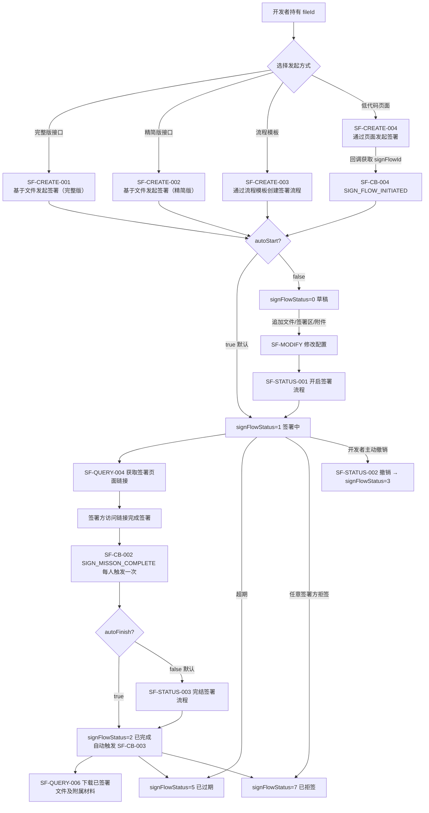
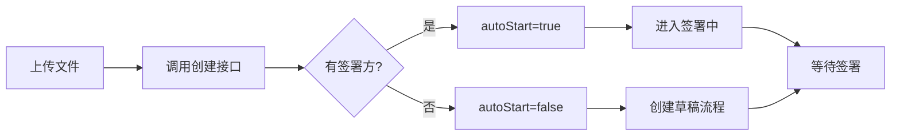

# 签署流程（含查询/下载）

## 1 文档元数据

| 字段 | 内容 |
| --- | --- |
| PRD-ID | F-003 |
| 产品线 | 签署流程（pdf-sign3） |
| 需求类型 | 新功能（V3 标准化重构） |
| 需求状态 | 草稿 |
| 当前版本 | V1.0 |
| 最后更新日期 | 2026-05-21 |
| 关键词（Tag） | 签署流程、待签文件、签署区、发起签署、追加文件、催签、流程延期、流程撤回、完结、下载文件 |
| 关联需求卡片 | 暂无（从 Epic E-001 抽取） |
| 关联页面规格卡 | 待产出 |
| 关联原型文件 | 待产出 |
| 所属 Epic | [E-001 e签宝 OpenAPI 3.0 一期](../E-001-e签宝OpenAPI3.0一期/prd.md) |
| 关联 Feature | [F-001 认证授权与免登体系](../F-001-认证授权与免登体系/prd.md)（需要授权调用）<br/>[F-002 文件&流程模板管理](../F-002-文件&流程模板管理/prd.md)（文件模板填充） |

## 2 文档修订记录

| 版本 | 日期 | 修订内容 | 修订人 |
| --- | --- | --- | --- |
| V1.0 | 2026-05-21 | 基于 pdf-sign3 opendoc 抽取 | 门生 |

## 3 需求概要

### 3.1 问题与机会（概要）

**现状问题**：
- V3 标准化接口需要覆盖签署流程的完整生命周期：发起、签署区管理、文件追加、流程控制、查询、下载
- 签署流程涉及多种状态、签署方类型、签署区控制，需要明确接口边界
- 多方签署、会签/或签、批量签等复杂场景需要覆盖

**机会**：
- V3 提供标准化的 RESTful 接口，统一签署流程管理
- 通过回调机制让开发者实时感知签署状态变化
- 支持多种签署配置（签署方式、签署顺序、强制阅读、通知等）

### 3.2 目标用户（概要）

- **核心用户**：**P3 企业集成开发者**——通过 API 发起签署流程、管理签署进度、处理签署回调
- **次级用户**：**P6 签署参与者**——在页面完成签署操作
- **间接用户**：**P4 企业管理员**——管理企业签署流程、审批用印<br/>**P2 平台运营人员**——排查签署异常

### 3.3 方案概述

按功能类别组织，覆盖签署流程完整生命周期：

1. **流程发起**（SIGN-CREATE-001~003）：完整版/精简版/页面发起
2. **流程控制**（SIGN-MGMT-001~005）：开启、追加文件/签署区/抄送方/附属材料、催签、延期、撤回、完结
3. **流程查询**（SIGN-QUERY-001~003）：详情、列表、集成方企业流程
4. **文件下载**（SIGN-DOWNLOAD-001~002）：签署中文件、已签署文件
5. **流程维护**（SIGN-MAINT-001~003）：删除待签文件、删除签署区、删除抄送方、删除附属材料
6. **解约**（SIGN-RESCIND-001~002）：发起解约、页面发起解约
7. **签署页面**（SIGN-PAGE-001~002）：获取签署页面链接、获取批量签页面链接

### 3.4 成功指标（3-5 项）

| 指标 | 目标值 | 观测时间 | 数据来源 |
| --- | --- | --- | --- |
| 签署成功率 | ≥ 99% | 月度 | 签署接口监控 |
| 签署完成平均耗时 | ≤ 24h | 上线后 90 天 | 签署流程埋点 |
| 签署流程接口响应时间 | ≤ 500ms（P99） | 月度 | API 监控 |
| 回调送达成功率 | ≥ 99.5% | 月度 | 回调投递指标 |

---

## 4 需求对象与概念模型

> 业务术语参考：context/business-glossary.md
> 已在术语表收录、本 PRD 直接引用的术语：**签署流程(signFlowId)**、**待签文件(fileId)**、**签署区(areaId)**、**发起方**、**签署方**、**填表补充人**、**抄送方**、**附属材料**、**催签**、**流程延期**、**流程完结**、**待签文件**。
>
> 本 PRD 新引入的术语 / 枚举：

| 术语 | 类型 | 定义 | 约束/备注 |
| --- | --- | --- | --- |
| signFlowStatus | 枚举值 | 签署流程状态 | 0=草稿 / 1=签署中 / 2=已完成 / 3=撤销 / 5=过期 / 7=拒签 |
| signers[].signerType | 枚举值 | 签署方类型 | 0=个人签署方 / 1=机构签署方 |
| signers[].signOrder | int32 | 签署顺序 | 1-255，值小的先签署 |
| signFlowExpireTime | int64 | 签署截止时间 | Unix时间戳（毫秒），默认创建后90天 |
| identityVerify | boolean | 身份校验 | true=校验不通过时报错 / false=不报错允许修改 |
| autoStart | boolean | 自动开启 | true=自动进入签署中 / false=需调用开启接口 |
| autoFinish | boolean | 自动完结 | true=所有签署完成后自动完结 / false=需调用完结接口 |
| noticeTypes | string | 通知类型 | 1=短信 / 2=邮件 / 3=钉钉 / 5=微信 / 6=企微 / 7=飞书，空=不通知 |
| signSceneType | 枚举值 | 签署场景类型 | NORMAL=中国大陆签 / GLOBAL=海外签 |

---

## 5 功能结构

### 5.1 本需求新增的功能节点

```mermaid
graph TD
    SIGN[F-003 签署流程 / pdf-sign3]
    SIGN --> C1[SGN-CREATE 流程发起]
    SIGN --> C2[SGN-MGMT 流程控制]
    SIGN --> C3[SGN-QUERY 流程查询]
    SIGN --> C4[SGN-DOWNLOAD 文件下载]
    SIGN --> C5[SGN-MAINT 流程维护]
    SIGN --> C6[SGN-RESCIND 解约]
    SIGN --> C7[SGN-PAGE 签署页面]

    C1 --> C1A[SGN-CREATE-001 完整版发起]
    C1 --> C1B[SGN-CREATE-002 精简版发起]
    C1 --> C1C[SGN-CREATE-003 页面发起]

    C2 --> C2A[SGN-MGMT-001 开启签署流程]
    C2 --> C2B[SGN-MGMT-002 追加待签文件]
    C2 --> C2C[SGN-MGMT-003 追加签署区]
    C2 --> C2D[SGN-MGMT-004 追加抄送方]
    C2 --> C2E[SGN-MGMT-005 追加附属材料]
    C2 --> C2F[SGN-MGMT-006 催签]
    C2 --> C2G[SGN-MGMT-007 流程延期]
    C2 --> C2H[SGN-MGMT-008 撤回签署流程]
    C2 --> C2I[SGN-MGMT-009 完结签署流程]

    C3 --> C3A[SGN-QUERY-001 查询流程详情]
    C3 --> C3B[SGN-QUERY-002 查询流程列表]
    C3 --> C3C[SGN-QUERY-003 查询集成方流程]

    C4 --> C4A[SGN-DOWNLOAD-001 下载签署中文件]
    C4 --> C4B[SGN-DOWNLOAD-002 下载已签署文件]

    C5 --> C5A[SGN-MAINT-001 删除待签文件]
    C5 --> C5B[SGN-MAINT-002 删除签署区]
    C5 --> C5C[SGN-MAINT-003 删除抄送方]
    C5 --> C5D[SGN-MAINT-004 删除附属材料]

    C6 --> C6A[SGN-RESCIND-001 发起解约]
    C6 --> C6B[SGN-RESCIND-002 页面发起解约]

    C7 --> C7A[SGN-PAGE-001 获取签署页面链接]
    C7 --> C7B[SGN-PAGE-002 获取批量签页面链接]
```



### 5.2 本需求核心业务流程



### 5.3 核心业务规则

> 跨多个功能的全局约束。

| 规则编号 | 规则描述 | 备注 |
| --- | --- | --- |
| BR-01 | 签署流程按 appId/orgId 隔离，跨企业调用无效 | 按 F-001 授权规则 |
| BR-02 | 签署流程有效期默认 90 天，最长不超过 90 天 | opendoc idv0fv 字段说明 |
| BR-03 | 已完成签署流程无法撤回/删除待签文件 | 业务规则 |
| BR-04 | autoStart=true 时无法追加待签文件 | opendoc su5g42 注意事项 |
| BR-05 | autoFinish=true 时无法追加签署区/抄送方 | opendoc su5g42 注意事项 |
| BR-06 | 自动开启的流程签名字段顺序须统一（同时签或按序签） | opendoc 相关说明 |
| BR-07 | 签署截止时间最大可设置为创建后 90 天 | opendoc signFlowExpireTime 说明 |
| BR-08 | 批量签署页面多流程共用，singleSign=1 时为单人单流程模式 | opendoc sq4xxq 说明 |

---

## 6 用户故事与用例

### 6.1 Epic

让企业集成开发者能够通过 V3 标准化 API 完整管理签署流程的生命周期：从发起、签署区管理、文件追加、催签、延期、撤回到下载归档，同时通过回调实时感知签署状态变化，实现企业电子合同签署的完整闭环。

### 6.2 Must Have（MVP）

**故事 1：开发者通过文件发起签署流程**

```text
作为企业集成开发者，
我希望上传待签署文件（或使用模板填充生成文件）后，能够调用发起签署接口创建签署流程，并获得签署页面链接，以便签署方完成签署。
```

验收标准（Gherkin）：
- Given 调用方持有有效的待签文件 fileId，或通过 F-002 模板填充生成 fileId
- When 调用 POST /v3/sign-flow/create-by-file 传入 fileId + signers[]
- Then 返回 code=0、signFlowId、signUrl（当 autoStart=true 时）
- And 若 autoStart=false，签署方需调用开启接口后进入签署中状态

**故事 2：多签署方签署并追加签署区**

```text
作为企业集成开发者，
我希望在发起签署时可以不设置签署方，后续通过追加签署区接口添加签署人，以灵活应对签署方信息不确定的场景。
```

验收标准（Gherkin）：
- Given 已有草稿状态的签署流程（autoStart=false）
- When 调用 POST /v3/sign-flow/{signFlowId}/signer-config 传入签署方信息
- Then 返回 code=0，签署区添加成功

**故事 3：查询签署进度和管理流程**

```text
作为企业集成开发者，
我希望按 signFlowId 查询当前签署进度和各签署方的签署状态，或批量查询企业内的签署流程列表，以便实时掌握流程进展。
```

验收标准（Gherkin）：
- Given 开发者持有 signFlowId
- When 调用 GET /v3/sign-flow/{signFlowId}
- Then 返回流程详情、各签署方状态、已完成签署的 fileId

- Given 开发者需要查询多个流程
- When 调用 GET /v3/sign-flows 传入查询条件
- Then 返回分页的流程列表

**故事 4：催签和流程延期**

```text
作为企业集成开发者，
我希望对签署方进行催签提醒，或者在临近截止时延长签署时间，以便推动签署进程。
```

验收标准（Gherkin）：
- Given 签署流程处于签署中状态，签署方尚未签署
- When 调用 POST /v3/sign-flow/{signFlowId}/remind
- Then 向签署方发送短信/邮件催签通知

- Given 签署流程临近截止日期
- When 调用 PUT /v3/sign-flow/{signFlowId}/expire-time 传入新截止时间
- Then 签署截止时间更新成功

**故事 5：下载已签署文件和归档处理**

```text
作为企业集成开发者，
我希望签署完成后能够下载已签署的 PDF 文件（包括 OFD 格式），并进行归档处理。
```

验收标准（Gherkin）：
- Given 签署流程已完成（signFlowStatus=2）
- When 调用 GET /v3/sign-flow/{signFlowId}/documents/download
- Then 返回带签名的合同文件下载链接（有效期 60 分钟）

**故事 6：撤回和作废签署流程**

```text
作为企业集成开发者，
我希望能够在签署过程中撤回已发起的签署流程，或在签署完成后发起解约。
```

验收标准（Gherkin）：
- Given 签署流程状态为签署中（非��完��/已撤销/已过期）
- When 调用 PUT /v3/sign-flow/{signFlowId}/revoke 传入撤销理由
- Then 流程状态变更为已撤销，签署流程终止

**故事 7：获取批量签署页面链接**

```text
作为企业集成开发者，
我希望能够一次性获取多流程的批量签署页面链接，让签署方在一个页面完成多个合同的签署。
```

验收标准（Gherkin）：
- Given 开发者持有多个 signFlowId
- When 调用 GET /v3/sign-flow/{signFlowId}/batch-sign-url
- Then 返回批量签署页面链接

---

## 7 功能清单

### 7.1 流程发起（SGN-CREATE）

| 功能 ID | 功能名称 | opendoc | 接口路径 | 优先级 | 展开状态 |
| --- | --- | --- | --- | --- | --- |
| SGN-CREATE-001 | 基于文件发起签署（完整版） | su5g42 | POST /v3/sign-flow/create-by-file | P0 | ✅ 已展开 |
| SGN-CREATE-002 | 基于文件发起签署（精简版） | nxhgcl3bfgqz8qlz | POST /v3/sign-flow/create-by-file | P0 | ✅ 已展开 |
| SGN-CREATE-003 | 通过页面发起签署 | lp54bn | POST /v3/sign-flow/page-create | P1 | 待展开 |

### 7.2 流程控制（SGN-MGMT）

| 功能 ID | 功能名称 | opendoc | 接口路径 | 优先级 | 展开状态 |
| --- | --- | --- | --- | --- |
| SGN-MGMT-001 | 开启签署流程 | pu4xsx | PUT /v3/sign-flow/{signFlowId}/start | P0 | ✅ 已展开 |
| SGN-MGMT-002 | 追加待签文件 | fuuzv5 | POST /v3/sign-flow/{signFlowId}/documents | P0 | ✅ 已展开 |
| SGN-MGMT-003 | 追加签署区 | ohzup7 | POST /v3/sign-flow/{signFlowId}/signer-config | P0 | ✅ 已展开 |
| SGN-MGMT-004 | 添加抄送方 | pkicgm | POST /v3/sign-flow/{signFlowId}/copy-to | P0 | ✅ 已展开 |
| SGN-MGMT-005 | 追加附属材料 | huo44q | POST /v3/sign-flow/{signFlowId}/attachments | P1 | ✅ 已展开 |
| SGN-MGMT-006 | 催签 | yws940 | POST /v3/sign-flow/{signFlowId}/remind | P0 | ✅ 已展开 |
| SGN-MGMT-007 | 流程延期 | idv0fv | PUT /v3/sign-flow/{signFlowId}/expire-time | P0 | ✅ 已展开 |
| SGN-MGMT-008 | 撤回签署流程 | klbicu | PUT /v3/sign-flow/{signFlowId}/revoke | P0 | ✅ 已展开 |
| SGN-MGMT-009 | 完结签署流程 | ynwqsm | PUT /v3/sign-flow/{signFlowId}/finish | P0 | ✅ 已展开 |

### 7.3 流程查询（SGN-QUERY）

| 功能 ID | 功能名称 | opendoc | 接口路径 | 优先级 | 展开状态 |
| --- | --- | --- | --- | --- | --- |
| SGN-QUERY-001 | 查询签署流程详情 | xxk4q6 | GET /v3/sign-flow/{signFlowId} | P0 | ✅ 已展开 |
| SGN-QUERY-002 | 查询签署流程列表 | kq4b2e | GET /v3/sign-flows | P0 | ✅ 已展开 |
| SGN-QUERY-003 | 查询集成方企业流程列表 | uhma1i | GET /v3/org-sign-flows | P1 | ✅ 已展开 |

### 7.4 文件下载（SGN-DOWNLOAD）

| 功能 ID | 功能名称 | opendoc | 接口路径 | 优先级 | 展开状态 |
| --- | --- | --- | --- | --- |
| SGN-DOWNLOAD-001 | 下载签署中文件 | gkgc4729sa67upfn | GET /v3/sign-flow/{signFlowId}/executing-doc | P1 | ✅ 已展开 |
| SGN-DOWNLOAD-002 | 下载已签署文件及附属材料 | kczf8g | GET /v3/sign-flow/{signFlowId}/documents/download | P0 | ✅ 已展开 |

### 7.5 流程维护（SGN-MAINT）

| 功能 ID | 功能名称 | opendoc | 接口路径 | 优先级 | 展开状态 |
| --- | --- | --- | --- | --- |
| SGN-MAINT-001 | 删除待签文件 | pvs0cm | DELETE /v3/sign-flow/{signFlowId}/document/{fileId} | P0 | ✅ 已展开 |
| SGN-MAINT-002 | 删除签署区 | bd27ph | DELETE /v3/sign-flow/{signFlowId}/signer-config/{signerConfigId} | P0 | ✅ 已展开 |
| SGN-MAINT-003 | 删除抄送方 | bdn9yt | DELETE /v3/sign-flow/{signFlowId}/copy-to/{copyToId} | P0 | ✅ 已展开 |
| SGN-MAINT-004 | 删除附属材料 | wvvyv8 | DELETE /v3/sign-flow/{signFlowId}/attachment/{fileId} | P1 | ✅ 已展开 |

### 7.6 解约（SGN-RESCIND）

| 功能 ID | 功能名称 | opendoc | 接口路径 | 优先级 | 展开状态 |
| --- | --- | --- | --- | --- |
| SGN-RESCIND-001 | 发起合同解约 | rcgt2karhmz1i | POST /v3/sign-flow/{signFlowId}/rescind | P1 | ✅ 已展开 |
| SGN-RESCIND-002 | 页面发起解约 | dy90gx | POST /v3/sign-flow/{signFlowId}/rescind-by-page | P1 | 待展开 |

### 7.7 签署页面（SGN-PAGE）

| 功能 ID | 功能名称 | opendoc | 接口路径 | 优先级 | 展开状态 |
| --- | --- | --- | --- | --- |
| SGN-PAGE-001 | 获取签署页面链接 | pvfkwd | GET /v3/sign-flow/{signFlowId}/sign-url | P0 | ✅ 已展开 |
| SGN-PAGE-002 | 获取批量签页面链接 | sq4xxq | GET /v3/sign-flow/{signFlowId}/batch-sign-url | P0 | ✅ 已展开 |

---

## 8 功能需求说明书

### 8.1 SGN-CREATE-001 基于文件发起签署（完整版）

#### 8.1.1 任务故事

见 §6.2 故事 1。

#### 8.1.2 逻辑实现规范

**Context**：发起签署流程，支持设置待签署文件、附属材料、签署流程配置、签署方信息等完整参数。

**Action**：`POST /v3/sign-flow/create-by-file`

**请求参数**：

| 参数名称 | 类型 | 必选 | 说明 |
| --- | --- | --- | --- |
| docs[].fileId | string | 是 | 待签署文件ID |
| docs[].fileName | string | 否 | 文件名称（含后缀） |
| docs[].neededPwd | boolean | 否 | 是否需要密码，默认false |
| docs[].fileEditPwd | string | 否 | 文件编辑密码 |
| docs[].contractBizTypeId | string | 否 | 合同类型ID（配合智能台账使用） |
| docs[].order | int | 否 | 文件展示顺序 1-50 |
| attachments[].fileId | string | 否 | 附属材料文件ID |
| attachments[].fileName | string | 否 | 附属材料名称 |
| signFlowConfig.signFlowTitle | string | 是 | 签署流程主题 |
| signFlowConfig.signFlowExpireTime | int64 | 否 | 签署截止时间（Unix毫秒，最大创建后90天） |
| signFlowConfig.autoStart | boolean | 否 | 自动开启，默认true |
| signFlowConfig.autoFinish | boolean | 否 | 自动完结，默认false |
| signFlowConfig.identityVerify | boolean | 否 | 身份校验，默认true |
| signFlowConfig.notifyUrl | string | 否 | 回调通知地址 |
| signFlowConfig.redirectConfig.redirectUrl | string | 否 | 签署完成后跳转地址 |
| signFlowConfig.redirectConfig.redirectDelayTime | int32 | 否 | 跳转延迟时间（秒） |
| signFlowConfig.signConfig.availableSignClientTypes | string | 否 | 签署终端类型 |
| signFlowConfig.signConfig.showBatchDropSealButton | boolean | 否 | 显示一键落章按钮 |
| signFlowConfig.signConfig.signTipsTitle | string | 否 | 签署前提示标题（最多20字） |
| signFlowConfig.signConfig.signTipsContent | string | 否 | 签署前提示内容（最多500字） |
| signFlowConfig.signConfig.signMode | string | 否 | 签署模式：NORMAL/GLOBAL |
| signFlowConfig.noticeConfig.noticeTypes | string | 否 | 通知类型（1/2/3/5/6/7） |
| signFlowConfig.authConfig.willingnessAuthModes | list | 否 | 签署意愿认证方式 |
| signFlowConfig.authConfig.psnAvailableAuthModes | list | 否 | 个人实名认证方式 |
| signFlowConfig.authConfig.orgAvailableAuthModes | list | 否 | 机构实名认证方式 |
| signFlowConfig.contractConfig.contractSecrecy | int | 否 | 合同保密配置：1=不保密/2=全保密 |
| signFlowConfig.contractConfig.allowToRescind | boolean | 否 | 是否允许解约，默认true |
| signers[].signConfig.signOrder | int32 | 否 | 签署顺序 |
| signers[].signConfig.forcedReadingTime | int32 | 否 | 强制阅读倒计时 |
| signers[].noticeConfig.noticeTypes | string | 否 | 签署方通知类型 |
| signers[].signerType | int | 否 | 签署方类型：0=个人/1=机构 |
| signers[].psnSignerInfo.psnAccount | string | 否 | 个人账号（手机号/邮箱） |
| signers[].psnSignerInfo.psnInfo.psnName | string | 否 | 姓名 |
| signers[].psnSignerInfo.psnInfo.psnIDCardNum | string | 否 | 证件号 |
| signers[].psnSignerInfo.psnInfo.psnIDCardType | string | 否 | 证件类型 |
| signers[].orgSignerInfo.orgId | string | 否 | 机构ID |
| signers[].orgSignerInfo.transactor.psnId | string | 否 | 经办人ID |
| signFlowInitiator.orgInitiator.orgId | string | 否 | 机构发起方ID |
| signFlowInitiator.psnInitiator.psnId | string | 否 | 个人发起方ID |

**Outcome**：
- 返回 `code=0`
- 返回 `data.signFlowId`：签署流程ID
- 当 autoStart=true 时返回 `data.signUrl`：签署页面链接（短链）
- 当 autoStart=true 时返回 `data.signLongUrl`：签署页面链接（长链）

#### 8.1.3 异常处理要求

| 异常 | 触发 | 系统行为 |
| --- | --- | --- |
| fileId 不存在或无效 | 传入的 fileId 不存在 | code 非 0，message 提示文件不存在 |
| signFlowExpireTime 超过90天 | 传入的截止时间超出创建后90天 | code 非 0，message 提示超过最大天数 |
| 未设置签署方且 autoStart=true | signers 为空且 autoStart=true | code 非 0，message 提示签署方不能为空 |
| 签署方超过10个 | signers 数组超过10个 | code 非 0，message 提示超出数量限制 |
| autoStart=true 时追加文件 | autoStart=true 时调用追加接口 | code 非 0，message 提示无法追加 |

#### 8.1.4 业务流转图



#### 8.1.5 数据字典

见 8.1.2 请求参数。

#### 8.1.6 状态流转表

| 起始状态 | 事件 | 目标状态 |
| --- | --- | --- |
| - | 创建且 autoStart=true | 签署中(1) |
| - | 创建且 autoStart=false | 草稿(0) |
| 草稿(0) | 调用开启接口 | 签署中(1) |

#### 8.1.7 权限矩阵

| 角色 | 可见范围 | 可执行动作 | 数据范围约束 |
| --- | --- | --- | --- |
| 发起方(appId) | 仅本 appId 发起的流程 | 发起/查询/管理 | 按 appId 隔离 |
| 机构(orgId) | 仅本 orgId 的流程 | 签署/查询 | 按 orgId 隔离 |

#### 8.1.8 边界条件与并发规则

- 同一流程不能同时被多个请求修改，后续操作会覆盖之前的修改
- 文件上传和模板填充会生成不同的 fileId，需要确保 fileId 有效
- 多方签署时 signOrder 相同的为同时签署

#### 8.1.9 PRD-页面规格卡映射

本功能涉及以下页面：
- 签署页面（H5/PC 自适应，受 availableSignClientTypes 控制）

**预计生成页面规格卡**：
- SIGN-PAGE-签署页面

#### 8.1.10 对外 OpenAPI 变更说明

| 接口路径 | 变更类型 | 是否影响对外文档 |
| --- | --- | --- |
| POST /v3/sign-flow/create-by-file | 新增 | 是 |

---

### 8.2 SGN-CREATE-002 基于文件发起签署（精简版）

（见 opendoc nxhgcl3bfgqz8qlz，与完整版相比减少了一些可选参数，参数说明同理）

**请求参数**（精简）：

| 参数名称 | 类型 | 必选 | 说明 |
| --- | --- | --- | --- |
| docs[].fileId | string | 是 | 待签署文件ID |
| signFlowTitle | string | 是 | 签署流程主题 |
| signers[].signerType | int | 是 | 签署方类型 |
| signers[].psnSignerInfo.psnAccount | string | 否 | 个人账号 |
| signers[].orgSignerInfo.orgId | string | 否 | 机构ID |

---

### 8.3 SGN-MGMT-001 开启签署流程

（见 opendoc pu4xsx）

**接口**：`PUT /v3/sign-flow/{signFlowId}/start`

**Context**：草稿状态的签署流程，通过本接口变为签署中状态。签署流程开启后，签署任务会按照流程既定配置开始执行（通知相关签署人开始签署等）。

**请求参数**：

| 参数名称 | 类型 | 必选 | 说明 |
| --- | :---: | :---: | --- |
| signFlowId | string | 是 | path，签署流程ID |

**响应参数**：

| 参数名称 | 类型 | 必选 | 说明 |
| --- | :---: | :---: | --- |
| code | int32 | 是 | 业务码，0表示成功 |
| message | string | 否 | 业务信息 |
| data | object | 否 | 业务数据 |

**响应示例**：
```json
{
    "code": 0,
    "message": "成功",
    "data": null
}
```

**异常处理要求**：

| 异常 | 触发 | 系统行为 |
| --- | --- | --- |
| 流程状态非草稿 | 已在开启/已完成/已撤销等状态 | code 非 0，message 提示当前状态不允许开启 |
| signFlowId 不存在 | 传入的 signFlowId 无效 | code 非 0，message 提示流程不存在 |

**注意事项**：
- 签署流程开启后，将不允许向签署流程中添加或删除待签文件和附属材料
- 签署流程开启后，可追加签署区，但 autoFinish=true 的流程不允许添加签署区

---

### 8.4 SGN-MGMT-002 追加待签文件

（见 opendoc fuuzv5）

**接口**：`POST /v3/sign-flow/{signFlowId}/unsigned-files`

**Context**：向草稿状态的签署流程中追加待签署文件，仅限流程开启之前允许追加。

**请求参数**：

| 参数名称 | 类型 | 必选 | 说明 |
| --- | :---: | :---: | --- |
| signFlowId | string | 是 | path，签署流程ID |
| unsignedFiles[].fileId | string | 是 | 待签署文件ID |
| unsignedFiles[].fileName | string | 否 | 待签署文件名称（含扩展名，如合同.pdf） |
| unsignedFiles[].neededPwd | int32 | 否 | 是否需要编辑密码：0-不需要，1-需要，默认0 |
| unsignedFiles[].fileEditPwd | string | 否 | 文档编辑密码（neededPwd为1时必填） |
| unsignedFiles[].contractBizTypeId | string | 否 | 合同类型ID（配合智能台账使用） |
| unsignedFiles[].order | int | 否 | 文件展示顺序 1-50 |

**响应参数**：

| 参数名称 | 类型 | 必选 | 说明 |
| --- | :---: | :---: | --- |
| code | int32 | 是 | 业务码，0表示成功 |
| message | string | 否 | 业务信息 |
| data | object | 否 | 业务数据 |

**响应示例**：
```json
{
    "code": 0,
    "message": "成功",
    "data": null
}
```

**异常处理要求**：

| 异常 | 触发 | 系统行为 |
| --- | --- | --- |
| 流程已开启 | autoStart=true 的流程 | code 非 0，message 提示无法追加 |
| 文件大小超限 | 单一文件超过20MB | code 非 0，message 提示文件过大 |
| 文件数量超限 | 流程中文件超过50个 | code 非 0，message 提示超出数量限制 |
| fileId 不存在 | 传入的文件ID无效 | code 非 0，message 提示文件不存在 |

**注意事项**：
- 仅限草稿状态（autoStart=false）时方可追加
- 已开启或自动开启的签署流程不允许追加待签文件
- 文件需先上传至 e签宝或通过模板填充生成
- 文件名称必须包含文件扩展名
- 文件名不支持 / \ : * " < > | ? 等9个特殊字符

### 8.5 SGN-MGMT-003 追加签署区

（见 opendoc ohzup7）

**接口**：`POST /v3/sign-flow/{signFlowId}/signers/sign-fields`

**Context**：向已创建的签署流程中追加签署方、签署区。

**请求参数**：

| 参数名称 | 类型 | 必选 | 说明 |
| --- | :---: | :---: | --- |
| signFlowId | string | 是 | path，签署流程ID |
| identityVerify | boolean | 否 | 身份校验配置，默认true：校验不通过时报错；false：不报错允许修改 |
| signers[].signerType | int32 | 是 | 签署方类型：0-个人，1-机构，2-法定代表人，3-经办人 |
| signers[].signConfig.signOrder | int32 | 否 | 签署顺序 1-255，值小的先签 |
| signers[].signConfig.signTaskType | int32 | 否 | 签署任务类型：0-会签，1-或签 |
| signers[].authConfig.willingnessAuthModes | list | 否 | 签署意愿认证方式 |
| signers[].noticeConfig.noticeTypes | string | 否 | 通知类型：1-短信，2-邮件，3-钉钉，5-微信，6-企微，7-飞书 |
| signers[].psnSignerInfo.psnAccount | string | 否 | 个人账号（手机号/邮箱） |
| signers[].psnSignerInfo.psnInfo.psnName | string | 否 | 姓名 |
| signers[].orgSignerInfo.orgId | string | 否 | 机构ID |
| signers[].orgSignerInfo.transactorInfo.psnId | string | 否 | 经办人ID |
| signers[].signFields[].fileId | string | 是 | 签署区所在文件ID |
| signers[].signFields[].signFieldType | int32 | 否 | 签署区类型：0-签章区，1-备注区，2-独立签署日期 |
| signers[].signFields[].normalSignFieldConfig.autoSign | boolean | 否 | 是否后台自动签章，默认false |
| signers[].signFields[].normalSignFieldConfig.signFieldPosition.positionPage | string | 否 | 签章区所在页码 |
| signers[].signFields[].normalSignFieldConfig.signFieldPosition.positionX | float | 否 | 签章区X坐标 |
| signers[].signFields[].normalSignFieldConfig.signFieldPosition.positionY | float | 否 | 签章区Y坐标 |

**响应参数**：

| 参数名称 | 类型 | 必选 | 说明 |
| --- | :---: | :---: | --- |
| code | int32 | 是 | 业务码，0表示成功 |
| message | string | 否 | 业务信息 |
| data[].signFieldId | string | 否 | 签署区ID |
| data[].fileId | string | 否 | 签署区所在文件ID |

**响应示例**：
```json
{
    "code": 0,
    "message": "成功",
    "data": [{
        "signFieldId": "8fd1*****ff25ef6d",
        "fileId": "0d8b8cf3******a2f2afd1df"
    }]
}
```

**异常处理要求**：

| 异常 | 触发 | 系统行为 |
| --- | --- | --- |
| autoFinish=true 时追加签署区 | 自动完结流程 | code 非 0，message 提示不允许添加 |
| 流程状态非草稿/签署中 | 流程已完成/已撤销等 | code 非 0，message 提示状态不允许 |
| 签署区超限 | 签署区超过300个 | code 非 0，message 提示超出数量限制 |
| fileId 不存在 | 传入的文件ID无效 | code 非 0，message 提示文件不存在 |

**注意事项**：
- 流程在"草稿"和"签署中"状态时允许追加
- autoFinish=true 的流程不支持再添加签署区
- 需确保流程中已添加了签署区所在的待签署文件

---

### 8.6 SGN-MGMT-004 添加抄送方

（见 opendoc pkicgm）

**接口**：`POST /v3/sign-flow/{signFlowId}/copiers`

**Context**：向已发起的流程中添加抄送方，使未参与签署的个人或企业接收签署相关信息。抄送方不参与签署，可以查看流程中的签署文件和附属材料。

**请求参数**：

| 参数名称 | 类型 | 必选 | ��明 |
| --- | :---: | :---: | --- |
| signFlowId | string | 是 | path，签署流程ID |
| copiers[].copierOrgInfo.orgId | string | 否 | 抄送机构账号ID |
| copiers[].copierOrgInfo.orgName | string | 否 | 抄送机构名称 |
| copiers[].copierPsnInfo.psnId | string | 否 | 抄送人账号ID |
| copiers[].copierPsnInfo.psnAccount | string | 否 | 抄送人账号（手机号/邮箱） |

**响应参数**：

| 参数名称 | 类型 | 必选 | 说明 |
| --- | :---: | :---: | --- |
| code | int32 | 是 | 业务码，0表示成功 |
| message | string | 否 | 业务信息 |
| data | object | 否 | 业务数据 |

**异常处理要求**：

| 异常 | 触发 | 系统行为 |
| --- | --- | --- |
| autoFinish=true 时添加抄送方 | 自动完结流程 | code 非 0，message 提示不允许 |
| 抄送方重复 | 已存在的抄送方 | code 非 0，message 提示重复 |

**注意事项**：
- 自动完结的流程（autoFinish=true）不支持添加抄送方
- 抄送方不可与流程中已有的抄送方重复
- 抄送给企业时，copierPsnInfo 必须传入接收人信息

### 8.7 SGN-MGMT-005 追加附属材料

（见 opendoc huo44q）

**接口**：`POST /v3/sign-flow/{signFlowId}/attachments`

**Context**：为流程添加附件，附件无需签署，只作为签署过程中的参考资料（录音、视频、图片、文档等）。

**请求参数**：

| 参数名称 | 类型 | 必选 | 说明 |
| --- | :---: | :---: | --- |
| signFlowId | string | 是 | path，签署流程ID |
| attachmentList[].fileId | string | 是 | 附属材料文件ID |
| attachmentList[].fileName | string | 否 | 附属材料文件名称（含扩展名） |

**响应参数**：

| 参数名称 | 类型 | 必选 | 说明 |
| --- | :---: | :---: | --- |
| code | int32 | 是 | 业务码，0表示成功 |
| message | string | 否 | 业务信息 |
| data | object | 否 | 业务数据 |

**异常处理要求**：

| 异常 | 触发 | 系统行为 |
| --- | --- | --- |
| fileId 不存在 | 传入的文件ID无效 | code 非 0，message 提示文件不存在 |
| 文件名含特殊字符 | 包含 / \ : * " < > | 等 | code 非 0，message 提示文件名无效 |

**注意事项**：
- 附件文件需先通过上传本地文件接口获取 fileId
- 文件仅可阅读，不能签章
- 如需签章，应使用追加待签文件接口

---

### 8.8 SGN-MGMT-006 催签

（见 opendoc yws940）

**接口**：`POST /v3/sign-flow/{signFlowId}/urge`

**Context**：向当前轮到签署但还未签署的签署人发送催签提醒。

**请求参数**：

| 参数名称 | 类型 | 必选 | 说明 |
| --- | :---: | :---: | --- |
| signFlowId | string | 是 | path，签署流程ID |
| noticeTypes | string | 否 | 通知方式：1-短信，2-邮件，默认按流程设置 |
| urgedOperator.psnAccount | string | 否 | 被催签人账号（手机号/邮箱） |
| urgedOperator.psnId | string | 否 | 被催签人账号ID |

**响应参数**：

| 参数名称 | 类型 | 必选 | 说明 |
| --- | :---: | :---: | --- |
| code | int32 | 是 | 业务码，0表示成功 |
| message | string | 否 | 业务信息 |
| data | object | 否 | 业务数据 |

**异常处理要求**：

| 异常 | 触发 | 系统行为 |
| --- | --- | --- |
| 发起签署后半小时内 | 流程创建时间<30分钟 | code 非 0，message 提示不允许催签 |
| 催签间隔不足 | 上次催签距今<10分钟 | code 非 0，message 提示催签过于频繁 |
| 流程已完结 | signFlowStatus=2 | code 非 0，message 提示流程已完结 |

**注意事项**：
- 发起签署后前半小时不可催签
- 与上次催签需间隔十分钟以上
- 为空时催签当前轮到签署但还未签署的所有签署人

---

### 8.9 SGN-MGMT-007 流程延期

（见 opendoc idv0fv）

**接口**：`PUT /v3/sign-flow/{signFlowId}/delay`

**Context**：延长签署流程中设置的签署截止时间。

**请求参数**：

| 参数名称 | 类型 | 必选 | 说明 |
| --- | :---: | :---: | --- |
| signFlowId | string | 是 | path，签署流程ID |
| signFlowExpireTime | int64 | 是 | 新的签署截止时间（Unix时间戳，单位：毫秒） |

**响应参数**：

| 参数名称 | 类型 | 必选 | 说明 |
| --- | :---: | :---: | --- |
| code | int32 | 是 | 业务码，0表示成功 |
| message | string | 否 | 业务信息 |
| data | object | 否 | 业务数据 |

**异常处理要求**：

| 异常 | 触发 | 系统行为 |
| --- | --- | --- |
| 延期超过限制 | 新时间超出当前时间+90天 | code 非 0，message 提示超出最大天数 |
| 延期已使用 | 之前已延期过一次 | code 非 0，message 提���不可重复延期 |
| 新时间早于原时间 | signFlowExpireTime < 原截止时间 | code 非 0，message 提示时间不能提前 |

**注意事项**：
- 签署截止时间仅限往后延期一次
- 新的签署截止时间可在当前接口调用时间的基础上最多延长90天
- 自2023年6月30日起支持对已过期的流程延期（仅一次）

### 8.10 SGN-MGMT-008 撤回签署流程

（见 opendoc klbicu）

**接口**：`POST /v3/sign-flow/{signFlowId}/revoke`

**Context**：撤销签署中的流程，撤销后签署流程将终止，变为已撤销状态。

**请求参数**：

| 参数名称 | 类型 | 必选 | 说明 |
| --- | :---: | :---: | --- |
| signFlowId | string | 是 | path，签署流程ID |
| revokeReason | string | 否 | 撤销原因（最多50字） |

**响应参数**：

| 参数名称 | 类型 | 必选 | 说明 |
| --- | :---: | :---: | --- |
| code | int32 | 是 | 业务码，0表示成功 |
| message | string | 否 | 业务信息 |
| data | object | 否 | 业务数据 |

**异常处理要求**：

| 异常 | 触发 | 系统行为 |
| --- | --- | --- |
| 流程已完结 | signFlowStatus=2 | code 非 0，message 提示不可撤销 |
| 流程状态非签署中 | 非 signFlowStatus=1 | code 非 0，message 提示状态不允许撤销 |

**注意事项**：
- 签署方已完成签字盖章后撤销存在法律风险，需获得全部已完成盖章的签署方同意
- 仅指定发起方经办人的场景才支持官网撤回

---

### 8.11 SGN-MGMT-009 完结签署流程

（见 opendoc ynwqsm）

**接口**：`POST /v3/sign-flow/{signFlowId}/finish`

**Context**：完结签署流程，完成后的签署流程不允许再添加/删除签章区域，也不允许撤销。

**请求参数**：

| 参数名称 | 类型 | 必选 | 说明 |
| --- | :---: | :---: | --- |
| signFlowId | string | 是 | path，签署流程ID |

**响应参数**：

| 参数名称 | 类型 | 必选 | 说明 |
| --- | :---: | :---: | --- |
| code | int32 | 是 | 业务码，0表示成功 |
| message | string | 否 | 业务信息 |
| data | object | 否 | 业务数据 |

**异常处理要求**：

| 异常 | 触发 | 系统行为 |
| --- | --- | --- |
| 签署方未全部完成 | 有签署方未签署 | code 非 0，message 提示还有未完成的签署方 |
| 流程状态非签署中 | 非 signFlowStatus=1 | code 非 0，message 提示状态不允许 |

**注意事项**：
- autoFinish=true 时无需调用此接口，系统自动完结
- 完结后才允许下载已签署文件
- 全部签署方完成签章后才可完结流程

---

### 8.12 SGN-QUERY-001 查询签署流程详情

（见 opendoc xxk4q6）

**接口**：`GET /v3/sign-flow/{signFlowId}`

**Context**：查询签署流程详情，返回流程信息、签署状态、签署方信息等。

**请求参数**：

| 参数名称 | 类型 | 必选 | 说明 |
| --- | :---: | :---: | --- |
| signFlowId | string | 是 | path，签署流程ID |

**响应参数**：

| 参数名称 | 类型 | 必选 | 说明 |
| --- | :---: | :---: | --- |
| code | int32 | 是 | 业务码，0表示成功 |
| message | string | 否 | 业务信息 |
| data | object | 否 | 包含 signFlowId / signFlowStatus / signFlowTitle / docs / signers / Copiers 等 |

**响应示例**：
```json
{
    "code": 0,
    "message": "成功",
    "data": {
        "signFlowId": "xxx",
        "signFlowStatus": 1,
        "signFlowTitle": "合同签署",
        "docs": [],
        "signers": []
    }
}
```

**注意事项**：
- 返回流程的完整状态和所有签署方状态
- 建议通过此接口查询流程状态后再进行后续操作

---

### 8.13 SGN-QUERY-002 查询签署流程列表

（见 opendoc kq4b2e）

**接口**：`GET /v3/sign-flows`

**Context**：查询当��开发者的签署流程列表，支持分页和条件筛选。

**请求参数**：

| 参数名称 | 类型 | 必选 | 说明 |
| --- | :---: | :---: | --- |
| creator | string | 否 | 流程创建者账号ID |
| signer | string | 否 | 签署方账号ID |
| status | int | 否 | 流程状态：0-草稿，1-签署中，2-已完成，3-已撤销，5-已过期，7-已拒签 |
| startCreateTime | int64 | 否 | 创建时间起始（Unix时间戳，毫秒） |
| endCreateTime | int64 | 否 | 创建时间截止（Unix时间戳，毫秒） |
| pageIndex | int | 否 | 页码，从1开始，默认1 |
| pageSize | int | 否 | 每页数量，默认20，最大100 |

**响应参数**：

| 参数名称 | 类型 | 必选 | 说明 |
| --- | :---: | :---: | --- |
| code | int32 | 是 | 业务码，0表示成功 |
| data | object | 否 | 包含流程列表、分页信息 |

**注意事项**：
- 支持按状态、时间范围筛选
- 返回分页的流程列表

---

### 8.14 SGN-QUERY-003 查询集成方企业流程列表

（见 opendoc uhma1i）

**接口**：`GET /v3/org-sign-flows`

**Context**：查询集成方企业（orgId）下的所有签署流程列表。

**请求参数**：

| 参数名称 | 类型 | 必选 | 说明 |
| --- | :---: | :---: | --- |
| orgId | string | 否 | 机构ID |
| status | int | 否 | 流程状态 |
| pageIndex | int | 否 | 页码，默认1 |
| pageSize | int | 否 | 每页数量，默认20 |

**响应参数**：

| 参数名称 | 类型 | 必选 | 说明 |
| --- | :---: | :---: | --- |
| code | int32 | 是 | 业务码，0表示成功 |
| data | object | 否 | 企业流程列表 |

**注意事项**：
- 按机构维度查询，适用于企业管理员查看所有流程

### 8.15 SGN-DOWNLOAD-001 下载签署中文件

（见 opendoc gkgc4729sa67upfn）

**接口**：`GET /v3/sign-flow/{signFlowId}/executing-doc`

**Context**：下载签署中的文件，获取当前流程中待签署的文件下载链接。

**请求参数**：

| 参数名称 | 类型 | 必选 | 说明 |
| --- | :---: | :---: | --- |
| signFlowId | string | 是 | path，签署流程ID |

**响应参数**：

| 参数名称 | 类型 | 必选 | 说明 |
| --- | :---: | :---: | --- |
| code | int32 | 是 | 业务码，0表示成功 |
| data | object | 否 | 包含 downloadUrl 等 |

**注意事项**：
- 流程状态为草稿或签署中时可用
- 签署完成后需使用 8.16 接口下载

---

### 8.16 SGN-DOWNLOAD-002 下载已签署文件及附属材料

（见 opendoc kczf8g）

**接口**：`POST /v3/sign-flow/{signFlowId}/file-download-url`（推荐）或 `GET /v3/sign-flow/{signFlowId}/documents/download`

**Context**：流程结束后，获取签署完成的文件以及相关附属材料的下载链接。

**请求参数**：

| 参数名称 | 类型 | 必选 | 说明 |
| --- | :---: | :---: | --- |
| signFlowId | string | 是 | path，已完成状态的签署流程ID |
| urlAvailableDate | int | 否 | 下载链接有效期（秒），默认3600秒（60分钟），范围1-3600 |
| aesEncrypt | boolean | 否 | 是否使用AES加密，默认false：true-使用AES加密，false-不使用 |
| rsaSecret | string | 否 | RSA公钥（base64编码），用于文件加密 |
| rsaSecretKey | string | 否 | RSA公钥版本标识 |

**响应参数**：

| 参数名称 | 类型 | 必选 | 说明 |
| --- | :---: | :---: | --- |
| code | int32 | 是 | 业务码，0表示成功 |
| data.files[].fileId | string | 否 | 签署文件ID |
| data.files[].fileName | string | 否 | 签署文件名称 |
| data.files[].downloadUrl | string | 否 | 已签署文件下载链接（默认60分钟有效） |
| data.attachments[].fileId | string | 否 | 附属材料文件ID |
| data.attachments[].fileName | string | 否 | 附属材料文件名称 |
| data.attachments[].downloadUrl | string | 否 | 附属材料下载链接 |

**异常处理要求**：

| 异常 | 触发 | 系统行为 |
| --- | --- | --- |
| 流程非完成状态 | signFlowStatus ≠ 2 | code 非 0，message 提示非签署完成状态不允许下载 |

**注意事项**：
- 仅限 signFlowStatus=2（已完成）状态方可下载
- 下载链接默认有效期60分钟，过期后需重新调用接口获取
- 支持AES加密和RSA加密两种方式保护文件下载地址

### 8.17 SGN-MAINT-001 删除待签文件

（见 opendoc pvs0cm）

**接口**：`DELETE /v3/sign-flow/{signFlowId}/document/{fileId}`

**Context**：删除签署流程中的待签文件，仅限草稿状态且文件未被签署时可用。

**请求参数**：

| 参数名称 | 类型 | 必选 | 说明 |
| --- | :---: | :---: | --- |
| signFlowId | string | 是 | path，签署流程ID |
| fileId | string | 是 | path，待签文件ID |

**响应参数**：

| 参数名称 | 类型 | 必选 | 说明 |
| --- | :---: | :---: | --- |
| code | int32 | 是 | 业务码，0表示成功 |
| message | string | 否 | 业务信息 |

**异常处理要求**：

| 异常 | 触发 | 系统行为 |
| --- | --- | --- |
| 文件已被签署 | 签署区已使用该文件 | code 非 0，message 提示文件已签署不可删除 |

---

### 8.18 SGN-MAINT-002 删除签署区

（见 opendoc bd27ph）

**接口**：`DELETE /v3/sign-flow/{signFlowId}/signers/sign-fields/{signFieldId}`

**Context**：删除签署流程中的签署区，仅限签署方未签署时可用。

**请求参数**：

| 参数名称 | 类型 | 必选 | 说明 |
| --- | :---: | :---: | --- |
| signFlowId | string | 是 | path，签署流程ID |
| signFieldId | string | 是 | path，签署区ID |

**响应参数**：

| 参数名称 | 类型 | 必选 | 说明 |
| --- | :---: | :---: | --- |
| code | int32 | 是 | 业务码，0表示成功 |
| message | string | 否 | 业务信息 |

**注意事项**：
- 签署方未签署时可删除
- 已签署的签署区不可删除

---

### 8.19 SGN-MAINT-003 删除抄送方

（见 opendoc bdn9yt）

**接口**：`DELETE /v3/sign-flow/{signFlowId}/copiers/{copyToId}`

**Context**：删除流程中的抄送方。

**请求参数**：

| 参数名称 | 类型 | 必选 | 说明 |
| --- | :---: | :---: | --- |
| signFlowId | string | 是 | path，签署流程ID |
| copyToId | string | 是 | path，抄送方ID |

**响应参数**：

| 参数名称 | 类型 | 必选 | 说明 |
| --- | :---: | :---: | --- |
| code | int32 | 是 | 业务码，0表示成功 |
| message | string | 否 | 业务信息 |

---

### 8.20 SGN-MAINT-004 删除附属材料

（见 opendoc wvvyv8）

**接口**：`DELETE /v3/sign-flow/{signFlowId}/attachments/{fileId}`

**Context**：删除流程中的附属材料。

**请求参数**：

| 参数名称 | 类型 | 必选 | 说明 |
| --- | :---: | :---: | --- |
| signFlowId | string | 是 | path，签署流程ID |
| fileId | string | 是 | path，附属材料文件ID |

**响应参数**：

| 参数名称 | 类型 | 必选 | 说明 |
| --- | :---: | :---: | --- |
| code | int32 | 是 | 业务码，0表示成功 |
| message | string | 否 | 业务信息 |

---

### 8.21 SGN-RESCIND-001 发起合同解约

（见 opendoc rcgt2karhmz1i）

**接口**：`POST /v3/sign-flow/{signFlowId}/rescind`

**Context**：对已完成的签署流程发起解约，撤销已签署的合同法律效力。

**请求参数**：

| 参数名称 | 类型 | 必选 | 说明 |
| --- | :---: | :---: | --- |
| signFlowId | string | 是 | path，签署流程ID |
| rescindReason | string | 否 | 解约原因 |

**响应参数**：

| 参数名称 | 类型 | 必选 | 说明 |
| --- | :---: | :---: | --- |
| code | int32 | 是 | 业务码，0表示成功 |
| message | string | 否 | 业务信息 |

**注意事项**：
- 仅限已完成状态的流程可解约
- 需要流程发起时设置 allowToRescind=true（默认true��
- 需全部签署方同意解约

---

### 8.22 SGN-RESCIND-002 页面发起解约

（见 opendoc dy90gx）

**接口**：`POST /v3/sign-flow/{signFlowId}/rescind-by-page`

**Context**：通过页面方式发起解约，适用于需要用户在线确认解约的场景。

**请求参数**：

| 参数名称 | 类型 | 必选 | 说明 |
| --- | :---: | :---: | --- |
| signFlowId | string | 是 | path，签署流程ID |

**响应参数**：

| 参数名称 | 类型 | 必选 | 说明 |
| --- | :---: | :---: | --- |
| code | int32 | 是 | 业务码，0表示成功 |
| data | object | 否 | 包含页面链接 |

---

### 8.23 SGN-PAGE-001 获取签署页面链接

（见 opendoc pvfkwd）

**接口**：`GET /v3/sign-flow/{signFlowId}/sign-url`

**Context**：获取签署流程的页面链接，供签署方完成签署。

**请求参数**：

| 参数名称 | 类型 | 必选 | 说明 |
| --- | :---: | :---: | --- |
| signFlowId | string | 是 | path，签署流程ID |
| signerAccount | string | 否 | 签署方账号（指定某人） |

**响应参数**：

| 参数名称 | 类型 | 必选 | 说明 |
| --- | :---: | :---: | --- |
| code | int32 | 是 | 业务码，0表示成功 |
| data.signUrl | string | 否 | 签署页面链接（短链，7天有效） |
| data.signLongUrl | string | 否 | 签署页面链接（长链） |

---

### 8.24 SGN-PAGE-002 获取批量签页面链接

（见 opendoc sq4xxq）

**接口**：`GET /v3/sign-flow/{signFlowId}/batch-sign-url`

**Context**：获取多流程的批量签署页面链接，适用于同一签署方需要签署多个流程的场景。

**请求参数**：

| 参数名称 | 类型 | 必选 | 说明 |
| --- | :---: | :---: | --- |
| signFlowId | string | 是 | path，签署流程ID |
| signFlowIds | string | 否 | 其他流程ID（逗号分隔） |
| singleSign | int | 否 | 单人单流程模式：1-是，0-否，默认0 |

**响应参数**：

| 参数名称 | 类型 | 必选 | 说明 |
| --- | :---: | :---: | --- |
| code | int32 | 是 | 业务码，0表示成功 |
| data | object | 否 | 包含批量签署链接 |

**注意事项**：
- singleSign=1 时为单人单流程模式
- 批量签署页面有效期通常为7天

## 9 非功能性需求

### 9.1 性能指标

- 签署接口响应时间：≤ 500ms（P99）
- 签署流程查询响应时间：≤ 300ms（P99）
- 文件下载时间：≤ 3s（10MB 文件）

### 9.2 安全要求

- 签署文件下载链接有效期：60 分钟
- 需要验证调用签名
- 敏感操作（撤回/解约）需记录操作日志

### 9.3 可访问性

支持多端访问。

### 9.4 兼容性要求

| 端 | 行为 |
| --- | --- |
| 全端支持 | 签署流程相关接口为服务端调用，无端差异 |
| 页面端 | 通过 H5/小程序/PC 页面完成签署操作 |
| iframe | 刷脸认证方式在 iframe 内不支持（需用其他认证方式） |

---

## 10 验收检查清单

- [ ] **AC-1**：基于文件发起的签署流程，返回 signFlowId 和 signUrl（当 autoStart=true）
- [ ] **AC-2**：autoStart=false 时，流程状态为草稿，需调用开启接口后才能签署
- [ ] **AC-3**：追加待签文件成功，文件加入签署流程
- [ ] **AC-4**：追加签署区成功，签署方信息添加到流程
- [ ] **AC-5**：催签接口发送通知给指定签署方
- [ ] **AC-6**：流程延期成功，新的截止时间生效
- [ ] **AC-7**：撤回签署流程成功，流程状态变为已撤销
- [ ] **AC-8**：完结签署流程成功，流程状态变为已完成
- [ ] **AC-9**：查询签署流程详情返回完整的签署方状态和文件信息
- [ ] **AC-10**：查询签署流程列表支持分页和条件筛选
- [ ] **AC-11**：下载已签署文件返回有效期 60 分钟的下载链接
- [ ] **AC-12**：删除待签文件/签署区/抄送方/附属材料成功
- [ ] **AC-13**：发起解约成功，解约后流程状态变更
- [ ] **AC-14**：签署页面链接生成，包含正确的流程信息和跳转配置

---

## 11 范围外

以下能力不在本期范围：
- 签署审批流程（用印审批单独模块）
- 批量发起签署（单次多流程需逐个调用）
- 印章管理（Seal API 单独模块）
- 电子存证（Evidence API 单独模块）

---

## 12 开放问题

| # | 问题 | 提出方 | 状态 |
| --- | --- | --- | --- |
| 1 | SGN-CREATE-003 通过页面发起的详细字段定义 | AI | 待补充 |
| 2 | SGN-RESCIND-002 页面发起解约的详细字段定义 | AI | 待补充 |
| 3 | 签署流程状态详细定义（各个状态码的含义） | AI | 待补充 |
| 4 | 签署流程临期提醒是否有专用回调 Action？ | AI | **已确认**：没有专门的临期提醒回调，通过现有通知机制实现 |
| 5 | 控件组接口是否存在 pdf-sign3 与 file-and-template3 镜像？ | AI | **已确认**：与 F-002 BR-03 结论一致，按同一套接口处理，两域各保留入口 |
| 6 | 精简版发起与完整版的参数差集是什么？ | AI | **已确认**：精简版是完整版的子集，精简版仅为降低对接成本简化了参数，完整版支持所有功能 |

---

## 变更记录

> 详细变更历史见同目录 `CHANGELOG.md`。

| 版本 | 日期 | 变更摘要 |
| --- | --- | --- |
| V1.0 | 2026-05-21 | 基于 pdf-sign3 opendoc 抽取，覆盖 24 个签署流程相关接口 |