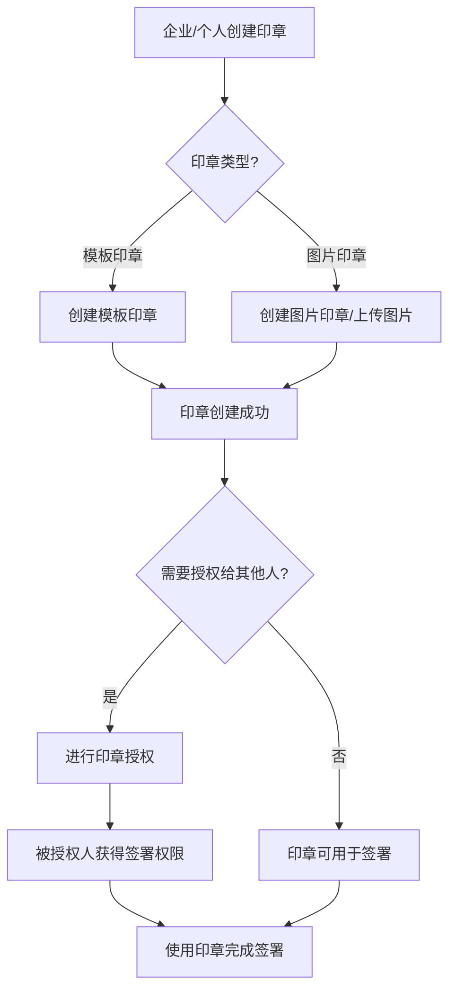

# 印章管理

## 1 文档元数据

| 字段 | 内容 |
| --- | --- |
| PRD-ID | F-005 |
| 产品线 | 印章管理（seal3） |
| 需求类型 | 新功能 |
| 需求状态 | 草稿 |
| 当前版本 | V1.0 |
| 最后更新日期 | 2026-05-21 |
| 关键词（Tag） | 印章、个人印章、机构印章、模板印章、图片印章、印章授权、默认印章 |
| 关联需求卡片 | |
| 关联页面规格卡 | 待产出 |
| 关联原型文件 | 待产出 |

## 2 文档修订记录

| 版本 | 日期 | 修订内容 | 修订人 |
| --- | --- | --- | --- |
| V1.0 | 2026-05-21 | 基于 opendoc seal3 抽取 | 吠陀 |

## 3 需求概要

### 3.1 问题与机会（概要）

**现状问题**：
- V3 印章管理接口需要在签名场景中使用，企业需要预先创建和授权印章
- 个人印章和机构印章的管理入口分离，API 需要区分不同的认证模式
- 跨企业印章授权需要明确授权规则和有效期管理

**机会**：
- V3 提供统一的印章管理 RESTful API，覆盖个人和机构印章全生命周期
- 支持模板印章、图片印章等多种印章类型
- 完整的印章授权体系（内部成员授权、跨企业授权）

### 3.2 目标用户（概要）

- **核心用户**：P3 企业集成开发者——通过 API 管理企业印章、进行印章授权
- **次级用户**：P4 企业管理员——在企业控制台管理印章
- **间接用户**：P6 签署参与者——使用已授权印章完成签署

### 3.3 方案概述

按功能类别组织，覆盖印章管理完整生命周期：

1. **个人印章**：创建模板印章、创建图片印章、查询列表、查询详情、设置默认、删除
2. **机构印章**：创建模板印章、创建图片印章、上传印章图片、查询列表、查询详情、启用/停用、设置默认、删除、获取创建页面、获取管理页面、获取法定代表人印章页面
3. **印章授权**：内部成员授权、内部成员授权详情、跨企业授权、跨企业授权详情、查询被外部企业授权、修改授权期限、解除授权、查询授权书签署链接

### 3.4 成功指标（3-5 项）

| 指标 | 目标值 | 观测时间 | 数据来源 |
| --- | --- | --- | --- |
| 印章创建接口成功率 | ≥ 99.5% | 月度 | seal3 接口监控 |
| 印章授权接口成功率 | ≥ 99.5% | 月度 | seal3 接口监控 |

---

## 4 需求对象与概念模型

> 业务术语参考：context/business-glossary.md

| 名词 | 定义 | 约束/备注 |
| --- | --- | --- |
| sealId | 印章ID | 唯一标识 |
| sealType | 印章制作方式 | 2-模板印章，3-图片印章 |
| sealStyle | 印章样式 | STANDARD=标准，HANDWRITE=手写，AI=AI手写 |
| isDefault | 是否默认印章 | true=默认，false=非默认 |
| sealStatus | 印章状态 | 1-已启用，2-待审核，3-审核不通过 |
| authType | 授权类型 | INTERNAL=内部成员授权，CROSS=跨企业授权 |
| authExpireTime | 授权到期时间 | Unix时间戳（毫秒） |

---

## 5 功能结构

### 5.1 本需求新增/调整的功能节点

```mermaid
graph TD
    SEAL[F-005 印章管理 / seal3]
    SEAL --> PSON[个人印章 SEAL-PSN]
    SEAL --> ORG[机构印章 SEAL-ORG]
    SEAL --> AUTH[印章授权 SEAL-AUTH]

    PSON --> P1[创建个人模板印章]
    PSON --> P2[创建个人图片印章]
    PSON --> P3[查询个人印章列表]
    PSON --> P4[查询个人印章详情]
    PSON --> P5[设置个人默认印章]
    PSON --> P6[删除个人印章]
    PSON --> P7[获取创建个人印章页面]
    PSON --> P8[获取管理个人印章页面]

    ORG --> O1[创建机构模板印章]
    ORG --> O2[创建机构图片印章]
    ORG --> O3[上传印章图片]
    ORG --> O4[查询企业内部印章]
    ORG --> O5[查询企业指定印章详情]
    ORG --> O6[启用机构印章]
    ORG --> O7[停用机构印章]
    ORG --> O8[设置机构默认印章]
    ORG --> O9[删除机构印章]
    ORG --> O10[获取创建机构印章页面]
    ORG --> O11[获取管理机构印章页面]
    ORG --> O12[获取创建法定代表人印章页面]

    AUTH --> A1[内部成员印章授权]
    AUTH --> A2[查询对内部成员印章授权详情]
    AUTH --> A3[跨企业印章授权]
    AUTH --> A4[查询对外部企业印章授权详情]
    AUTH --> A5[查询被外部企业授权印章]
    AUTH --> A6[修改印章授权期限]
    AUTH --> A7[解除印章授权]
    AUTH --> A8[查询印章授权书签署链接]
```



### 5.2 本需求核心业务流程



### 5.3 核心业务规则

| 规则编号 | 规则描述 | 备注 |
| --- | --- | --- |
| BR-01 | 印章按 psnId/orgId 隔离，个人印章和企业印章分开管理 | 按 F-001 授权规则 |
| BR-02 | 个人印章需要 manage_psn_resource 授权 | opendoc 权限要求 |
| BR-03 | 机构印章需要 manage_org_seal 授权 | opendoc 权限要求 |
| BR-04 | 内部成员授权：被授权人须为企业成员；授权需签署《电子印章授权书》；角色分 SEAL_USER 和 SEAL_EXAMINER；授权有效期最长3年 | opendoc fu6ov5 |
| BR-05 | 跨企业授权：受托方为调用应用AppId所属企业；需签署《电子印章跨企业委托使用授权书》；支持静默签署；有效期最长3年 | opendoc qkxyha |

---

## 6 用户故事与用例

### 6.1 Epic

让企业集成开发者能够通过 V3 标准化 API 完整管理印章的全生命周期：从创建、查询、授权到删除，同时确保签署时可使用已授权印章。

### 6.2 Must Have（MVP）

**故事 1：企业创建机构印章**

```text
作为企业集成开发者，
我希望能够创建机构模板印章或图片印章，
以便在签署流程中使用企业印章。
```

验收标准（Gherkin）：
- Given 调用方持有 orgId 和 manage_org_seal 授权
- When 调用创建机构印章接口传入 orgId、sealName、sealTemplateStyle 等
- Then 返回 code=0、sealId

**故事 2：查询企业内部印章列表**

```text
作为企业集成开发者，
我希望能够查询企业所有的印章列表，
以便选择可用的印章。
```

验收标准（Gherkin）：
- Given 调用方持有 orgId 和 manage_org_seal 授权
- When 调用查询企业内部印章接口传入 orgId
- Then 返回分页的印章列表

**故事 3：进行内部成员印章授权**

```text
作为企业管理员，
我希望能够将企业印章授权给内部成员使用，
以便成员代表企业签署。
```

验收标准（Gherkin）：
- Given 企业已创建印章，且持有 manage_org_seal 授权
- When 调用内部成员授权接口传入 sealId、granteeId、authExpireTime
- Then 返回授权成功，被授权人获得签署权限

---

## 7 功能清单

### 7.1 个人印章（SEAL-PSN）

| 功能编号 | 功能名称 | opendoc | 接口路径 | 优先级 |
| --- | --- | --- | --- | --- |
| SEAL-PSN-001 | 创建个人模板印章 | tmtccg | POST /v3/seals/psn-seals/create-by-template | P0 |
| SEAL-PSN-002 | 创建个人图片印章 | yi2wca | POST /v3/seals/psn-seals/create-by-image | P0 |
| SEAL-PSN-003 | 查询个人印章列表 | wvyyt7 | GET /v3/seals/psn-seal-list | P0 |
| SEAL-PSN-004 | 查询个人印章详情 | mksg88 | GET /v3/seals/psn-seal-info | P0 |
| SEAL-PSN-005 | 设置个人默认印章 | cotuo9 | PUT /v3/seals/psn-seals/set-default-seal | P0 |
| SEAL-PSN-006 | 删除个人印章 | pnr1w7 | DELETE /v3/seals/psn-seal | P0 |
| SEAL-PSN-007 | 获取创建个人印章页面 | cwc95p | GET /v3/seals/psn-seal-create-url | P0 |
| SEAL-PSN-008 | 获取管理个人印章页面 | qksso1 | GET /v3/seals/psn-seals-manage-url | P0 |

### 7.2 机构印章（SEAL-ORG）

| 功能编号 | 功能名称 | opendoc | 接口路径 | 优先级 |
| --- | --- | --- | --- | --- |
| SEAL-ORG-001 | 创建机构模板印章 | igfmd2 | POST /v3/seals/org-seals/create-by-template | P0 |
| SEAL-ORG-002 | 创建机构图片印章 | lggz9w | POST /v3/seals/org-seals/create-by-image | P0 |
| SEAL-ORG-003 | 上传印章图片 | gd1tsb | POST /v3/files/file-key | P0 |
| SEAL-ORG-004 | 查询企业内部印章 | ups6h1 | GET /v3/seals/org-own-seal-list | P0 |
| SEAL-ORG-005 | 查询企业指定印章详情 | picwop | GET /v3/seals/org-seal-info | P0 |
| SEAL-ORG-006 | 启用机构印章 | eyggvgw6g59wlg4k | PUT /v3/seals/org-seals/enable-seal | P0 |
| SEAL-ORG-007 | 停用机构印章 | bg74uaocvopgflw6 | PUT /v3/seals/org-seals/disable-seal | P0 |
| SEAL-ORG-008 | 设置机构默认印章 | ilroud | PUT /v3/seals/org-seals/set-default-seal | P0 |
| SEAL-ORG-009 | 删除机构印章 | qdfvs6 | DELETE /v3/seals/org-seal | P0 |
| SEAL-ORG-010 | 获取创建机构印章页面 | qxfxq0 | GET /v3/seals/org-seal-create-url | P0 |
| SEAL-ORG-011 | 获取管理机构印章页面 | dcef94 | GET /v3/seals/org-seals-manage-url | P0 |
| SEAL-ORG-012 | 获取创建法定代表人印章页面 | mh48ch0fen8adxqg | GET /v3/seals/legal-rep-seal-create-url | P0 |

### 7.3 印章授权（SEAL-AUTH）

| 功能编号 | 功能名称 | opendoc | 接口路径 | 优先级 |
| --- | --- | --- | --- | --- |
| SEAL-AUTH-001 | 内部成员印章授权 | fu6ov5 | POST /v3/seals/org-seals/internal-auth | P0 |
| SEAL-AUTH-002 | 查询对内部成员印章授权详情 | totfte | GET /v3/seals/org-seals/internal-auth | P0 |
| SEAL-AUTH-003 | 跨企业印章授权 | qkxyha | POST /v3/seals/org-seals/external-auth | P0 |
| SEAL-AUTH-004 | 查询对外部企业印章授权详情 | ngvb5p | GET /v3/seals/org-seals/external-auth | P0 |
| SEAL-AUTH-005 | 查询被外部企业授权印章 | czrua1 | GET /v3/seals/org-authorized-seal-list | P0 |
| SEAL-AUTH-006 | 修改印章授权期限 | giha96 | PUT /v3/seals/org-seals/reauthorization | P0 |
| SEAL-AUTH-007 | 解除印章授权 | sgx0am | DELETE /v3/seals/org-seals/auth-delete | P0 |
| SEAL-AUTH-008 | 查询印章授权书签署链接 | dszm8d | GET /v3/seals/org-seals/authorization-sign-url | P0 |

---

## 8 功能需求说明书

### 8.1 SEAL-PSN-001 创建个人模板印章 需求说明

#### 8.1.1 任务故事

当用户需要使用个人印章进行签署时，我想要通过 e签宝 提供的模板样式来制作个人印章，这样可以快速创建符合规范的印章。

#### 8.1.2 逻辑实现规范

##### Context（前置条件）

- 用户已获得 manage_psn_resource 授权
- 个人用户已在 e签宝 完成实名认证

##### Action（触发动作）

1. 调用方传入 psnId、sealName、sealTemplateStyle、sealSize 等参数
2. 系统验证参数合法性
3. 系统创建印章并返回 sealId

##### Outcome（预期结果）

1. **界面变化**：无（纯 API）
2. **数据变化**：新增印章记录
3. **反馈提示**：返回 code=0 和 sealId

#### 8.1.3 异常处理要求

| 异常场景 | 触发条件 | 系统行为 |
| --- | --- | --- |
| 参数校验失败 | sealName 重复或 sealSize 不匹配模板 | 返回非0 code，message 说明原因 |
| 权限不足 | 未获得 manage_psn_resource | 返回对应错误码 |

---

### 8.2 SEAL-PSN-002 创建个人图片印章 需求说明

#### 8.2.1 任务故事

当用户需要使用自己设计的图片作为印章时，我想要上传图片并创建图片印章，这样可以制作个性化的印章。

#### 8.2.2 逻辑实现规范

##### Context（前置条件）

- 用户已获得 manage_psn_resource 授权
- 已通过上传接口获取 fileId

##### Action（触发动作）

1. 调用方传入 psnId、sealName、fileId
2. 系统验证图片有效性
3. 系统创建印章

##### Outcome（预期结果）

1. **数据变化**：新增印章记录
2. **反馈提示**：返回 code=0 和 sealId

#### 8.2.3 异常处理要求

| 异常场景 | 触发条件 | 系统行为 |
| --- | --- | --- |
| 图片格式不支持 | fileId 对应的文件不是图片 | 返回非0 code |
| psnId 无效 | psnId 不存在 | 返回非0 code |

---

### 8.3 SEAL-ORG-001 创建机构模板印章 需求说明

#### 8.3.1 任务故事

当企业需要创建机构印章时，我想��通过模板样式来制作机构印章，这样可以在签署流程中使用企业印章。

#### 8.3.2 逻辑实现规范

##### Context（前置条件）

- 企业已获得 manage_org_seal 授权
- 企业已在 e签宝 完成实名认证

##### Action（触发动作）

1. 调用方传入 orgId、sealName、sealTemplateStyle、sealSize 等
2. 系统创建机构印章
3. 返回 sealId

##### Outcome（预期结果）

1. **数据变化**：新增机构印章记录
2. **反馈提示**：返回 code=0 和 sealId

#### 8.3.3 异常处理要求

| 异常场景 | 触发条件 | 系统行为 |
| --- | --- | --- |
| sealName 重复 | 同企业下已有同名印章 | 返回非0 code |
| 权限不足 | 未获得 manage_org_seal | 返回对应错误码 |

---

### 8.4 SEAL-AUTH-001 内部成员印章授权 需求说明

#### 8.4.1 任务故事

当企业管理员需要将印章授权给内部成员使用时，我想要进行内部成员授权，这样成员可以代表企业签署文件。

#### 8.4.2 逻辑实现规范

##### Context（前置条件）

- 已创建企业印章
- 持有 manage_org_seal 授权

##### Action（触发动作）

1. 调用方传入 orgId、sealId、granteeId
2. 系统验证被授权人是否为企&#x4E1A;成员
3. 创建授权记录

##### Outcome（预期结果）

1. **数据变化**：新增授权记录，被授权人获得印章使用权限
2. **反馈提示**：返回 code=0 和 authId

#### 8.4.3 异常处理要求

| 异常场景 | 触发条件 | 系统行为 |
| --- | --- | --- |
| 印章不存在 | sealId 无效 | 返回非0 code |
| 被授权人非企业成员 | granteeId 不属于该企业 | 返回非0 code |

---

### 8.5 SEAL-AUTH-003 跨企业印章授权 需求说明

#### 8.5.1 任务说明

当企业需要将印章授权给另一个企业使用时，我想要进行跨企业授权，这样受托企业可以代表授权企业签署文件。

#### 8.5.2 逻辑实现规范

##### Context（前置条件）

- 已创建企业印章
- 授权双方均已完成企业认证

##### Action（触发动作）

1. 调用方传入 orgId、sealId、targetOrgId
2. 系统创建跨企业授权
3. 返回 authId

##### Outcome（预期结果）

1. **数据变化**：新增跨企业授权记录
2. **反馈提示**：返回 code=0 和 authId

#### 8.5.3 异常处理要求

| 异常场景 | 触发条件 | 系统行为 |
| --- | --- | --- |
| 对方企业未认证 | targetOrgId 未完成企业认证 | 返回非0 code |

---

### 8.6 SEAL-AUTH-007 解除印章授权 需求说明

#### 8.6.1 任务故事

当企业需要取消对某个成员或企业的印章授权时，我想要解除授权，这样被授权人失去印章使用权限。

#### 8.6.2 逻辑实现规范

##### Context（前置条件）

- 存在有效的授权记录
- 持有 manage_org_seal 授权

##### Action（触发动作）

1. 调用方传入 orgId、authId
2. 系统删除授权记录
3. 返回 code=0

##### Outcome（预期结果）

1. **数据变化**：授权记录被删除，被授权人失去印章使用权限
2. **反馈提示**：返回 code=0

---

### 8.7 其他功能说明

剩余功能（查询列表、查询详情、启停用、设置默认、删除、页面链接等）逻辑类似，详见 opendoc 原文。

#### 8.7.1 业务流转图

不涉及

#### 8.7.2 数据字典

不涉及

#### 8.7.3 状态流转表

| 当前状态 | 触发动作 | 下一个状态 |
| --- | --- | --- |
| 待审核 | 管理员启用 | 已启用 |
| 已启用 | 管理员停用 | 已停用 |
| 已停用 | 管理员启用 | 已启用 |

#### 8.7.4 权限矩阵

| 角色 | 可见范围 | 可执行动作 |
| --- | --- | --- |
| 个人用户 | 自己的印章 | 创建、查询、修改、删除 |
| 企业管理员 | 企业所有印章 | 创建、查询、修改、���除���授权 |
| 印章授权获得者 | 被授权的印章 | 使用印章签署 |

#### 8.7.5 边界条件与并发规则

- **印章名称唯一性**：同一 psnId/orgId 下印章名称不可重复
- **授权有效期**：最长 3 年，到期自动失效

#### 8.7.6 PRD-页面规格卡映射

不涉及

---

## 9 非功能性需求

### 9.1 性能要求

| 场景 | 要求 |
| --- | --- |
| 印章创建接口 | ≤ 300ms（P99） |
| 印章查询接口 | ≤ 200ms（P99） |

### 9.2 安全要求

- 印章授权需要验证调用签名
- 敏感操作需记录操作日志

### 9.3 可用性与可访问性

- 支持 PC 端和移动端访问

### 9.4 兼容性要求

本功能全端行为一致，无差异。

---

## 10 验收检查清单

- [ ] **AC-1**：创建个人模板印章成功，返回 sealId
- [ ] **AC-2**：创建个人图片印章成功，返回 sealId
- [ ] **AC-3**：查询个人印章列表返回分页数据
- [ ] **AC-4**：创建机构模板印章成功，返回 sealId
- [ ] **AC-5**：上传印章图片成功，返回 fileId
- [ ] **AC-6**：查询企业内部印章列表返回分页数据
- [ ] **AC-7**：内部成员印章授权成功，被授权人获得权限
- [ ] **AC-8**：跨企业印章授权成功
- [ ] **AC-9**：修改授权期限成功
- [ ] **AC-10**：解除印章授权成功
- [ ] **AC-11**：启用/停用机构印章成功
- [ ] **AC-12**：设置默认印章成功
- [ ] **AC-13**：删除印章成功

---

## 11 范围外

以下能力不在本期范围：
- 印章设计工具（通过页面管理）
- 批量授权操作
- 印章使用统计

---

## 12 开放问题

| # | 问题 | 状态 |
| --- | --- | --- |
| 1 | 印章授权回调通知的具体 Action 类型 | 待补充 |

---

## 变更记录

| 版本 | 日期 | 变更摘要 |
| --- | --- | --- |
| 1.0 | 2026-05-21 | 基于 opendoc seal3 抽取 |