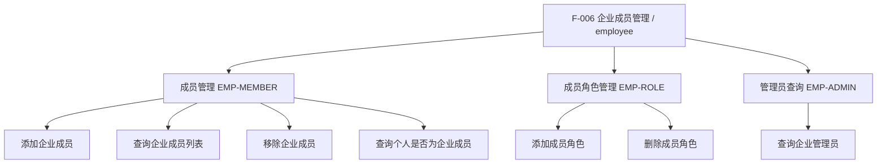
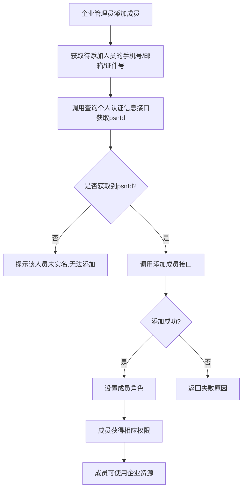

# 企业成员管理

## 1 文档元数据

| 字段 | 内容 |
| --- | --- |
| PRD-ID | F-006 |
| 产品线 | 企业成员管理（employee） |
| 需求类型 | 新功能 |
| 需求状态 | 草稿 |
| 当前版本 | V1.0 |
| 最后更新日期 | 2026-05-21 |
| 关键词（Tag） | 企业成员、成员管理、成员角色、添加成员、移除成员、成员管理员 |
| 关联需求卡片 | |
| 关联页面规格卡 | 待产出 |
| 关联原型文件 | 待产出 |

## 2 文档修订记录

| 版本 | 日期 | 修订内容 | 修订人 |
| --- | --- | --- | --- |
| V1.0 | 2026-05-21 | 基于 opendoc employee 抽取 | 吠陀 |

## 3 需求概要

### 3.1 问题与机会（概要）

**现状问题**：
- V3 企业成员管理 API 需要支持企业组织架构管理
- 成员角色管理需要与印章管理、模板管理等系统联动
- 添加成员前需确认个人已完成实名认证

**机会**：
- V3 提供统一的企业成员管理 RESTful API
- 支持成员角色细分（普通成员、印章保管员、成员管理员、模板管理员）
- 与印章授权、内部成员授权等场景联动

### 3.2 目标用户（概要）

- **核心用户**：P3 企业集成开发者——通过 API 管理企业成员、分配角色
- **次级用户**：P4 企业管理员——在企业控制台管理成员
- **间接用户**：P6 企业成员——被授权使用企业资源

### 3.3 方案概述

按功能类别组织，覆盖企业成员管理完整生命周期：

1. **成员管理**：添加成员、查询成员列表、移除成员、查询个人是否为企业成员
2. **成员角色管理**：添加成员角色、删除成员角色
3. **管理员查询**：查询企业管理员列表

### 3.4 成功指标（3-5 项）

| 指标 | 目标值 | 观测时间 | 数据来源 |
| --- | --- | --- | --- |
| 成员添加接口成功率 | ≥ 99.5% | 月度 | employee 接口监控 |
| 成员管理接口响应时间 | ≤ 200ms（P99） | 月度 | API 监控 |

---

## 4 需求对象与概念模型

> 业务术语参考：context/business-glossary.md

| 名词 | 定义 | 约束/备注 |
| --- | --- | --- |
| orgId | 机构账号ID | 企业在 e签宝 的唯一标识 |
| psnId | 个人账号ID | 个人在 e签宝 的唯一标识 |
| memberRole | 成员角色 | 1-普通成员，2-印章保管员，3-成员管理员，4-模板管理员，98-法定代表人，99-企业管理员 |
| departmentId | 部门ID | 企业在 e签宝 组织架构中的部门标识 |
| employeeNum | 员工编号 | 用户自定义，可为企业工号 |

---

## 5 功能结构

### 5.1 本需求新增/调整的功能节点



### 5.2 本需求核心业务流程



### 5.3 核心业务规则

| 规则编号 | 规则描述 | 备注 |
| --- | --- | --- |
| BR-01 | 添加成员前需先通过「查询个人认证信息」接口(psnId)获取已实名的个人账号ID，未实名的个人没有psnId | opendoc has759 + vssvtu |
| BR-02 | 添加的成员默认角色为"普通成员"（role=1） | opendoc has759 |
| BR-03 | 成员角色可叠加，一个成员可拥有多个角色 | opendoc bzrzic role 说明 |
| BR-04 | 成员角色：1-普通成员，2-印章保管员，3-成员管理员，4-模板管理员，98-法定代表人，99-企业管理员 | opendoc |
| BR-05 | 移除成员后，该成员的企业资源使用权限同时失效 | 业务规则 |
| BR-06 | 成员管理需要 manage_org_member 授权 | opendoc 权限要求 |

---

## 6 用户故事与用例

### 6.1 Epic

让企业集成开发者能够通过 V3 标准化 API 完整管理企业成员的添加、查询、移除和角色分配，确保企业组织架构管理的合规性和效率。

### 6.2 Must Have（MVP）

**故事 1：添加企业成员**

```text
作为企业管理员，
我希望能够将已实名的个人添加为企业成员，
以便其可以使用企业资源。
```

验收标准（Gherkin）：
- Given 待添加的个人已完成实名认证
- When 调用添加企业成员接口传入 orgId、psnId、memberName 等
- Then 返回 code=0，成员添加成功，默认角色为普通成员

**故事 2：查询企业成员列表**

```text
作为企业管理员，
我希望能够查询企业所有成员的列表，
以便了解组织架构。
```

验收标准（Gherkin）：
- Given 调用方持有 manage_org_member 授权
- When 调用查询成员列表接口传入 orgId
- Then 返回分页的成员列表，包含 psnId、memberName、role 等信息

**故事 3：管理成员角色**

```text
作为企业管理员，
我希望能够为企业成员分配不同角色，
以便精细化控制权限。
```

验收标准（Gherkin）：
- Given 成员已添加为企业成员
- When 调用添加成员角色接口传入 psnId 和 role
- Then 返回 code=0，成员获得对应角色权限

---

## 7 功能清单

### 7.1 成员管理（EMP-MEMBER）

| 功能编号 | 功能名称 | opendoc | 接口路径 | 优先级 |
| --- | --- | --- | --- | --- |
| EMP-MEMBER-001 | 添加企业成员 | has759 | POST /v3/organizations/{orgId}/members | P0 |
| EMP-MEMBER-002 | 查询企业成员列表 | bzrzic | GET /v3/organizations/{orgId}/member-list | P0 |
| EMP-MEMBER-003 | 移除企业成员 | tz2uqp | DELETE /v3/organizations/{orgId}/members/{psnId} | P0 |
| EMP-MEMBER-004 | 查询个人是否为企业成员 | smmg6dwz7fyys2wl | GET /v3/organizations/{orgId}/member-check | P0 |

### 7.2 成员角色管理（EMP-ROLE）

| 功能编号 | 功能名称 | opendoc | 接口路径 | 优先级 |
| --- | --- | --- | --- | --- |
| EMP-ROLE-001 | 添加成员角色 | qhbzzmq2a7r03kyo | POST /v3/organizations/{orgId}/members/{psnId}/roles | P0 |
| EMP-ROLE-002 | 删除成员角色 | usgc6c1d2x6ofon1 | DELETE /v3/organizations/{orgId}/members/{psnId}/roles/{roleId} | P0 |

### 7.3 管理员查询（EMP-ADMIN）

| 功能编号 | 功能名称 | opendoc | 接口路径 | 优先级 |
| --- | --- | --- | --- | --- |
| EMP-ADMIN-001 | 查询企业管理员 | fxm4ii | GET /v3/organizations/{orgId}/admin-list | P0 |

---

## 8 功能需求说明书

### 8.1 EMP-MEMBER-001 添加企业成员 需求说明

#### 8.1.1 任务故事

当企业需要添加成员时，我想要批量添加企业成员，这样可以快速构建企业组织架构。

#### 8.1.2 逻辑实现规范

##### Context（前置条件）

- 企业已获得 manage_org_member 授权
- 待添加的个人已完成实名认证

##### Action（触发动作）

1. 调用方传入 orgId、members 数组（最多10个）
2. 系统验证每个 psnId 的实名状态
3. 添加成功返回 addedMembers，失败返回 unaddedMembers

##### Outcome（预期结果）

1. **数据变化**：新增成员记录，默认角色为普通成员
2. **反馈提示**：返回 code=0、addedMembers、unaddedMembers

#### 8.1.3 异常处理要求

| 异常场景 | 触发条件 | 系统行为 |
| --- | --- | --- |
| 用户已是成员 | psnId 已是企业成员 | 返回 failedReason：用户已是当前企业成员 |
| 用户不存在 | psnId 不存在 | 返回 failedReason：用户不存在 |
| 成员未实名 | psnId 未完成实名 | 返回 failedReason：用户不存在 |

---

### 8.2 EMP-MEMBER-002 查询企业成员列表 需求说明

#### 8.2.1 任务故事

当企业需要了解组织架构时，我想要查询企业成员列表，这样可以查看所有成员信息。

#### 8.2.2 逻辑实现规范

##### Context（前置条件）

- 企业已获得 manage_org_member 授权

##### Action（触发动作）

1. 调用方传入 orgId、pageNum、pageSize
2. 系统返回分页的成员列表

##### Outcome（预期结果）

1. **数据变化**：返回成员列表（psnId、psnName、role、employeeNum、memberName 等）
2. **反馈提示**：返回 code=0、total、members

---

### 8.3 EMP-MEMBER-003 移除企业成员 需求说明

#### 8.3.1 任务故事

当企业需要移除成员时，我想要移除企业成员，这样可以调整组织架构。

#### 8.3.2 逻辑实现规范

##### Context（前置条件）

- 企业已获得 manage_org_member 授权
- 成员不是法定代表人（role=98）或企业管理员（role=99）

##### Action（触发动作）

1. 调用方传入 orgId、psnId
2. 系统删除成员记录

##### Outcome（预期结果）

1. **数据变化**：成员记录被删除，成员失去企业资源使用权限
2. **反馈提示**：返回 code=0

#### 8.3.3 异常处理要求

| 异常场景 | 触发条件 | 系统行为 |
| --- | --- | --- |
| 成员不可移除 | 成员是法定代表人或企业管理员 | 返回非0 code |

---

### 8.4 EMP-MEMBER-004 查询个人是否为企业成员 需求说明

#### 8.4.1 任务故事

当需要确认某个人是否是企业的成员时，我想要查询这个信息，这样可以判断该人是否有权使用企业资源。

#### 8.4.2 逻辑实现规范

##### Context（前置条件）

- 企业已获得 manage_org_member 授权

##### Action（触发动作）

1. 调用方传入 orgId、psnId
2. 系统返回 isMember

##### Outcome（预期结果）

1. **数据变化**：返回布尔值
2. **反馈提示**：返回 code=0、isMember

---

### 8.5 EMP-ROLE-001 添加成员角色 需求说明

#### 8.5.1 任务故事

当需要为成员分配更多权限时，我想要添加成员角色，这样可以精细化控制权限。

#### 8.5.2 逻辑实现规范

##### Context（前置条件）

- 成员已是企业成员
- 企业已获得 manage_org_member 授权

##### Action（触发动作）

1. 调用方传入 orgId、psnId、roles
2. 系统为成员添加角色

##### Outcome（预期结果）

1. **数据变化**：成员获得新角色
2. **反馈提示**：返回 code=0

---

### 8.6 EMP-ROLE-002 删除成员角色 需求说明

#### 8.6.1 任务故事

当需要收回成员的某个权限时，我想要删除成员角色，这样可以调整权限。

#### 8.6.2 逻辑实现规范

##### Context（前置条件）

- 成员已是企业成员且拥有该角色
- 企业已获得 manage_org_member 授权

##### Action（触发动作）

1. 调用方传入 orgId、psnId、roleId
2. 系统删除成员的角色

##### Outcome（预期结果）

1. **数据变化**：成员失去该角色
2. **反馈提示**：返回 code=0

---

### 8.7 EMP-ADMIN-001 查询企业管理员 需求说明

#### 8.7.1 任务故事

当需要了解企业的管理员信息时，我想要查询管理员列表，这样可以联系管理员。

#### 8.7.2 逻辑实现规范

##### Context（前置条件）

- 企业已获得 manage_org_member 授权

##### Action（触发动作）

1. 调用方传入 orgId
2. 返回管理员列表

##### Outcome（预期结果）

1. **数据变化**：返回管理员列表
2. **反馈提示**：返回 code=0、admins

---

### 8.8 其他功能说明

#### 8.8.1 业务流转图

不涉及

#### 8.8.2 数据字典

不涉及

#### 8.8.3 状态流转表

不涉及

#### 8.8.4 权限矩阵

| 角色 | 可见范围 | 可执行动作 |
| --- | --- | --- |
| 企业管理员 | 企业所有成员 | 添加、移除、查询、设置角色 |
| 成员管理员 | 企业所有成员 | 添加、移除、查询 |
| 普通成员 | 自己 | 查看自己的信息 |

#### 8.8.5 边界条件与并发规则

- **批量添加限制**：一次最多添加 10 个成员
- **角色互斥**：法定代表人（role=98）和企业管理员（role=99）不可移除

#### 8.8.6 PRD-页面规格卡映射

不涉及

---

## 9 非功能性需求

### 9.1 性能要求

| 场景 | 要求 |
| --- | --- |
| 成员添加接口 | ≤ 200ms（P99） |
| 成员查询接口 | ≤ 200ms（P99） |

### 9.2 安全要求

- 成员管理需要验证调用签名
- 敏感操作需记录操作日志

### 9.3 可用性与可访问性

支持 PC 端和移动端访问

### 9.4 兼容性要求

本功能全端行为一致，无差异。

---

## 10 验收检查清单

- [ ] **AC-1**：添加企业成员成功，返回添加结果
- [ ] **AC-2**：查询企业成员列表返回分页数据
- [ ] **AC-3**：移除企业成员成功，成员失去企业资源权限
- [ ] **AC-4**：查询个人是否为企业成员返回正确结果
- [ ] **AC-5**：添加成员角色成功，成员获得权限
- [ ] **AC-6**：删除成员角色成功
- [ ] **AC-7**：查询企业管理员列表成功

---

## 11 范围外

以下能力不在本期范围：
- 部门管理 API
- 批量成员操作
- 成员权限细粒度控制

---

## 12 开放问题

| # | 问题 | 状态 |
| --- | --- | --- |
| 1 | 成员角色与印章授权的联动关系 | 待补充 |

---

## 变更记录

| 版本 | 日期 | 变更摘要 |
| --- | --- | --- |
| 1.0 | 2026-05-21 | 基于 opendoc employee 抽取 |